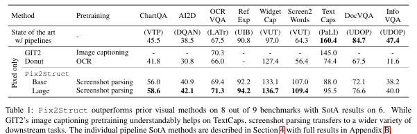

우리 주변에는 **시각적으로 표현된 언어**가 매우 많습니다. 예를 들어, 다이어그램이 포함된 교과서, 이미지와 표가 있는 웹페이지, 버튼과 폼이 있는 모바일 앱 등이 이에 해당합니다. 하지만 이처럼 다양한 형태의 데이터 때문에, 기존 연구는 보통 특정 도메인에 맞춘 방법론에 의존했으며, 데이터, 모델 구조, 학습 목표를 다른 작업에서 공유하기 어렵다는 한계가 있었습니다.

이를 해결하기 위해 연구진은 **Pix2Struct**라는 모델을 제안했습니다. 이 모델은 **시각적 언어 이해**를 위한 사전 학습된 이미지-텍스트 변환 모델로, 시각적 언어가 포함된 작업에 맞게 **미세 조정(finetuning)**할 수 있습니다.

Pix2Struct의 주요 특징은 다음과 같습니다:

1. **사전 학습 전략**:  
   - Pix2Struct는 웹페이지 스크린샷을 **마스킹(masking)** 처리한 뒤, 이를 간단한 HTML 구조로 변환하는 작업을 학습합니다.  
   - 웹은 이미지, 텍스트, 구조가 잘 반영된 HTML 형식으로 구성되어 있기 때문에, 다양한 학습 데이터로 활용하기에 적합합니다.  
   - 이 방식은 기존의 OCR(문자 인식), 언어 모델링, 이미지 캡셔닝(이미지 설명 생성) 같은 사전 학습 방법을 포괄하는 새로운 전략입니다.

2. **입력 데이터의 가변 해상도 처리**:  
   - 다양한 해상도의 이미지를 처리할 수 있는 입력 표현 방식을 도입했습니다.

3. **언어와 시각 정보의 융합**:  
   - 텍스트 질문 같은 언어 프롬프트를 입력 이미지 위에 직접 렌더링(표시)하여 더욱 유연한 방식으로 언어와 이미지를 결합합니다.

이 모델의 성능은 놀라운데, **문서, 삽화, 사용자 인터페이스, 자연 이미지** 등 4가지 도메인에서 9개의 과제를 테스트한 결과, 6개의 과제에서 **최신 기술 수준(state-of-the-art)**의 성능을 달성했습니다. 

결론적으로, Pix2Struct는 다양한 시각적 언어 이해 작업에 적용할 수 있는 강력하고 유연한 모델로, 기존의 한계를 뛰어넘는 새로운 가능성을 보여줍니다.

[Paper Link](https://arxiv.org/pdf/2210.03347)

[Code Link](https://github.com/google-research/pix2struct)

## Method

### 1. 배경
이전의 연구들은 **픽셀 기반의 시각적 언어 모델링**을 주로 **문서**와 **자연 이미지**에 적용해 왔습니다.

1. **문서 모델링**:  
   - **Donut (2022)**와 **Dessurt (2022)**는 **이미지에서 추출한 표면적인 특징**이나 **예상된 OCR(문자 인식)** 출력에 기반한 **사전 학습된 목표**를 결합하여 문서를 이해하려고 시도했습니다.

2. **자연 이미지 모델링**:  
   - **GIT2 (2022)**와 **PaLI (2022)**는 대규모 **이미지 캡셔닝 데이터**(예: TextCaps)를 모아서 훈련하고, 이를 자연 이미지 데이터셋에 잘 적용할 수 있도록 연구했습니다.

하지만 이런 기존 방법들은 한 가지 작업에만 특화되어 있어, **다양한 종류의 작업(예: 문서, UI, 사진 등)**을 하나의 모델로 처리하기는 어려웠습니다.

#### Pix2Struct는 무엇이 다른가요?
Pix2Struct는 단 하나의 모델로 다양한 작업을 처리하는 것을 목표로 합니다.
이미지만 입력으로 받아들이고, 텍스트를 결과로 출력합니다.
Pix2Struct는 처음 학습할 때(사전 학습) 웹페이지 스크린샷을 보고, 그걸 HTML 형태로 변환하는 연습을 합니다. 
웹페이지는 이미지와 텍스트가 섞여 있어서, 이 데이터를 학습하면 다양한 작업에 적응할 수 있는 기본 능력을 키울 수 있습니다.

#### 픽셀 기반 모델이 어려운 이유
이미지에서 텍스트를 정확히 읽으면서 의미를 이해하는 건 매우 어렵습니다. 
텍스트가 많은 이미지(예: 긴 문서)는 특히나 더 어렵습니다.
긴 문서를 처리하려면 고해상도 이미지를 다뤄야 하고, 문서의 가로/세로 비율도 다양해서 어려운 점이 많습니다.

#### Pix2Struct의 방법

Pix2Struct는 이러한 도전 과제들을 해결하기 위한 구성 요소를 갖추고 있습니다.
- 다양한 해상도와 비율을 처리할 수 있는 방법: 이미지 크기가 제각각이어도 문제없이 처리할 수 있는 기술을 도입
- 스크린샷을 HTML로 변환하는 학습 방식: 웹페이지처럼 이미지와 텍스트가 섞인 데이터를 학습해, 다양한 작업에 적응할 수 있는 기반을 다집니다.
- 커리큘럼 학습: 학습 난이도를 점진적으로 올리면서 더 잘 배울 수 있도록 도와줍니다.
- 텍스트와 이미지를 동시에 처리: 질문을 이미지 위에 표시한 뒤, 그 이미지와 텍스트를 함께 분석하는 식으로 작업을 처리합니다.

### 2. Architecture

Pix2Struct는 **이미지를 입력받아 텍스트를 출력하는 모델**로, **ViT(Visual Transformer)** 구조를 기반으로 합니다. 대부분은 기존 ViT 방식과 비슷하지만, Pix2Struct는 **입력 처리 방식**에서 중요한 변화를 도입했습니다. 이 변화가 모델이 **다양한 시각적 언어**를 더 잘 이해할 수 있도록 도와줍니다.

#### **기존 ViT 방식의 문제점**

1. **해상도 조정 과정에서 비율이 왜곡됨**:  
   - 기존 ViT는 이미지를 특정 크기로 고정해 입력을 처리합니다.  
     하지만 문서, 모바일 UI, 그림 등은 화면 비율(가로/세로 비율)이 다양해서, 이미지를 고정 크기로 변경하면 비율이 왜곡되어 중요한 정보가 손실될 수 있습니다.

2. **해상도가 높은 작업에 활용하기 어려움**:  
   - 기존 방식은 **특정 해상도**에서만 학습되기 때문에, 해상도가 다른 작업(예: 더 큰 이미지)을 처리하려면 모델을 다시 학습해야 하는 문제가 있습니다.

#### **Pix2Struct의 새로운 접근법**

Pix2Struct는 위 문제를 해결하기 위해 입력 이미지를 처리하는 방식을 바꿨습니다:

1. **고정된 패치 크기를 최대한 활용**:  
   - 이미지를 특정 크기로 맞추는 대신, **이미지를 확대하거나 축소**해서 고정된 크기의 **패치(조각)**를 가능한 많이 뽑아냅니다.  
     이렇게 하면 이미지 비율이 왜곡되지 않으면서 중요한 정보를 그대로 유지할 수 있습니다.

2. **2D 위치 임베딩 사용**:  
   - 이미지를 패치로 나눌 때, 각 패치의 **위치 정보**를 모델이 이해할 수 있도록 **2차원 위치 정보(2D 임베딩)**를 추가합니다.  
     이를 통해 다양한 해상도의 이미지를 정확히 처리할 수 있습니다.

#### **이 방식이 주는 두 가지 큰 장점**

1. **다양한 화면 비율에 강함**:  
   - 문서나 모바일 UI처럼 비율이 극단적으로 다른 이미지도 문제없이 처리할 수 있습니다.

2. **동적으로 해상도와 시퀀스 길이를 변경 가능**:  
   - 모델을 새로 학습하지 않아도, 입력 이미지의 해상도나 데이터 크기가 달라질 때 유연하게 대응할 수 있습니다.

### 3. Pretraining

#### **Pix2Struct의 사전 학습 목표**

Pix2Struct의 사전 학습은 **입력 이미지(웹페이지 스크린샷)**의 **기본 구조를 이해**하는 능력을 키우는 것입니다. 이를 위해 **웹페이지의 스크린샷**과 **HTML 텍스트**를 사용하여 **자기지도 학습** 데이터를 생성합니다.

#### **사전 학습 데이터 준비 과정**

1. **데이터 생성**:
   - 각 웹페이지에서 **HTML 소스**와 화면 크기가 1024 x 1024인 **스크린샷**을 수집합니다.

2. **HTML 구조 간소화**:
   - HTML의 DOM 트리(웹페이지의 계층 구조)를 단순화하여 효율적으로 학습할 수 있도록 수정합니다:
     - **화면에 보이는 요소만 유지**하거나, 화면에 보이는 자식 노드가 있는 경우만 남깁니다. (스크립트, 숨겨진 태그 등 제거)
     - **불필요한 중첩 구조 제거**: 자식이 하나만 있는 경우, 그 자식을 손자 노드로 대체합니다.
     - 예시:
        """html
        

            
                
텍스트

            
        

        """
        """html
        
텍스트

        """
     - **텍스트와 이미지 정보만 유지** 
        - 각 노드에서 중요한 텍스트와 이미지와 관련된 파일 이름, 대체 텍스트만 남김
        - 스타일 정보, url, tag 이름 과 같은 추가 정보는 현재는 생략하지만, 미래에는 활용 가능성이 있음 

3. **시퀀스 길이 최적화**:
   - 모델의 **디코더(출력 생성기)**가 처리할 수 있는 길이에 맞춰 HTML 트리를 잘라냅니다.
   - 선택된 부분의 범위를 나타내는 **바운딩 박스**를 스크린샷 위에 표시합니다.

4. **BART 스타일 학습 신호 추가**:
   - **텍스트의 50%를 마스킹(masking)** 처리하고, 모델이 이를 기반으로 전체 HTML 트리를 디코딩하도록 학습합니다.  
    - HTML 트리에서 텍스트의 절반을 무작위로 선택해 마스킹합니다.
    - 모델은 마스킹된 부분을 기반으로 전체 HTML 트리를 다시 만들어야 합니다.
   - 마스킹된 부분은 선택된 트리에서 랜덤하게 선택한 텍스트 조각이며, 스크린샷 상에 마스크로 표시됩니다.

#### **기존 사전 학습 방법과의 비교**

Pix2Struct의 **스크린샷 파싱(screenshot parsing)** 방식은 기존의 여러 사전 학습 방법과 유사한 요소를 통합합니다:

1. **OCR과의 유사점**:
   - **마스킹되지 않은 부분을 복원**하는 작업은 **텍스트 인식(OCR)** 학습과 비슷합니다.  
     - 예: `<C++>`을 예측하는 작업은 Donut이 사용한 OCR 방식과 유사합니다.

2. **마스크드 언어 모델링(MLM)과의 유사점**:
   - **마스킹된 부분을 복원**하는 작업은 **MLM(예: BERT)**과 유사하지만, Pix2Struct는 이미지의 시각적 정보를 활용해 더 강력한 힌트를 제공합니다.  
     - 예: `<Python>`을 예측하는 작업은 MLM과 비슷하지만, 시각적 힌트를 통해 예측합니다.

3. **이미지 캡셔닝과의 유사점**:
   - 이미지에서 **alt-text(대체 텍스트)**를 복원하는 작업은 **이미지 캡셔닝**과 비슷합니다.  
     - 하지만 Pix2Struct는 **웹페이지의 전체 맥락**을 참고할 수 있어 더 풍부한 정보를 활용합니다.  
     - 예: `img alt=C++`을 예측하는 작업은 이 방식을 보여줍니다.

### 4. Warming up with a reading curriculum

Pix2Struct를 바로 스크린샷 파싱(screenshot parsing) 작업에 사전 학습시키는 것도 가능하지만, 이렇게 하면 학습이 불안정하고 속도가 느릴 수 있습니다. 이를 해결하기 위해, 학습 초기에 간단한 읽기 훈련(warmup) 단계를 추가하는 방법을 제안했습니다.

- 텍스트 읽기 학습:
    - 랜덤한 색상과 글꼴로 작성된 간단한 텍스트 이미지를 생성합니다.
    - 모델은 이 이미지를 보고 원래 텍스트를 복원(디코딩)하는 작업을 학습합니다.
    - (예: "Hello"라는 텍스트 이미지에서 "Hello"를 출력하는 방식)
- 훈련의 목표:
    - 복잡한 작업(스크린샷 파싱)을 바로 학습하기 전에, 모델이 기본적인 텍스트 읽기 능력을 먼저 익히도록 합니다.
    - 이 과정을 통해 학습 초기의 부담을 줄이고, 모델이 더 안정적으로 학습을 시작할 수 있습니다.

- 학습 안정성 향상:
    - 학습이 더 안정적으로 이루어지고, 빠르게 수렴합니다.
    - 즉, 모델이 더 짧은 시간에 효과적으로 학습할 수 있습니다.
- 파인튜닝 성능 개선:
    -나중에 다양한 작업에 맞게 모델을 미세 조정(finetuning)할 때 더 나은 성능을 발휘합니다.

Dessurt 모델(Davis et al., 2022)에서도 비슷한 방식의 커리큘럼 학습이 사용되었습니다.

### 5. Finetuning

Pix2Struct의 **파인튜닝(finetuning)** 과정은 비교적 간단합니다. 모델이 다양한 작업에 적응할 수 있도록 **입력 이미지와 출력 텍스트를 작업에 맞게 전처리**하면 됩니다. 이 과정은 T5와 유사하며, 작업에 필요한 데이터를 이미지와 텍스트 형태로 준비하는 것이 핵심입니다. 아래는 주요 작업에 대한 전처리와 파인튜닝 방법입니다.

#### **5.1. 캡셔닝(Captioning)**

- **작업**: 이미지를 보고 설명(캡션)을 생성하는 작업입니다. (예: TextCaps, Screen2Words)
- **방법**:  
  - 입력 이미지와 출력 텍스트를 그대로 사용합니다.
  - 특정 **영역**(바운딩 박스)에 초점을 맞춰야 할 경우(예: Widget Captioning), 해당 영역을 이미지 위에 표시합니다.  
    (예: 특정 버튼에 대한 설명을 생성할 때, 버튼 부분에 바운딩 박스를 그려줌)

#### **5.2. 시각적 질문 응답(Visual Question Answering, VQA)**

- **작업**: 이미지를 보고 질문에 답하는 작업입니다. (예: OCR-VQA, ChartQA, DocVQA, InfographicsVQA)
- **방법**:  
  - **질문**을 이미지 상단에 **헤더**로 직접 표시합니다.
  - Pix2Struct는 질문과 이미지를 **시각적으로 함께 처리**하여 답을 생성합니다.
  - 다중 선택 질문(예: AI2D)의 경우, 선택지들도 질문과 함께 헤더에 표시합니다.

#### **왜 효과적인가?**
- Pix2Struct는 사전 학습 과정에서 입력 이미지의 여러 부분 간의 **긴밀한 상호작용**을 이해하도록 훈련받았기 때문에, 질문을 이미지와 함께 처리하는 방식이 효과적입니다.

#### **5.3. RefExp (참조 표현 작업)**

- **작업**: 주어진 자연어 표현이 **UI 컴포넌트** 중 어느 것을 가리키는지 선택하는 작업입니다.
- **방법**:  
  - 각 후보(UI 컴포넌트)에 대해, 다음과 같이 학습 데이터를 준비합니다:
    1. **입력 이미지**: 후보 컴포넌트의 바운딩 박스와 자연어 표현을 포함.
    2. **출력 텍스트**: "true" 또는 "false".
  - 학습 시, **정답 후보(positive candidate)** 한 개당 **오답 후보(negative candidate)** 5개를 샘플링하여 학습합니다.
  - **추론 단계**: 각 후보에 대해 "true"를 생성할 확률을 계산한 뒤, 가장 높은 점수를 받은 후보를 선택합니다.

## Experimental Setup

### **벤치마크 평가**

- **평가 도메인**: Pix2Struct는 **4가지 도메인**에서 시각적 언어 이해를 평가합니다:  
  1. **일러스트레이션**  
  2. **사용자 인터페이스(UI)**  
  3. **자연 이미지**  
  4. **문서**  
- **데이터셋**: 다양한 도메인과 작업 형식을 포함하도록 데이터셋을 최적화했으며, **추가 라벨링 데이터 없이 표준 데이터 분할**을 사용합니다.  
  - 자세한 데이터셋 정보는 Appendix C(Table 4) 및 Section 4 참조.

- **평가 지표**:
  - **ANLS (Average Normalized Levenshtein Similarity)**: DocVQA, InfographicVQA  
  - **Exact Match (EM)**: AI2D, RefExp, OCR-VQA  
  - **Relaxed Accuracy (RA)**: ChartQA  
  - **CIDEr**: 생성 작업(Captioning)  

### **구현 및 베이스라인**

#### **사전 학습**
1. **모델 변형**:
   - **Base 모델**: 282M 파라미터, 12 인코더/디코더 레이어, 히든 크기 768.  
   - **Large 모델**: 1.3B 파라미터, 18 인코더/디코더 레이어, 히든 크기 1536.

2. **훈련 단계**:
   - 텍스트 읽기 워밍업(BooksCorpus 사용, 30K 스텝).  
   - Base 모델: **270K 스텝** 동안 스크린샷 파싱 학습 (배치 크기 2048, 64 TPU 사용).  
   - Large 모델: **170K 스텝** 동안 학습 (배치 크기 1024, 128 TPU 사용).  

3. **세부 설정**:
   - 입력 시퀀스 길이: 2048 패치.  
   - 디코더 시퀀스 길이: 128 토큰.  
   - 학습률 스케줄: 1000 스텝 동안 0.01까지 선형 증가 후, **코사인 감소**.  
   - Adafactor 옵티마이저 사용.  
   - Base 모델: 30 BLEU, Large 모델: 32 BLEU.

#### **베이스라인**
1. **비교 대상**:
   - Pix2Struct는 각 도메인에서의 **최신 기술 수준(SotA)** 모델과 비교했습니다.  
   - SotA 모델 중 일부는 **모델 앙상블, 멀티태스크 학습, 검증 데이터 학습**을 활용했지만,  
     Pix2Struct는 **단일 모델, 단일 작업** 기준으로 공정하게 비교했습니다.

2. **도메인별 특징**:
   - 몇몇 SotA 모델은 특정 도메인에 특화된 입력(e.g., UI의 계층 뷰, 차트의 골드 데이터 테이블)을 사용하여 다른 도메인에 적용하기 어려운 경우도 있었습니다.  
   - **Donut**을 파인튜닝하여 순수한 시각적 베이스라인으로 사용했습니다.

## Results

