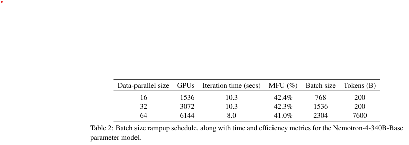

NVIDIA는 **Nemotron-4 340B 모델 시리즈**를 공개했습니다. 이 시리즈에는 **Nemotron-4-340B-Base**, **Nemotron-4-340B-Instruct**, **Nemotron-4-340B-Reward** 모델이 포함되어 있습니다. 해당 모델들은 **NVIDIA Open Model License Agreement** 하에 공개되며, 이는 모델 및 출력물의 배포, 수정, 사용을 허용하는 포괄적인 라이선스입니다.

이 모델들은 다양한 평가 기준에서 다른 공개 모델들과 경쟁력 있는 성능을 보이며, **FP8 정밀도**로 설정 시 **8개의 GPU가 장착된 DGX H100**에서 실행할 수 있도록 설계되었습니다. 특히, 이 모델들은 **소형 언어 모델 훈련을 위한 합성 데이터를 생성**하는 데 매우 유용하며, 다양한 연구와 상업적 응용 분야에서 커뮤니티에 큰 도움이 될 것으로 기대됩니다.

특히, 모델 정렬 과정에서 사용된 데이터의 **98% 이상이 합성 데이터**로 이루어져 있어, 이러한 모델들이 합성 데이터 생성에 있어 높은 효율성을 보여줍니다. 또한, 오픈 연구를 지원하고 모델 개발을 촉진하기 위해, NVIDIA는 모델 정렬 과정에서 사용된 **합성 데이터 생성 파이프라인**도 공개 소스로 제공한다고 발표했습니다.

[Paper Link](https://arxiv.org/pdf/2406.11704)

## Introduction

1. **모델 소개**
   - NVIDIA는 **Nemotron-4 340B 모델 시리즈**(Base, Instruct, Reward)를 공개했으며, 이는 **오픈 액세스 모델**로 제공됩니다.
   - 높은 품질의 데이터셋으로 9조 개의 토큰을 학습했으며, 다양한 응용 분야에서 뛰어난 성능을 보입니다.

2. **정렬(Alignment) 과정**
   - Supervised Fine-Tuning(SFT), RLHF(Reinforcement Learning with Human Feedback), DPO(Direct Preference Optimization)를 사용해 모델을 정렬.
   - 정렬을 통해 명령 수행, 대화 능력, 문제 해결 능력이 크게 향상됨.
   - **Reward 모델**은 품질 평가 및 데이터 생성 과정에서 중요한 역할을 수행.

3. **성능**
   - Nemotron-4-340B-Base: Llama-3, Mixtral, Qwen 등 다른 공개 모델들과 동등한 성능.
   - Nemotron-4-340B-Instruct: 명령 수행과 대화 능력에서 경쟁 모델을 능가.
   - Nemotron-4-340B-Reward: **RewardBench**에서 최고 성능을 기록하며 GPT-4o 및 Gemini 같은 상용 모델을 초월.

4. **합성 데이터 생성**
   - 학습 데이터의 **98% 이상이 합성 데이터**로 구성되었으며, 비용이 높은 인간 주석 데이터를 대체함.
   - 합성 데이터는 웹 텍스트 재구성, 도메인별 데이터 생성, 텍스트 품질 분류기 학습 데이터 생성 등 다양한 용도로 활용.

5. **커뮤니티 기여**
   - Nemotron-4 모델과 **합성 데이터 생성 파이프라인**을 공개하여 연구 및 AI 응용 개발을 가속화.
   - 합성 데이터 생성 파이프라인에는 프롬프트 생성, 응답 및 대화 생성, 품질 필터링, 선호도 랭킹이 포함됨.

6. **책임 있는 AI 개발**
   - 모델의 오용을 방지하기 위해 유해하거나 유독한 콘텐츠 생성에 사용하지 않을 것을 권장하며, 책임 있는 AI 개발을 지향. 

## Pretraining
### 1. Data

1. **데이터 구성**
   - **영어 자연어 데이터 (70%)**: 웹 문서, 뉴스 기사, 과학 논문, 책 등 다양한 출처와 도메인에서 선별된 데이터로 구성.
   - **다국어 자연어 데이터 (15%)**: 53개 언어로 이루어진 단일언어(monolingual)와 병렬(parallel) 코퍼스 포함.
   - **소스 코드 데이터 (15%)**: 43개의 프로그래밍 언어 데이터로 구성.

2. **학습 과정**
   - 총 9조 개의 토큰으로 학습.
     - **8조 개**의 토큰은 정식 사전 학습 단계에서 사용.
     - **1조 개**의 토큰은 추가 사전 학습(continued pretraining) 단계에서 사용.

3. **데이터 세부 정보**
   - **Nemotron-4-340B-Base**는 **Nemotron-4-15B-Base**와 동일한 데이터 구성을 따름.

### 2. Architectural Details

1. **아키텍처 특징**
   - **Nemotron-4-15B-Base**와 유사한 구조.
   - **디코더 전용 Transformer 아키텍처**(Vaswani et al., 2017).
   - **Causal Attention Masks** 사용.
   - **Rotary Position Embeddings (RoPE)** 적용 (Su et al., 2021).
   - **SentencePiece Tokenizer** 사용 (Kudo & Richardson, 2018).
   - MLP 레이어에서 **Squared ReLU 활성화 함수** 사용.

2. **추가 설계 세부사항**
   - **바이어스 항 없음**.
   - **드롭아웃 비율 0**.
   - **입력-출력 임베딩 분리**(Untied Input-Output Embeddings).
   - **Grouped Query Attention (GQA)** 도입 (Ainslie et al., 2023).

3. **파라미터**
   - **임베딩 파라미터**: 94억 개.
   - **non-embedding파라미터**: 3316억 개.

### 3. Training Details

1. **하드웨어 구성**
   - **768개의 DGX H100 노드** 사용, 각 노드는 **8개의 H100 80GB SXM5 GPU**로 구성.
   - H100 GPU는 **16비트 부동소수점(bfloat16)** 연산에서 **989 teraFLOP/s**의 처리 속도를 가짐.
   - 노드 내부 GPU 간 연결: **NVLink** 및 **NVSwitch**(양방향 450 GB/s, 총 900 GB/s).
   - 노드 간 통신: **8개의 NVIDIA Mellanox 400 Gbps HDR InfiniBand HCA** 사용.

2. **병렬 처리 및 최적화**
   - **8-way 텐서 병렬 처리**(Shoeybi et al., 2019).
   - **12-way 파이프라인 병렬 처리**(Narayanan et al., 2021) 및 데이터 병렬 처리 조합.
   - 분산 옵티마이저로 옵티마이저 상태를 데이터 병렬 복제본에 분산하여 메모리 사용량 감소.
   - 배치 크기 점진적 증가:
     - 데이터 병렬 크기: 16 → 64로 확장.
     - 배치 크기 및 토큰 처리량: 768 → 2304, 200 → 7600억 토큰.
   - **Model FLOP/s Utilization (MFU)**: GPU 학습 효율성을 측정(이론적 최대치 100%).

3. **학습 단계 요약**
   - **사전 학습**: 8조 개의 토큰으로 학습.
   - **추가 학습(continued training)**: 1조 개의 추가 토큰으로 학습, 학습 품질 향상.

4. **추가 학습 데이터 분포**
   - **첫 번째 분포**: 사전 학습에서 사용된 토큰을 재사용하되, 고품질 소스에 더 높은 가중치 부여.
   - **두 번째 분포**: QA 스타일의 정렬 예제와 모델 정확도가 낮은 영역의 데이터를 소량 포함.
   - **학습률 조정**: 학습률의 크기보다 감소율 경사를 우선시하여 점진적인 전환 유도.

5. **효과**
   - 데이터 분포와 학습률 조정을 통해 **사전 학습 데이터와 새로운 데이터 간의 원활한 전환** 실현.
   - 최종 학습 단계에서 **모델 품질과 다운스트림 응답 성능**이 크게 향상됨.



### 4. Base Model Evaluation

1. **비교 대상**
   - **Llama-3 70B** (MetaAI, 2024)
   - **Mistral 8x22B** (Mistral-AI-Team, 2024b)
   - **Qwen-2 72B** (Qwen-Team, 2024)

2. **평가 항목 및 기준**
   - **종합 벤치마크**:
     - **MMLU** (5-shot) (Hendrycks et al., 2020)
     - **BBH** (3-shot) (Suzgun et al., 2022)
   - **상식 추론**:
     - **ARC Challenge** (25-shot) (Clark et al., 2018)
     - **Winogrande** (5-shot) (Sakaguchi et al., 2020)
     - **Hellaswag** (10-shot) (Zellers et al., 2019)
   - **코드**:
     - **HumanEval Pass@1** (0-shot) (Chen et al., 2021a)

3. **평가 방법**
   - 모든 평가에서 표준화된 설정을 사용.
   - **LM-Evaluation Harness**(Gao et al., 2021)을 활용하여 성능 측정.

4. **결과**
   - **상식 추론**: Nemotron-4-340B-Base가 가장 높은 정확도를 기록.
   - **종합 벤치마크 (BBH)**: 최고의 성능 달성.
   - **MMLU 및 코드 평가 (HumanEval)**: 다른 경쟁 모델들과 동등한 성능.


## Alignment
### 1. Reward Modeling

1. **보상 모델의 역할**
   - **모델 정렬(Alignment)**에서 핵심적인 역할 수행.
   - 학습 과정에서 **선호도 랭킹**과 **품질 필터링**의 중요한 기준으로 작용.
   - 강력한 명령 수행 모델을 학습하기 위해 필수적.

2. **데이터 수집**
   - **HelpSteer2**라는 10,000개의 인간 선호 데이터를 수집.
   - HelpSteer(Wang et al., 2023b)에서 소개된 방법론을 기반으로 데이터 생성.
   - **HelpSteer2 데이터셋**은 공개되었으며, 자세한 내용은 Wang et al. (2024)에서 확인 가능.

3. **모델 설계**
   - 기존 **페어와이즈 랭킹 모델(pairwise ranking)** 대신 **다중 속성 회귀 보상 모델(multi-attribute regression reward model)** 채택:
     - 불필요한 요소(예: 응답 길이에 따른 선호도) 제거.
     - 유사한 응답 간 미묘한 차이를 포착하여 세밀한 보상 예측 가능.
   - **Nemotron-4-340B-Base** 모델 기반으로 설계:
     - 최종 Softmax 레이어를 새로운 보상 "헤드(head)"로 교체.
     - "헤드"는 마지막 레이어의 히든 상태를 **HelpSteer 속성**(도움성, 정확성, 일관성, 복잡성, 장황성)의 5차원 벡터로 매핑하는 선형 투영.

4. **보상 산출**
   - 추론 중에는 각 속성 값을 가중합하여 **전체 보상 점수**로 계산.

5. **성과**
   - **RewardBench**(Lambert et al., 2024)에서 최고 정확도를 기록.
   - Nemotron-4-340B-Reward 모델의 우수성 입증:
     - Nemotron-4-340B-Base 모델의 강력한 성능.
     - HelpSteer2 데이터셋의 높은 품질.
     - 사용된 방법론의 효과성.

6. **응용**
   - Nemotron-4-340B-Reward 모델은 **Nemotron-4-340B-Instruct** 학습의 탄탄한 기반을 제공.

### 2. Alignment Data

- 기존 데이터셋의 한계와 고품질 인간 주석 데이터 수집의 높은 비용 문제 해결을 위해 **Synthetic Data Generation(SDG)** 활용.
- 전체 정렬 과정에서 사용된 데이터의 **98% 이상**이 합성 데이터로 구성.
- **10K 인간 주석 데이터**만 사용: 
    - 10K는 **지도 학습(Supervised Fine-Tuning)**에, 
    - 10K는 **HelpSteer2 데이터**로 **보상 모델 및 선호도 학습**에 사용.

#### 2.1. **프롬프트 준비 (Prompt Preparation)**
   - **다양한 시나리오**를 포함하도록 프롬프트 분포를 조정.
   - **다차원적 다양성**:
     - **작업 유형**: 작성, 개방형 Q&A, 폐쇄형 Q&A.
     - **주제**: STEM, 인문학, 일상생활 등.
     - **형식**: JSON 출력, 단락 형식, Yes/No 답변 등.
   - **Mixtral-8x7B-Instruct-v0.1** 모델을 활용하여 주제별 프롬프트 생성.

##### Synthetic Single-Turn Prompts 생성 과정 요약


1. **주제 수집**
   - **다양한 주제**를 포함하기 위해 생성기를 활용하여 **매크로 주제**와 관련 **서브 주제**를 생성.
   - 합성 매크로 주제, 서브 주제, 수작업으로 수집한 주제를 포함해 총 **3,000개 주제** 확보.

2. **프롬프트 생성 방식**
   - **개방형 Q&A 프롬프트**:
     - 예: "머신러닝이란 무엇인가?"
     - 주제별로 질문을 생성한 뒤, 초기 질문이 짧은 경향이 있어 더 구체적이고 세부적인 질문으로 개선.
   - **작문 프롬프트**:
     - 예: "머신러닝에 대한 에세이를 작성하세요."
     - 뉴스레터, 에세이 등 특정 문서 유형에 대한 작성 지침 포함.
     - 생성된 작업을 세부적으로 다듬어 자세한 지침 포함.
   - **폐쇄형 Q&A 프롬프트**:
     - **C4 데이터셋**의 텍스트를 기반으로 지침 생성.
     - 예: "주어진 텍스트를 요약하세요." 또는 "주어진 텍스트에 기반하여 xxx는 무엇인가?"
     - 문서와 지침을 수작업으로 정의된 템플릿을 사용해 연결.
   - **수학 및 코딩 프롬프트**:
     - 수학 및 파이썬 프로그래밍 관련 **키워드** 수집:
       - **12,000개 파이썬 키워드**와 **17,000개 수학 키워드**.
     - Wikipedia 엔터티를 수학 또는 파이썬과 관련된지 분류.
     - 파이썬 사전 학습 데이터에서 자주 사용되는 키워드를 분석.
     - 키워드별로 문제를 생성.

##### Synthetic Instruction-Following Prompts 생성 과정 요약

1. **목적**
   - 모델의 **명령 수행 능력**을 향상시키기 위해 **합성 명령 수행 프롬프트** 생성.
   - 명령 수행 프롬프트는 모델의 정렬(Alignment)에 중요한 요소.

2. **프롬프트 생성 방식**
   - **단일 턴(single-turn) 명령 수행 프롬프트**:
     - 랜덤하게 선택된 합성 프롬프트를 기반으로 **검증 가능한 지침(verifiable instruction)**을 생성(Zhou et al., 2023).
     - 예: "머신러닝에 대한 에세이를 작성하세요. 답변은 3단락으로 작성해야 합니다."
     - 생성된 지침은 프롬프트와 함께 수작업으로 정의된 템플릿을 사용해 결합.
   - **다중 턴(multi-turn) 명령 수행 프롬프트**:
     - 하나의 지침이 **모든 이후 대화에 적용**되도록 설계.
     - 예: 
       ```
       [BEGIN OF INSTRUCTION] 모든 질문에 대해 3단락으로 답변하세요. [END OF INSTRUCTION]
       ```
   - **두 번째 턴(second-turn) 명령 수행 프롬프트**:
     - 첫 번째 응답을 수정하도록 요청하는 지침 포함.
     - 예: "이전 답변을 주어진 지침에 따라 수정하세요."

3. **예시**
   - 단일 턴:
     - 사용자: "머신러닝의 정의를 설명하세요."
     - 지침: "답변은 3단락으로 작성되어야 합니다."
   - 다중 턴:
     - 사용자: "머신러닝과 딥러닝의 차이를 설명하세요."
     - 어시스턴트: "차이점은 다음과 같습니다..."
     - 사용자: "구체적인 예시를 추가해주세요." 
       (이 대화 전체에 동일한 지침이 적용됨.)


##### Synthetic Two-Turn Prompts 생성 과정 요약

1. **배경 및 목적**
   - 지도 학습(Supervised Fine-Tuning) 단계에서는 **다중 턴 대화 데이터**를 주로 사용.
   - 선호도 학습(Preference Fine-Tuning) 단계에서는 **단일 턴 데이터**가 주로 사용되므로, 모델의 다중 턴 대화 능력 개선이 필요.
   - 이를 위해 **두 턴(Two-Turn) 프롬프트**를 생성하여 **선호도 데이터셋** 구축.

2. **구조**
   - **두 턴 프롬프트** 형식:
     ```
     User: [질문 1]
     Assistant: [응답]
     User: [질문 2]
     ```

3. **프롬프트 생성 과정**
   - 첫 번째 사용자 질문은 **ShareGPT** 데이터(RyokoAI, 2023)에서 소싱.
   - 어시스턴트 응답과 두 번째 사용자 질문은 **중간 명령 모델(intermediate instruct models)**을 활용하여 생성.

4. **활용 사례**
   - **첫 번째 사용자 질문**: "머신러닝이란 무엇인가요?"
   - **어시스턴트 응답**: "머신러닝은 데이터를 기반으로 패턴을 학습하고 예측하는 알고리즘입니다."
   - **두 번째 사용자 질문**: "머신러닝과 딥러닝의 차이점을 설명해주세요."

5. **결론**
   - **두 턴 프롬프트**는 선호도 학습 단계에서 모델의 **다중 턴 대화 능력**을 강화.
   - ShareGPT 데이터를 기반으로 사용자 질문을 풍부하게 만들고, 중간 모델을 활용해 현실감 있는 대화 흐름을 생성. 
   - 결과적으로, **더 자연스럽고 유용한 대화 응답**을 생성하는 모델로 발전 가능.

#### Real-world LMSYS Prompts 요약

1. **목적**
   - 현실 세계의 사용자 요청을 반영하기 위해 **LMSYS-Chat-1M 데이터셋(LMSYS)**(Zheng et al., 2023)에서 프롬프트를 가져옴.
   - **지도 학습(Supervised Learning)**과 **선호도 학습(Preference Learning)**을 위해 균형 있는 비율로 프롬프트를 분리.

2. **프롬프트 분류**
   - **지도 학습용 프롬프트**:
     - 안전하지 않을 가능성이 있는 프롬프트 제거.
     - 불필요한 대화를 유발하지 않도록 설계.
   - **선호도 학습용 프롬프트**:
     - 잠재적으로 안전하지 않은 프롬프트 유지.
     - 모델이 안전한 응답과 안전하지 않은 응답을 구별하도록 학습.

3. **프롬프트 비교**
   - **Mixtral-8x7B-Instruct-v0.1 모델**을 사용해 각 프롬프트에 대한 응답 생성.
   - **Nemotron-4-340B-Reward 모델**을 활용해 생성된 응답의 유용성(helpfulness)을 평가.
   - **결과**:
     - 합성 단일 턴 프롬프트의 평균 유용성이 LMSYS 프롬프트보다 높음.
     - LMSYS 프롬프트는 평균적으로 더 복잡하고 난이도가 높은 경향.


#### 2.2 Synthetic Dialogue Generation

1. **목적**
   - 지도 학습(Supervised Fine-Tuning)을 통해 모델이 사용자와의 **대화 형식**을 배우도록 지원.
   - 모델의 **다중 턴 대화 능력**을 향상하기 위해 각 대화를 **3턴**으로 구성.

2. **대화 생성 방식**
   - **명령 모델(Instruct Model)**을 사용해 입력 프롬프트에 대한 응답 생성.
   - **역할 놀이(role-playing)** 기법을 활용:
     - 모델이 **Assistant**와 **User** 역할을 번갈아 수행.
     - 사용자 턴에서 다양한 성격을 반영하기 위해 명시적인 지침 제공(부록 C 참고).
   - 사용자 질문을 더 자연스럽게 보이도록 **정중한 표현**(예: "감사합니다", "기꺼이 도와드리겠습니다" 등) 제거.

3. **품질 관리**
   - **Nemotron-4-340B-Reward 모델**로 생성된 대화의 품질 평가.
   - 사전 설정된 기준 이하의 샘플은 필터링하여 고품질 데이터만 유지.
   - **그리디 샘플링**을 사용해 데이터 생성.

4. **결론**
   - 모델이 대화 중에는 "좋은 친구처럼" 유연하고 상호작용적으로 반응하도록 설계.
   - 대화 품질을 꼼꼼히 체크해, 엉뚱한 응답 대신 유용하고 실질적인 결과를 보장.

#### 2.3 Synthetic Preference Data Generation 

1. **목적**
   - **HelpSteer2 데이터셋(10K)**만으로는 충분하지 않으므로, **더 다양한 도메인**과 **고품질 응답**을 포함한 **합성 선호 데이터**를 생성.
   - 데이터는 **(프롬프트, 선택된 응답, 거부된 응답)** 형식의 **트리플릿**으로 구성.

##### 데이터 생성 과정

1. **응답 생성**
   - **프롬프트 종류**:
     - **단일 턴 프롬프트**
     - **명령 수행 프롬프트**
     - **두 턴 프롬프트**
     - 실세계 프롬프트: ShareGPT, LMSYS, GSM8K(Cobbe et al., 2021), MATH(Hendrycks et al., 2021) 데이터셋.
   - **응답 생성 방식**:
     - 여러 **중간 명령 모델(intermediate models)**을 랜덤하게 사용하여 다양한 응답 생성.
     - 더 어려운 예제를 위해 **최상위 모델**의 랜덤 생성 응답을 포함.

2. **응답 평가 및 선택**
   - **Ground-Truth-as-a-Judge**:
     - GSM8K, MATH 데이터셋의 **정답 레이블** 또는 **검증 도구(예: Python 프로그램)** 사용.
     - 정답 응답은 선택(chosen), 잘못된 응답은 거부(rejected)로 분류.
   - **LLM-as-Judge**:
     - LLM에 두 응답을 비교하도록 프롬프트 제공.
     - **위치 편향(positional bias)** 방지를 위해 응답 순서를 바꿔 두 번 평가.
     - 일관된 결과가 나온 경우에만 유효한 트리플릿으로 채택.
   - **Reward-Model-as-Judge**:
     - **Nemotron-4-340B-Reward 모델**이 각 (프롬프트, 응답) 쌍에 대한 보상을 예측.
     - 보상 점수에 따라 선호 순위를 결정.
     - **Reward Bench** 평가 결과:
       - Chat-Hard 카테고리에서 평균 정확도: **Reward-Model-as-Judge(0.87)** > **LLM-as-Judge(0.54)**.
       - Chat-Hard는 선택된 응답과 거부된 응답을 구별하기 어려운 경우를 다루며, 선호 데이터 생성에 매우 중요.

##### 전환 및 결과
- **초기 데이터셋 생성**에는 LLM-as-Judge를 사용.
- **후기 데이터셋 생성**에는 정확도가 더 높은 Reward-Model-as-Judge로 전환.
- Chat-Hard와 같은 복잡한 시나리오에서 **더 정밀한 선호도 평가** 가능.

#### 2.4 Interative Weak-to-Strong Alignment


1. **목적**
   - **고품질 데이터 생성 및 모델 정렬(Alignment)**을 통해 지속적인 성능 개선을 목표로 함.
   - 약한 초기 모델에서 시작해 강한 모델로 발전하는 **Iterative Weak-to-Strong** 방식 도입(Burns et al., 2023).


##### 프로세스

1. **기본 개념**
   - 모델의 **품질**(약함 또는 강함)은 다양한 평가 지표(예: 정확성, 유용성 등)를 기반으로 정의.
   - 초기 정렬 모델을 데이터 생성기(generator)로 사용:
     - 대화 데이터 및 선호 데이터 생성.
   - 생성된 데이터를 사용해 더 나은 **Base 모델**을 지도 학습(Supervised Fine-Tuning)과 선호도 학습(Preference Tuning)으로 정렬.
   - **학생 모델(student model)**이 **교사 모델(teacher model)**의 성능을 능가할 수 있음을 발견.

2. **1차 반복**
   - **Mixtral-8x7B-Instruct-v0.1**을 초기 정렬 모델로 사용:
     - 이 모델은 강력한 성능과 허용적 라이선스를 가짐.
   - 생성된 데이터를 사용해 **Nemotron-4-340B-Base**의 중간 체크포인트(340B-Interm-1-Base)를 학습.
   - 결과:
     - **340B-Interm-1-Base**가 Mixtral-8x7B Base를 능가.
     - **340B-Interm-1-Instruct**가 Mixtral-8x7B-Instruct-v0.1 모델보다 뛰어난 성능을 보임.

3. **2차 반복**
   - **340B-Interm-1-Instruct**를 새로운 데이터 생성기로 사용:
     - Mixtral-8x7B-Instruct-v0.1보다 향상된 성능을 보유.
   - 생성된 데이터는 이전 데이터보다 높은 품질을 보임.
   - 이 데이터를 사용해 **340B-Interm-2-Base**를 학습한 후, 이를 **340B-Interm-2-Chat**로 정렬.

4. **플라이휠 효과(Self-Reinforcing Flywheel Effect)**
   - **강한 Base 모델**이 더 강력한 Instruct 모델을 만듦.
   - **고품질 데이터셋**이 동일한 Base 모델에서도 더 강력한 Instruct 모델을 생성.


- **약한 초기 모델**에서 시작했음에도 불구하고, **데이터 품질과 모델 강화를 반복적으로 개선**하여 강력한 모델을 개발.
- 생성기와 데이터셋 간의 상호 작용을 통해 **지속적으로 모델 성능을 향상**.
- 여러 라운드의 데이터 생성과 정제를 통해 고품질 모델을 개발하는 효과적인 방법론.

#### 2.5 Additional Data Sources

1. **목적**
   - 특정 능력을 모델에 학습시키기 위해 다양한 **보충 데이터셋**을 통합.
   - 모델의 **주제 유지, 부정확한 작업 처리, STEM 지식, 문서 기반 추론, 함수 호출 능력** 등을 강화.

##### 데이터셋 활용 상세

1. **주제 유지(Topic Following)**
   - **CantTalkAboutThis**(Sreedhar et al., 2024):
     - 다양한 주제를 다룬 합성 대화 데이터 포함.
     - 주제를 벗어나게 하는 **방해 요소(distractor turns)** 포함.
     - **모델의 주제 집중력**을 향상시켜 **작업 중심 상호작용**에서 더 나은 성능 제공.

2. **불가능한 작업 처리(Incapable Tasks)**
   - **불가능한 작업**(예: 인터넷 접속, 실시간 정보 필요)을 처리하는 능력 강화:
     - 사람의 작성 예제를 사용하여 LLM으로 다양한 질문 생성.
     - 모델이 **부정 응답(rejections)**을 명시적으로 생성하도록 학습.
     - 질문-응답 쌍 데이터로 학습해 **환각(hallucination)**을 줄임.

3. **STEM 데이터셋**
   - **Open-Platypus**(Lee et al., 2023):
     - STEM 및 논리적 추론 능력 강화.
   - 통합된 데이터셋:
     - PRM800K(Lightman et al., 2023)
     - SciBench(Wang et al., 2023a)
     - ARB(Sawada et al., 2023)
     - openbookQA(Mihaylov et al., 2018)

4. **문서 기반 추론 및 QA**
   - **FinQA**(Chen et al., 2021b):
     - **수치 추론 능력** 향상.
   - **Liu et al. (2024)**:
     - **문맥화된 QA 정확도** 개선을 위한 인간 주석 데이터 사용.
   - **WikitableQuestions**(Pasupat and Liang, 2015):
     - **반구조화 데이터** 이해 능력 강화.

5. **함수 호출(Function Calling)**
   - **Glaive AI**(2023):
     - 함수 호출 기능 향상을 위해 데이터의 서브셋 사용.

### 3. Alignment Algorithms

#### 3.1 Staged Supervised Fine-Tuning

1. **목적**
   - 모델 정렬(Alignment)에서 첫 단계로 **Supervised Fine-tuning(SFT)** 수행.
   - 전통적으로 모든 작업의 샘플을 혼합해 한 번에 학습하지만, 이 방식은 **작업 간 충돌**을 초래할 수 있음.
   - 특히 코딩 작업에서는 데이터 샘플링 가중치를 조정해도 모든 작업에 최적화된 정렬을 달성하기 어려움.
   - 이를 해결하기 위해 **2단계 SFT 전략** 도입.


- 1단계: **Code SFT**
   - **목적**: 모델의 **코딩 및 추론 능력**을 향상시키되, 다른 작업에 방해되지 않도록 분리된 학습 수행.
   - **데이터 생성**: 
     - **Genetic Instruct** 기법 사용:
       - **자기 지시(Self-instruction)**(Wang et al., 2022)와 **Wizard Coder 변형**(Luo et al., 2023)을 결합해 **고품질 시드 데이터**로부터 많은 합성 샘플 생성.
       - **적합도 함수(fitness function)**:
         - LLM을 활용해 지시문의 정확성과 품질 평가.
         - 평가를 통과한 샘플만 데이터 풀에 추가.
       - 병렬 실행으로 대규모 데이터 생성 가능.
   - **최종 데이터셋**: 중복 제거 및 필터링 후 약 **80만 샘플** 확보.
   - **학습 설정**:
     - **학습 횟수(Epoch)**: 1
     - **학습률(LR)**: 3e-7
     - **글로벌 배치 크기**: 128

- 2단계: **General SFT**
   - **목적**: 다양한 작업에 대한 모델 정렬을 수행.
   - **데이터셋**:
     - **20만 샘플**로 구성된 혼합 데이터셋 사용(3.2절 데이터 참조).
     - **Code SFT** 단계에서 사용한 코딩 샘플의 2% 포함(**망각 방지** 목적).
   - **학습 설정**:
     - **학습 횟수(Epoch)**: 3
     - **글로벌 배치 크기**: 128
     - **학습률 검색 범위(LR Search)**: [1e-7, 5e-7]

- 기타 학습 설정
   - **손실 계산**:
     - 사용자(User) 턴은 마스킹하고, 어시스턴트(Assistant) 턴에서만 손실 계산.

- 결과
- **2단계 SFT 전략**은 작업 간 충돌을 줄이고, 모델이 **모든 다운스트림 작업에서 우수한 성능**을 보이도록 정렬.
- **Genetic Instruct**를 활용한 코딩 데이터 생성은 모델의 코딩 능력을 크게 향상.
- **망각 방지** 기법을 통해 이전 학습 단계의 유용한 정보를 유지.

#### 3.2 Preference Fine-tuning

1. **목적**
   - **지도 학습(Supervised Fine-tuning)** 이후, **선호도 학습(Preference Fine-tuning)**을 통해 모델 성능을 추가적으로 개선.
   - 선호도 학습 데이터는 **(프롬프트, 선택된 응답, 거부된 응답)** 형식의 **트리플릿**을 사용(Ouyang et al., 2022; Bai et al., 2022).

2. **방법론**
   - **Direct Preference Optimization (DPO)**(Rafailov et al., 2024)와 **Reward-aware Preference Optimization** 알고리즘 사용.
   - 여러 반복(iteration)을 통해 모델을 점진적으로 개선.

##### **Direct Preference Optimization (DPO)**
   - **목적**: 정책 네트워크(policy network)를 최적화해 선택된 응답과 거부된 응답 간의 **암묵적 보상 격차**를 극대화.
   - **관찰된 문제점**:
     - 선택된 응답과 거부된 응답의 **가능도(likelihood)**가 모두 감소.
     - 장기간 훈련 시 **과적합(overfitting)** 발생 가능.
     - 한 평가 지표(예: MT-Bench)가 개선되면 다른 지표(예: 0-shot MMLU)가 저하되는 경향.
   - **문제 해결**:
     - DPO 손실에 추가적으로 **선택된 응답에 대한 SFT 손실(weighted SFT loss)** 추가:
       - 정책 네트워크가 선호 데이터에서 과도하게 벗어나지 않도록 방지.
     - **Nemotron-4-340B-Reward 모델**을 사용해 고품질 응답을 선택:
       - 신뢰할 수 없는 데이터(ground-truth가 없는 경우) 제거.
   - **결과 데이터셋**:
     - **16만 개 샘플** 포함, 다양한 작업 포함.
   - **학습 설정**:
     - **Epoch**: 1
     - **글로벌 배치 크기**: 256
     - **학습률(LR)**: [3e-8, 3e-7] 범위에서 튜닝.
     - **DPO KL 정규화 계수**: [3e-4, 3e-3] 범위에서 튜닝.
     - **SFT 손실 가중치**: [1e-5, 1e-3] 범위에서 튜닝.

##### Reward-aware Preference Optimization (RPO) 

1. **배경 및 문제점**
   - 대부분의 선호 데이터는 **Nemotron-4-340B-Reward**에서 생성된 보상 점수를 기반으로 함
   - 기존 **DPO(Direct Preference Optimization)** 방식의 한계:
     - 두 응답 간 **이진 순위 차이**만 고려.
     - 거부된 응답(rejected)이 선택된 응답(chosen)보다 약간 나쁜 경우와 훨씬 나쁜 경우를 구별하지 못함.
     - 이로 인해 과적합 및 **고품질 거부 응답의 불필요한 학습 제거** 발생.

2. **핵심 개념**
   - DPO와 달리, RPO는 두 응답 간 **보상 격차(reward gap)**를 학습하여 문제를 해결.
   - 보상 모델의 보상 점수(r*)를 이용해 정책 네트워크(policy network)의 **암묵적 보상 격차**를 근사.

3. **손실 함수**
   - RPO 손실 함수:
    
     - **π**: 훈련할 정책 네트워크.
     - **π_ref**: 참조 정책(reference policy).
     - (x, y_c, y_l): 프롬프트, 선택된 응답, 거부된 응답.
     - (r*(x, y_c), r*(x, y_l)): 선택된 응답과 거부된 응답의 보상 점수.
     - **D**: 거리 메트릭(metric).
     - **η, β**: 조정 가능한 하이퍼파라미터.

4. **RPO의 특징**
   - DPO 대비 개선:
     - 보상 격차를 근사하여 과적합 방지.
     - 고품질 거부 응답에 대한 불필요한 "학습 제거(unlearning)" 방지.

5. **RPO 학습 설정**
   - **초기화**: DPO로 학습된 체크포인트를 초기화 및 참조 정책으로 사용.
   - **데이터셋**: 약간 덜 엄격한 필터링 기준으로 생성된 **30만 개 샘플** 사용.
   - **하이퍼파라미터**:
     - 학습률(lr): 3e-7
     - KL 정규화 계수(β): [1e-3, 1] 범위에서 튜닝.
     - SFT 손실의 가중치: 1e-5
   - **반복 학습**:
     - RPO를 3번 반복(iteration) 수행.
     - 각 반복에서 이전 체크포인트를 초기화 및 참조 정책으로 사용.
     - 반복 학습마다 모델 성능이 지속적으로 향상됨.


- 결과 및 효과
    - **1회 반복**만으로도 모든 작업에서 모델 성능 균일하게 개선.
    - **3회 반복** 후, 최종적으로 **Nemotron-4-340B-Instruct** 모델 완성.
    - RPO는:
    - **보상 격차**를 고려한 학습으로 더 정교한 선호 학습 가능.
    - DPO 방식의 과적합 문제를 해결하고, 모델의 안정성을 향상.


## Prompt Examples


