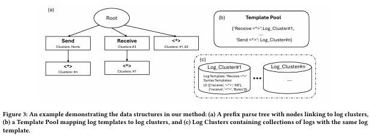
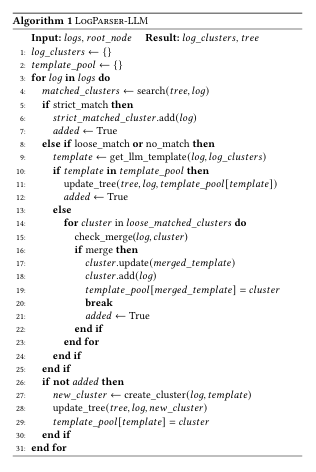

이 논문은 로그 데이터를 효율적으로 분석하기 위한 새로운 로그 파싱 시스템 **LogParser-LLM**을 제안합니다. 주요 내용은 다음과 같습니다.

**1. 배경**
- **로그 데이터의 중요성**: 로그 데이터는 시스템 진단, 보안 분석, 성능 최적화 등 다양한 분야에서 핵심적인 역할을 합니다.
- **로그 파싱의 과제**: 현대 시스템의 복잡성과 로그 형식의 동적 변화로 인해 기존 자동화된 파싱 기술들이 어려움을 겪고 있습니다.
- **LLM(대규모 언어 모델)의 가능성**: LLM은 방대한 지식과 문맥 처리 능력을 바탕으로 다양한 응용 분야에서 혁신적인 성과를 내고 있습니다.

**2. LogParser-LLM의 특징**
- **LLM과 로그 파싱의 통합**: LogParser-LLM은 LLM의 의미적 이해 능력을 통계적 기법과 결합하여 로그 데이터를 효과적으로 처리합니다.
  - **하이퍼파라미터 튜닝 불필요**: 기존 방법과 달리, 별도의 하이퍼파라미터 조정이 필요하지 않습니다.
  - **레이블이 없는 학습 데이터**: 추가적인 레이블링 작업 없이도 높은 성능을 발휘합니다.
  - **실시간 적응성**: **온라인 파싱** 기술을 통해 로그 데이터의 동적 변화에 빠르게 적응할 수 있습니다.

- **파싱 세분화 제어**: 로그 파싱의 세분화 수준(Granularity)을 조정할 수 있는 새로운 지표를 제안하고, 사용자와의 상호작용을 통해 원하는 수준으로 조율할 수 있도록 설계되었습니다.

**3. 실험 결과**
- **벤치마크 데이터셋**:
  - Loghub-2k
  - 대규모 LogPub 벤치마크(14개 데이터셋, 평균 360만 개 로그 포함)

- **주요 성과**:
  - **F1 Score**: 90.6%
  - **Parsing Accuracy**: 81.1%
  - **LLM 호출 횟수**: 평균 272.5회 (효율적 리소스 활용)

- **비교 우위**: LogParser-LLM은 기존의 패턴 기반, 신경망 기반, 그리고 LLM을 활용한 기존 접근법을 모두 능가하는 효율성과 정확성을 보여주었습니다.

[Paper Link](https://arxiv.org/pdf/2408.13727)

## Introduction

- **로그 데이터의 중요성**: 로그 데이터는 시스템 진단, 보안 분석, 성능 최적화 등에서 필수적이며, 시스템의 동작 이해와 오류 탐지 등에 큰 역할을 합니다.
- **기존 로그 파싱의 한계**:
  - **전통적 방식**: 정규 표현식 기반 또는 소스 코드 비교 방식으로 로그를 파싱했지만, 시스템 복잡성 증가와 로그의 다양성 때문에 비효율적임.
  - **데이터 기반 접근**: 클러스터링, 빈번한 패턴 탐지 등 기법이 사용되었지만, 의미적 정보 부족 및 하이퍼파라미터 튜닝의 필요성으로 인해 일반화가 어려움.
  - **신경망 접근**: LSTM, 프리트레인 모델 등이 사용되었지만, 레이블 데이터 의존성 및 높은 자원 소모로 인해 실용성이 제한됨.

### **LogParser-LLM의 제안**
**LogParser-LLM**은 LLM(대규모 언어 모델)과 **접두어 트리(Prefix Tree)**를 결합한 혁신적 로그 파싱 프레임워크로, 다음과 같은 특징을 가집니다:
- **LLM 템플릿 추출기**: 로그 메시지의 의미적 템플릿을 효과적으로 추출하며, 정확도를 높임.
- **접두어 트리**: 효율적인 로그 클러스터링을 수행하며 반복적인 LLM 호출을 줄여 계산량을 감소시킴.
- **자동 병합 메커니즘**: LLM의 템플릿 추출 과정에서 발생할 수 있는 오류를 수정.
- **ICL(In-Context Learning) 및 NER(Named Entity Recognition) 사용**: 템플릿 추출 정확도를 더욱 향상.

### **새로운 개념: Parsing Granularity**
- **파싱 세분화**: 로그 파싱 결과의 세분화 수준이 달라질 경우 기존 평가 지표에서 오류로 간주될 수 있음.
- **Granularity Distance 지표**: 세분화 수준 차이를 정량화하는 새로운 평가 기준을 제안.
- **사용자 조정**: 사용자가 원하는 세분화 수준으로 결과를 조정할 수 있는 기능 제공.

### **실험 결과**
- **벤치마크 데이터셋**:
  - Loghub-2k
  - LogPub(14개 데이터셋, 평균 360만 개 로그)
- **성과**:
  - F1 Score:
    - 그룹핑: 기존 대비 48.3% 증가
    - 템플릿 정확도: 기존 대비 32.0% 증가
  - **ICL을 통한 성능 향상**: 소량의 레이블 데이터(32샷)로 세분화 조정 시, 최대 56.8% 및 69.7% 성능 향상.
  - **효율성**: 14개 데이터셋 평균 3.6백만 로그 처리 시, LLM 호출 횟수는 평균 272.5회로 최소화.

### **기여**
1. **LogParser-LLM**: 대규모 언어 모델과 접두어 트리를 결합하여 의미적, 구문적 정보를 모두 활용하는 로그 파싱 프레임워크.
2. **템플릿 추출 정확도 향상**: ICL과 NER 프롬프팅을 활용해 적응성과 범용성을 강화.
3. **세분화 평가 지표**: Parsing Granularity를 정량화하는 새로운 지표 도입 및 사용자 맞춤 조정 기능 제공.
4. **효율성과 실효성 검증**: 대규모 벤치마크를 통해 최신 기술 대비 우수한 성능 입증.

## Related Works

### **1. 로그 파싱(Log Parsing)이란?**

- **로그 파싱의 목적**: 로그 데이터에서 **정적 템플릿**과 **동적 매개변수**를 식별.
  - 예: `Successfully connected to <*> for <*>`에서 `"/10.190.173.170:50010"`과 `“blk_1073742826_2022"`은 동적 매개변수로 분류.
- **로그 파싱 기술의 분류**:
  - **문법 기반** (Syntax-based)
  - **의미 기반** (Semantic-based)
  - **상호작용 기반** (Interactive)
  - **LLM 기반** (LLM-based)

### **2. 주요 로그 파싱 기법**
#### **2.1 문법 기반 로그 파싱 (Syntax-based)**
- **원리**: 반복되는 패턴을 정적 템플릿으로, 나머지를 매개변수로 식별.
- **방법론**:
  - **빈도 기반**: SLCT, LFA, LogCluster, Logram 등.
  - **유사성 기반**: LKE, LogSig, LogMine, SHISO, LenMa 등.
  - **휴리스틱 기반**: AEL, IPLoM, Drain, Spell, Brain, MoLFI 등.
- **장점**: 속도와 비용 효율성.
- **단점**:
  - 로그 데이터의 의미를 고려하지 않음.
  - 도메인별 튜닝 필요.

#### **2.2 의미 기반 로그 파싱 (Semantic-based)**
- **원리**: 신경망과 사전학습 언어모델(Pre-trained Language Models)을 활용하여 템플릿과 매개변수를 분류.
- **예시**:
  - **LSTM 기반**: Semparser, Uniparser.
  - **사전학습 모델**: LogPPT, VALB (특정 매개변수 카테고리 분류 강화).
- **장점**: 다양한 로그 유형에 대한 일반화 가능.
- **단점**:
  - 레이블 데이터 의존성.
  - 높은 자원 소모와 정기적인 업데이트 필요.

#### **2.3 상호작용 기반 로그 파싱 (Interactive)**
- **원리**: 사용자 피드백을 통합하여 로그 파싱 정확도 향상.
- **장점**:
  - 빠른 적응성.
  - 템플릿 마이닝 정확도 개선.

#### **2.4 LLM 기반 로그 파싱 (LLM-based)**
- **원리**: LLM(대규모 언어 모델)의 방대한 사전학습 데이터를 활용하여 로그 파싱 수행.
- **특징**:
  - 코드 및 로그 데이터 포함 사전학습으로 높은 적응성과 의미적 이해 제공.
  - 새로운 로그 형식에 대해 빠르게 일반화 가능.
- **도전 과제**:
  - **라인 단위 파싱**: 계산량이 많아 현실적 응용이 어려움.
  - **높은 운영 비용**: LLM의 파라미터 공간이 커서 자원 소모가 큼.
  - **프롬프트 튜닝**: 성능 최적화를 위한 튜닝 과정 자체가 리소스를 많이 요구.

### **3. LLM 활용 가능성과 한계**
- **장점**:
  - 의미적 이해와 높은 일반화 능력.
  - 전처리 및 하이퍼파라미터 튜닝 최소화.
  - 레이블 데이터 의존성 감소로 배포 프로세스 단순화.
- **한계**:
  - 높은 계산 비용 및 운영 비용.
  - 더 효율적인 접근법 개발 필요.

## Granualrity of Log Parsing

- **세분화(Granularity)**는 로그 파싱 결과의 템플릿이 얼마나 구체적이거나 일반적인지를 결정짓는 중요한 요소.
- **두 가지 주요 차원**:
  - **Specificity(구체성)**: 템플릿이 얼마나 세부적이고 자세한 정보를 담고 있는지.
  - **Applicability(적용성)**: 템플릿이 얼마나 다양한 로그 엔트리에 적응할 수 있는지.

### 1. Characterization of Granularity
#### **Specificity (구체성)**
- **높은 구체성(High Specificity, 높은 세분화)**:
  - 템플릿이 더 세부적이고 변수 부분이 적음.
  - 좁은 범위의 로그에 적용됨.
  - 예: 특정 클라이언트 이름 포함.
- **낮은 구체성(Low Specificity, 낮은 세분화)**:
  - 템플릿이 더 일반적이고 변수 부분이 많음.
  - 넓은 범위의 로그에 적용됨.
  - 예: 클라이언트 이름 대신 일반적인 플레이스홀더 사용.

#### **Applicability (적용성)**
- **높은 적용성(High Applicability, 낮은 세분화)**:
  - 템플릿 구조가 일반적이고 다양한 로그 엔트리에 적합.
  - 예: 세션 이름 같은 일반적인 요소만 포함.
- **낮은 적용성(Low Applicability, 높은 세분화)**:
  - 특정 로그 하위 집합에만 적합.
  - 예: 구조적으로 고유한 플레이스홀더 사용.

#### **세분화의 균형과 주관성**
- **균형의 필요성**:
  - Specificity와 Applicability 사이의 균형이 중요하며, 이는 사용자의 요구와 특정 로그 분석 문맥에 따라 다름.
  - 이상적인 세분화는 두 차원을 적절히 조율하여 개별 사용 사례를 충족시킴.

- **주관적 특성**:
  - 세분화 수준은 주관적이며, 특정 세분화를 "우월하다"고 판단하거나 벤치마크 데이터의 라벨을 절대적인 기준으로 보는 것은 부적절.
  - 사용 사례에 따라 다르게 설정될 필요가 있음.

#### **기존 메트릭의 한계**
- 기존 메트릭은 세분화 차이를 적절히 포착하지 못하며, 이는 로그 그룹화 및 파싱 정확도 평가에 부정적인 영향을 미침.
- 템플릿의 구체성과 적용성을 평가하지 못하면 잘못된 결과를 초래할 수 있음.

#### **새로운 메트릭: Granularity Distance**
- **Granularity Distance**: 세분화 수준의 차이를 정량적으로 측정할 수 있는 새로운 지표.
  - **두 가지 수준**에서 세분화 차이를 평가:
    1. Specificity(구체성) 측면.
    2. Applicability(적용성) 측면.
  - **특징**:
    - 기존 메트릭의 한계를 보완.
    - 로그 템플릿이 개별 사용 사례와 요구사항에 맞게 조정되도록 지원.

#### **시각적 예시**

- Figure 2에서는 Windows 데이터셋의 로그 메시지 세 개를 사용하여 세분화 수준에 따른 파싱 결과를 비교:
  - **높은 적용성/낮은 구체성**: 일반적인 구조를 가지며 더 많은 로그와 일치.
  - **낮은 적용성/높은 구체성**: 특정 로그 하위 집합에 맞게 더 세부적으로 설계.
  - 벤치마크 데이터는 특정 세분화 수준(Granularity I)을 "라벨된 기준"으로 사용.

### 2. Measuring Granularity Discrepancy

#### **1. 기존 평가 메트릭의 한계**
- **현재의 평가 메트릭**:
  - 로그 그룹화 정확성(Grouping Accuracy, GA) 및 파싱 정확성(Parsing Accuracy, PA)은 로그 메시지의 템플릿과 매개변수를 평가하는 데 사용됨.
  - 템플릿별 평가를 위해 F1-Score 기반 메트릭(FGA, FTA)이 도입되었음.
  - 그러나 기존 메트릭은 다음과 같은 문제점이 있음:
    - **템플릿 불균형의 영향**: 로그 메시지의 빈도가 높은 템플릿은 과대평가되는 반면, 낮은 빈도의 중요한 템플릿(예: 오류 메시지)은 과소평가될 수 있음.
    - **세분화 차이 반영 부족**: 구체성과 적용성의 차이를 측정하는 데 한계가 있음.
    - **라벨의 주관성**: 벤치마크 데이터셋은 라벨링 과정에서 주관적 해석에 의존하며, 이를 절대적인 기준으로 삼는 것은 부적절.

#### **2. Granularity Distance(GD) 메트릭**
- **도입 배경**:
  - 기존 메트릭의 세분화 차이 감지 한계를 극복하기 위해 **Granularity Distance(GD)** 메트릭을 제안.
  - **목적**:
    - 서로 다른 파싱 결과 간의 세분화 차이를 정량적으로 측정.
    - 인간의 개입 없이도 원하는 세분화 수준에 도달하기 위해 필요한 최소한의 변환 작업을 반영.

- **구성 요소**:
  1. **Grouping Granularity Distance(GGD)**:
     - 로그 메시지 그룹화에 중점.
     - 동일한 템플릿을 강요하지 않고, 메시지 그룹이 기대한 그룹화와 일치하도록 조정.
  2. **Parsing Granularity Distance(PGD)**:
     - 보다 엄격한 메트릭으로, 각 로그 템플릿의 정확한 일치를 요구.
     - 파싱된 템플릿 간의 차이를 거리로 계산.

- **변환 작업**:
  - **GGD 작업**:
    1. **병합(Merge)**: 한 정적 섹션을 변수로 변경하여 그룹을 결합.
    2. **분할(Split)**: 한 변수를 정적 섹션으로 변경하여 그룹을 분리.
    - **예제**
        - 로그 메시지:
        1. "User A logged in from IP 192.168.0.1"
        2. "User B logged in from IP 192.168.0.2"
        3. "Admin logged in from IP 10.0.0.1"

        - **파싱 결과 A (고세분화)**:
        - 그룹 1: "User A logged in from IP <*>"
        - 그룹 2: "User B logged in from IP <*>"
        - 그룹 3: "Admin logged in from IP <*>"

        - **파싱 결과 B (저세분화)**:
        - 그룹 1: "<*> logged in from IP <*>"
        - **GGD 계산 과정**
        1. **변환 작업**:
        - 결과 A를 결과 B로 변환:
            - 그룹 1과 그룹 2를 병합(Merge)하여 "User <*> logged in from IP <*>" 생성.
            - 새로 생성된 그룹과 그룹 3을 병합하여 "<*> logged in from IP <*>" 생성.
        - 총 2번의 **병합(Merge)** 작업 필요.
        2. **GGD 값**:
        - GGD = 2 (병합 작업의 횟수)

  - **PGD 작업**:
    1. **정적 → 변수**: 템플릿의 정적 섹션을 변수로 변환.
    2. **변수 → 정적**: 변수를 정적 섹션으로 변환.
    - **예제**
        - 템플릿 비교:
        - **템플릿 A (고세분화)**: "User <*> logged in from IP <*>"
        - **템플릿 B (저세분화)**: "<*> logged in from IP <*>"
        - **PGD 계산 과정**
        1. **변환 작업**:
        - 템플릿 A의 정적 부분 "User"를 변수로 변환(**Static → Variable**)하여 템플릿 B와 일치시킴.
        - 총 1번의 **Static → Variable** 작업 필요.
        2. **PGD 값**:
        - PGD = 1 (변환 작업의 횟수)

- **특징**:
  - **대칭성**: A 템플릿에서 B 템플릿으로의 거리는 B에서 A로의 거리와 동일.
  - **비음성 및 식별성**: 거리 값은 0 이상이며, 두 템플릿이 동일할 경우 거리는 0.

#### **3. Granularity Distance 계산**
- **정확한 토큰화**: 로그 메시지가 정확히 토큰화되고, 각 토큰이 매개변수 또는 템플릿으로 분류될 경우 GD 계산이 간단.
- **근사 계산(GGD)**:
  - 정확한 라벨링이 없는 경우, 단순히 병합과 분할 작업의 횟수를 세어 근사 GGD를 계산.

#### **4. Granularity Distance의 장점**
- **세분화 차이 반영**: 기존 메트릭이 놓치는 세분화 차이를 감지 및 정량화 가능.
- **유연성**: 다양한 파싱 결과와 사용자 요구에 맞게 세분화 조정 지원.
- **효율성**: 복잡한 로그 파싱 평가를 간소화하면서도 논리적 비교 가능.

## Methodology

LogParser-LLM은 로그 파싱의 주요 문제를 해결하기 위해 다음 네 가지 원칙을 기반으로 설계되었습니다:
1. **강화된 템플릿 추출**: LLM(대규모 언어 모델)의 강력한 성능을 활용하여 템플릿 추출의 정확도를 높임.
2. **효율적인 LLM 사용**: LLM 호출을 최적화하여 자원 소비를 최소화.
3. **적은 인간 개입과 폭넓은 적용성**: 레이블링 작업이나 하이퍼파라미터 튜닝을 최소화하면서 다양한 도메인과 로그 형식에 적용 가능.
4. **상호작용 피드백 통합**: 사용자의 피드백을 반영하여 파싱 세분화를 조정.

### **1. 사전 처리 (Preprocessing)**
- **최소한의 사전 처리**:
  - 간단한 정규 표현식을 사용하여 로그 내용을 추출.
  - 기존 접근법과 달리, IP 주소나 블록 ID와 같은 공통 변수를 대체하지 않음. 대신, 로그의 **전체 문맥**을 유지하여 LLM이 더 깊이 이해하도록 설계.
- **토큰화 방식**:
  - 모든 로그는 **공백**으로 토큰화.
  - 별도의 구분자 없이, LLM의 기본 토크나이저를 활용하여 처리 간소화 및 일관성 유지.

### **2. 주요 알고리즘: Prefix Parse Tree**
- **기본 알고리즘**: Drain 알고리즘에서 영감을 얻은 **Prefix Parse Tree(접두어 파싱 트리)**를 중심으로 동작.
- **역할**:
  - 새로운 로그 메시지가 들어오면 기존 클러스터와 매칭.
  - LLM 호출 시점을 효율적으로 관리하여 템플릿 추출 수행.
  - LLM에서 추출된 새 템플릿을 트리에 업데이트.

#### **2.1 데이터 구조**

LogParser-LLM은 다음 세 가지 주요 데이터 구조로 구성됩니다

- Log Cluster (로그 클러스터)
    - **정의**: 동일한 템플릿을 공유하는 로그들의 집합.
    - **구성 요소**:
    - **Log IDs**: 해당 클러스터에 포함된 개별 로그 메시지의 ID.
    - **Log Embedding**: LLM 인코더를 사용해 생성된 로그 임베딩, 이후 사용을 위해 저장.
    - **템플릿**:
        - **Syntax Template**: 정적/변수 부분을 명시적으로 구분한 템플릿.
        - **Log Template**: LLM이 추출한 템플릿으로, 여러 토큰을 단일 플레이스홀더로 표현 가능.
    - **저장 방식**: 토큰 개수를 키로 하고, 이에 해당하는 템플릿 리스트를 값으로 가지는 딕셔너리 형태로 저장.
    -`{"<토큰 개수>": [['recieve', '<*>', 'KB'], ['recieve', '<*>', 'Bytes']]}`

- Template Pool (템플릿 풀)
    - **역할**: 로그 템플릿과 로그 클러스터를 연결.
    - **특징**: 템플릿-클러스터 간 매핑을 관리하여 효율적인 접근 제공.

- Prefix Parse Tree (접두어 파싱 트리)
    - **구조**:
    - 각 노드는 하나의 토큰을 상징하며, 루트 노드는 제외.
    - 와일드카드 토큰 `<*>`은 모든 토큰과 매칭 가능.
    - 루트 노드를 제외한 거의 모든 노드는 특정 로그 클러스터로의 포인터를 가질 수 있음.
    - 루트 노드에서 특정 노드까지의 경로는 하나의 템플릿을 표현 
    - **특징**:
    - 동일한 로그 클러스터가 여러 노드에서 참조될 수 있음.
    - 이는 특정 로그 클러스터에 대해 다양한 **Syntax Template** 변형이 존재할 수 있기 때문.

#### **2.2 Cluster matching with tree search**

- 토큰화 및 트리 탐색
    1. **로그 토큰화**:
    - 새로운 로그 메시지를 공백 기준으로 토큰화.
    2. **트리 탐색**:
    - 첫 번째 토큰부터 순차적으로 **Prefix Parse Tree**의 노드와 비교.
    - 현재 노드와 매칭되면, 그 자식 노드들만 다음 토큰의 비교 대상으로 지정.
    - 모든 토큰이 매칭되거나, 매칭 가능한 노드가 없을 때까지 탐색 반복.
    3. **후보군 식별**:
    - 탐색 중 매칭된 노드들이 참조하는 로그 클러스터를 후보로 선정.

- 후보 클러스터 평가
    - 후보 클러스터를 검토하여 **Strict Match(엄격 매칭)**, **Loose Match(느슨한 매칭)**, 또는 **No Match(불일치)**로 분류:
    1. **토큰 수 검사**:
    - 로그 메시지의 토큰 수와 클러스터 템플릿의 토큰 수가 다르면 즉시 **No Match** 처리.
    2. **Loose Match 시도**:
    - 템플릿의 토큰과 로그 메시지의 토큰을 순서대로 비교.
    - 템플릿의 `<*>` 와일드카드는 모든 토큰과 매칭 가능.
    - 예: 템플릿 "prefetching...<*>"은 로그 "prefetching...data1"와 느슨하게 매칭.
    3. **Strict Match 확인**:
    - 느슨하게 매칭된 경우, 정규 표현식을 사용하여 `<*>` 외의 부분이 정확히 일치하는지 확인.
    - **완전한 토큰 정렬**이 이루어지면 Strict Match로 간주.

- 매칭 결과 처리
1. **Strict Match 발생**:
   - 해당 로그를 매칭된 클러스터에 추가.
2. **Strict Match 실패**:
   - **LLM 템플릿 추출기 호출**:
     - 새로운 템플릿을 생성.
     - 생성된 템플릿으로 트리와 클러스터 업데이트.

- LLM 호출 최적화
    - 기존 방식:
        - 데이터셋별 임계값(Threshold)과 유사도 측정을 사용하여 매칭.
        - 복잡한 하이퍼파라미터 튜닝 필요.
    - LogParser-LLM:
        - LLM의 정확한 템플릿 추출 능력을 활용하여 튜닝 불필요.
        - 템플릿 생성 과정이 단순화됨.
        - LLM 호출 횟수는 생성되는 **고유 템플릿 수**로 제한됨.
        - 템플릿 수는 로그 데이터셋의 **총 템플릿 수**에 비례.
        - 즉, 데이터셋 크기에 따라 확장 가능한 방식.

#### **2.3 Parse tree update**

Parse Tree Update는 새로운 로그가 기존 클러스터와 매칭되지 않거나, 매칭된 템플릿에 변형이 필요할 때 수행됩니다. 이 과정은 로그 템플릿을 업데이트하고, 필요에 따라 새로운 클러스터를 생성하며, 트리 구조를 조정합니다. **Algorithm 1**에 정의된 업데이트 규칙의 주요 단계는 다음과 같습니다:

- Loose Match 또는 No Match 처리
    1. **LLM 호출 및 템플릿 추출**:
    - 새로운 로그를 처리할 때 **Loose Match** 또는 **No Match** 상태인 경우, LLM을 호출하여 로그 템플릿을 생성.
    2. **템플릿 풀 검토**:
    - **템플릿 존재 여부 확인**:
        - **템플릿이 템플릿 풀에 존재**:
            - 해당 로그가 기존 클러스터에 속하며, 새로운 **Syntax Template** 변형이 필요함을 의미.
            - 새로운 Syntax Template을 클러스터에 추가하고, Parse Tree를 조정하여 새로운 노드를 포함.
        - **템플릿이 템플릿 풀에 없음**:
            - Loose Match가 확인된 경우, LLM을 다시 호출하여 기존 클러스터와 병합 가능한지 평가.
            - **병합 가능**:
                - 기존 클러스터 템플릿을 업데이트하고, 새로운 템플릿을 템플릿 풀에 추가.
                - Syntax Template과 Log Template 모두 병합된 템플릿으로 갱신.
            - **병합 불가능**:
                - 새로운 로그는 기존 클러스터와 호환되지 않음.

- **새로운 클러스터 생성**
1. **Unique Log Template 감지**:
   - 템플릿 풀에서도 매칭되지 않고, 병합이 불가능한 로그는 새로운 템플릿에 해당.
2. **새로운 클러스터 생성**:
   - 해당 로그를 위한 새로운 클러스터를 생성.
   - Parse Tree를 업데이트하여 새로운 클러스터와 관련된 노드를 추가.
3. **템플릿 풀 업데이트**:
   - 새로 생성된 템플릿을 템플릿 풀에 추가하여 이후 검색에 반영.

- 예시
    **1) 기존 템플릿에 속하는 경우**
    - 로그: "User X connected to IP 192.168.1.1"
    - 기존 템플릿: "User <*> connected to IP <*>"
    - **동작**:
    - LLM이 생성한 템플릿이 기존 템플릿 풀에 존재.
    - 해당 로그를 기존 클러스터에 추가.
    - 새로운 Syntax Template("User X connected to IP <*>")를 클러스터와 트리에 추가.

    **2) 병합 가능한 경우**
    - 로그: "Admin logged in from IP 10.0.0.1"
    - Loose Match 템플릿: "<*> logged in from IP <*>"
    - **동작**:
    - LLM이 병합 가능성을 평가.
    - 병합 템플릿 "<*> logged in from IP <*>" 생성.
    - 기존 클러스터와 템플릿 풀을 병합된 템플릿으로 업데이트.

    **3) 새로운 클러스터 생성**
    - 로그: "System rebooted at 10:00 AM"
    - **동작**:
    - LLM이 새로운 템플릿 생성: "System rebooted at <*>"
    - 새로운 클러스터와 템플릿 풀 생성.
    - Parse Tree에 새로운 노드 추가.

### **3 LLM 템플릿 추출 강화**

LogParser-LLM의 템플릿 추출 성능을 더욱 향상시키기 위해 **Variable-Aware Prompting**과 **In-Context Learning(ICL)**을 도입합니다. 이를 통해 LLM의 작업 이해도를 높이고, 템플릿 추출의 정확성과 유연성을 개선합니다.

#### **3.1 Variable-Aware Prompting**
- **핵심 개념**:
  - 과거 연구[22]에서 특정 변수의 식별 및 분류가 템플릿 추출의 정확도를 높인다는 점이 강조됨.
  - 이 접근법을 바탕으로 **체인 오브 띠셋(Chain-of-Thought) 프롬프팅** 기법을 적용하여 LLM의 작업 이해를 강화.

- **동작 방식**:
  - 프롬프트는 로그의 변수를 식별하고, 이를 10개의 분류로 분류하는 역할을 수행.
  - 모델이 각 구성 요소를 변수로 분류하는 이유와 해당 이유를 설명하도록 유도.
  - 예: 
    - 로그 메시지: `"User A logged in from IP 192.168.1.1"`
    - 템플릿: `"User <*> logged in from IP <*>"`

- **효과**:
  - 변수 식별 및 분류로 템플릿 추출 정확도 개선.
  - 이후 작업(예: 이상 탐지)에서 유리한 데이터 제공.

#### **3.2 In-Context Learning(ICL) with K-Shot Demonstrations**
- **ICL 개념**:
  - LLM을 미세 조정하지 않고도, 프롬프트에 예제(샘플)를 포함하여 학습된 지식을 활용.
  - ICL 프롬프트 구성:
    1. **Instruction**: 작업에 대한 설명.
    2. **Demonstrations**: 예제 쌍(쿼리-정답).
    3. **Query**: 질문 또는 문제.

- **K-Shot Demonstrations**:
  - 각 템플릿 추출 시, **k=3**개의 예제를 기존 템플릿-로그 쌍 풀에서 선택.
  - 예제 선택 기준:
    - 쿼리 로그와 기존 풀의 로그 간 **코사인 유사도** 계산.
    - 상위 k개의 예제를 선택해 프롬프트에 포함.

- **Seed Examples**:
  - 10개의 변수 유형(예: IP 주소, 사용자 ID 등)을 대표하는 초기 예제를 포함.
  - 새로 생성된 템플릿은 풀에 추가되어 지속적으로 예제 풀을 확장.

### **4 인간의 개입을 통한 최적 세분화 달성**

**Human-in-Loop** 접근법은 로그 파싱의 정확도를 높이고, 원하는 세분화를 유지하기 위해 인간의 전문성을 활용합니다.

#### **4.1 사전 처리 개입**
- **전문가 주석**:
  - 파싱 시작 전에 전문가가 일부 로그를 주석 처리.
  - 활용 방식:
    - ICL 프롬프트의 **Seed Example**로 사용.
    - LLM의 미세 조정(Fine-Tuning) 데이터로 활용.

#### **4.2 실시간 보정**
- **파싱 과정에서 인간의 판단 활용**:
  - 실시간으로 템플릿 병합/분리 결정을 조정.
  - 예: 특정 로그 그룹의 세분화 수준이 사용자의 요구와 맞지 않을 경우, 즉시 조정.

#### **4.3 사후 처리 개선**
- **자동 분석과 인간 검토 결합**:
  - 시스템이 잠재적 병합 또는 분할 후보를 제안.
  - 전문가가 이를 검토하여 최종적으로 조정.
  - 예: 템플릿 간 의미적 유사성을 평가해 적절한 병합 수행.

