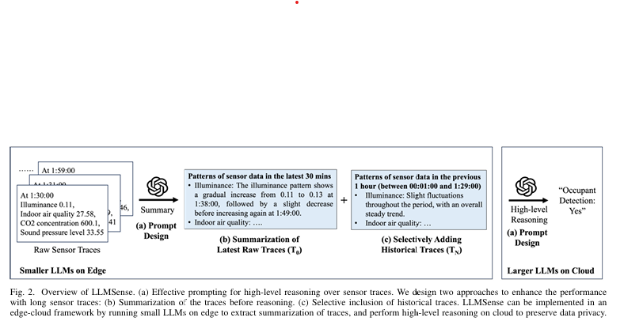
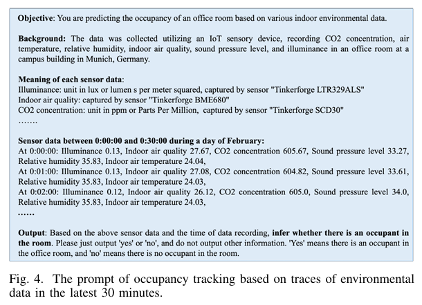

1. **문제 정의:**
   - 기존 머신러닝은 짧은 시간 내의 원시 센서 데이터를 처리하는 **저수준 인지 작업**에는 강하지만, 인간의 일상 패턴 모델링이나 점유 추적(occupancy tracking)과 같은 **고차원적 추론 작업**에는 한계가 있음.
   - 이러한 문제는 **제한된 학습 데이터**와 **센서 데이터의 높은 차원성**, 그리고 인간의 지식을 통합한 설계가 필요하다는 점에서 기인함.

2. **연구 질문:**
   - "LLMs의 추론 능력과 세계 지식을 활용하여 장기적인 시공간 센서 데이터에서 복잡한 이벤트를 인식할 수 있는가?"

3. **제안된 프레임워크:**
   - 고차원적 추론 작업을 위해 LLM에 효과적인 **프롬프트 전략** 설계.
   - 원시 센서 데이터와 저수준 인지 작업 결과를 모두 처리할 수 있도록 설계.

4. **장기 센서 데이터 처리 향상 전략:**
   - **요약 후 추론**: 센서 데이터를 요약하여 중요한 정보에 집중.
   - **선별적 과거 데이터 포함**: 중요한 과거 데이터를 선택적으로 포함해 문맥과 추론의 품질을 향상.

5. **엣지-클라우드 협력 구조:**
   - **엣지 디바이스**: 작은 LLM을 활용해 데이터를 로컬에서 요약, 개인 정보 보호 및 네트워크 효율성 향상.
   - **클라우드**: 고차원적인 추론 작업은 클라우드에서 처리.

6. **결과:**
   - 두 가지 고차원 추론 작업에서 80% 이상의 정확도 달성:
     1. 행동 데이터를 활용한 치매 진단.
     2. 환경 센서 데이터를 이용한 점유 추적(occupancy tracking).

7. **통찰과 가이드라인:**
   - LLM을 센서 데이터 기반 추론 작업에 활용하는 전략 제공.
   - 향후 연구 방향 제시:
     - 시공간 데이터를 위한 LLM 아키텍처 개선.
     - 개인 정보 보호 문제 해결.

[Paper Link](https://arxiv.org/pdf/2403.19857)

## Related Work

### **1. 센서 데이터에서의 고차원 추론**
- **필요성**:
  - 점유 추적(occupancy tracking), 인간 일상 모델링, 환경 모니터링, 에너지 관리와 같은 작업은 장기적인 센서 데이터를 기반으로 개념을 이해하고 추론해야 함.
  - 이러한 작업은 복잡한 센서 데이터를 해석하고, 도메인 지식을 통합해 예측이나 결정을 내리는 고급 추론 능력을 요구함.

- **기존 접근 방식**:
  - **머신러닝 모델 학습**: 장기적인 센서 데이터를 입력으로 사용하는 방법.
  - **기본 원칙 기반 규칙(first-principle rules)**: 저수준 인지 작업 결과를 결합하는 규칙 적용.
  - **문제점**:
    - 환경 또는 대상이 다를 경우 데이터에 대한 일반화가 잘 되지 않음.

### **2. LLM의 시계열 데이터 분석**
- **LLM의 활용 이유**:
  - 시계열 데이터와 텍스트 데이터는 구조적으로 유사함.
  - LLM은 복잡한 패턴을 학습하고 추출하는 데 강점을 보임.

- **기존 연구 사례**:
  - 시계열 데이터 예측에 LLM 활용.
  - 시간적 시퀀스 모델링 및 extrapolation 작업에서 LLM 활용.
  - LLM이 일반적인 패턴 학습 도구로 작동 가능함을 입증.

- **한계**:
  - 고차원 추론 작업에서 LLM의 효과적인 실행 방안은 아직 부족.
  - 단순히 패턴을 이해하는 것뿐만 아니라, 응용 분야에 필요한 도메인 지식을 사용해 센서 데이터를 해석해야 하는 과제가 남아 있음.

### **3. LLM의 도메인 특화 응용**
- **장점**:
  - LLM은 방대한 언어 데이터를 학습해 세계 지식(world knowledge)을 보유하고 있음.
  - 제로샷 학습(zero-shot learning)이나 파인튜닝을 통해 다양한 도메인에 적응 가능.

- **응용 사례**:
  - 활동 인식(activity recognition)
  - 클라우드 시스템에서의 근본 원인 분석(root cause analysis)
  - 의료 진단(medical diagnosis)

- **미해결 과제**:
  - LLM의 세계 지식을 활용해 장기 센서 데이터를 해석하는 구체적인 방법은 여전히 해결해야 할 과제.

## Motivation

### A. Application Scenarios

1. **스트리밍 센서 데이터를 직접 처리**:
   - **적용 상황**:
     - 센서 데이터의 **데이터 속도가 낮고**, 중간 수준의 저수준 인지 작업을 정의하기 어려운 경우.
   - **방법**:
     - 스트리밍 형태의 센서 데이터를 텍스트화(textualize)하고 구조화(structure)한 뒤 LLM에 입력.
     - 예: 환경 센서를 이용한 점유 추적(occupancy tracking) 작업에서, 센서 데이터를 텍스트로 변환하여 LLM이 문맥 기반 추론을 통해 예측을 수행.
   - **특징**:
     - 데이터의 맥락을 이해하고, 입력된 센서 데이터를 기반으로 적절한 추론 및 예측 생성 가능.

2. **저수준 인지 결과를 활용**:
   - **적용 상황**:
     - 센서 데이터의 **데이터 속도가 높아**(예: depth video), 데이터를 직접 LLM에 입력하는 것이 비효율적인 경우.
   - **방법**:
     - 기존의 머신러닝 모델을 사용해 **저수준 인지 작업**을 먼저 수행.
     - 결과를 구조화하여 LLM에 입력.
     - 예: 인지 장애(cognitive impairment) 감지 작업에서, 활동 인식(activity recognition) 결과를 기반으로 LLM이 피험자의 행동을 분석.
   - **특징**:
     - 저수준 인지 작업으로 데이터의 복잡성을 줄이고, LLM이 고차원적인 분석을 수행하도록 데이터 형태를 간소화.

### B. Advantages of leveraging LLMs

**1. LLM의 세계 지식 활용**
- **장점**:
  - LLM은 방대한 세계 및 전문가 지식을 보유하고 있어 다양한 복잡한 작업을 수행할 수 있음.
  - 예: 활동 인식(activity recognition), 근본 원인 분석(root cause analysis), 의료 진단(medical diagnosis) 등.
- **적용 사례**:
  - 행동 데이터를 기반으로 한 **인지 장애 감지** 작업에서, 치매 증상에 대한 질병 지식을 통합하여 더 나은 이해와 추론 가능.
- **의의**:
  - 센서 데이터를 기반으로 물리적 세계를 이해하고, 고차원적인 추론 작업을 수행하는 데 필요한 맥락과 배경 지식을 제공.

**2. 긴 연속 데이터 처리 능력**
- **장점**:
  - LLM은 **일반 패턴 학습자(general pattern learner)**로서 시계열 데이터 분석에서 성공적으로 활용된 사례가 있음.
  - 센서 데이터(원시 데이터 또는 저수준 예측 결과)는 물리적 세계의 연속적인 관찰 데이터로 구성.
- **적용 방법**:
  - 센서 데이터를 텍스트로 변환하면, LLM의 능력을 활용해 장기적인 센서 데이터를 이해하고 고차원적인 추론 작업 수행 가능.
- **의의**:
  - 복잡한 패턴과 연속 데이터의 구조를 이해하는 데 강점을 발휘하여, 센서 데이터로부터 유의미한 결과를 도출할 수 있음.

**3. 적은 학습 데이터로 일반화 가능**
- **문제점**:
  - 기존 머신러닝 기반 접근법은 **환경 변화**나 **다른 집단**에서 수집된 데이터에 대한 일반화가 어려움.
- **LLM의 강점**:
  - LLM은 이전에 학습한 지식을 활용하여 **새로운 사례에 대해 추론**하고, 다양한 환경에 적응 가능.
- **의의**:
  - 적은 학습 데이터로도 높은 적응성과 일반화 성능을 발휘, 다양한 설정에서 효율적인 결과를 제공.

## Design of LLM Sensse

- **목표**: 센서 데이터를 기반으로 고차원 추론을 수행하기 위한 효과적인 프롬프트 프레임워크 설계.
- **주요 특징**:
  1. **데이터 요약**: 추론 전에 센서 데이터를 요약하여 복잡성을 줄임.
  2. **선별적 과거 데이터 사용**: 역사적 데이터 중 중요한 부분만 포함하여 효율성 향상.
- **엣지-클라우드 구현**:
  - **엣지(Edge)**: 작은 LLM을 사용해 센서 데이터를 요약, 데이터 전송량 감소 및 개인 정보 보호.
  - **클라우드(Cloud)**: 고차원 추론 작업 수행.

### A. Prompt Design for High-level Reasoning on Sensor Traces

- **목적**:
  - 사전 학습된 일반-purpose LLM이 특정 고차원 추론 작업에서 우수한 성능을 발휘할 수 있도록 프롬프트를 설계.
  - **제로샷 학습(zero-shot learning)** 방식으로 설계된 포괄적인 프롬프트 활용.
  
- **프롬프트 구성 요소**:
  - 프롬프트는 다음 네 가지 요소로 구성됨: `Prompt = Objective + Context + Data + Format`

1. **Objective (목표)**:
   - LLM이 수행해야 할 작업의 지침을 제공.
   - 예: 점유 추적(occupancy tracking) 작업에서 특정 추론 목표를 명시.

2. **Context (문맥)**:
   - 작업 및 센서 데이터의 배경 정보를 포함.
   - **도메인 지식**을 주입하여, 센서 데이터를 이해하는 데 도움을 줌.
   - 예: 센서 데이터 수집 방식과 물리적 의미를 문맥 정보로 추가.

3. **Data (데이터)**:
   - 시간적(spatial-temporal) 센서 데이터 제공.
   - 예: 환경 센서 데이터를 시계열 형태로 텍스트화하여 포함.

4. **Format (형식)**:
   - LLM이 결과를 생성할 때 따라야 할 출력 형식 제공.
   - 작업의 일관성과 가독성을 높이기 위해 필수적.

### B. Dealing with Long Traces

- 센서 데이터가 길어질수록, LLM의 **컨텍스트 한계(context limit)**로 인해 성능이 저하될 수 있음.
- 긴 데이터로 인해:
  - LLM이 정보를 효과적으로 처리하기 어려움.
  - 추론 작업에 불확실성이 커질 가능성 존재.

긴 센서 데이터를 효과적으로 처리하기 위해 두 가지 접근 방식을 제안:

**1) 추론 전에 요약(Summarization before Reasoning)**
- **문제**:
  - 긴 센서 데이터(예: 2~4주 동안의 행동 관찰)는 텍스트로 변환 시 5,000개 이상의 토큰을 포함할 수 있음.
  - 이러한 대량의 데이터를 LLM에 직접 입력하면 정보 처리에 비효율적이며, 추론의 불확실성을 증가시킬 수 있음.
  
- **해결 방안**:
  - LLM의 **요약 능력**을 활용하여 먼저 센서 데이터를 요약한 후 추론을 수행.
  - **프로세스**:
    1. 첫 번째 쿼리: 주어진 기간 동안 센서 데이터 패턴 요약.
    2. 두 번째 쿼리: 요약된 데이터를 기반으로 점유 추적(occupancy tracking) 등 고차원 추론 수행.
  - **효과**:
    - 데이터를 간결하고 정보 중심적으로 변환.
    - 도메인 지식을 요약 과정에 추가하여 추론에 도움.
    - 요약된 중간 결과가 추론 과정을 더 설명 가능하게 만듦.

**2) 선택적 과거 데이터 포함(Selective Inclusion of History Traces)**
- **문제**:
  - LLM의 요약 과정에서도 **노이즈**가 발생할 가능성이 있음.
  
- **해결 방안**:
  - 과거 데이터를 **선별적으로 포함**하여, 가장 관련 있고 중요한 데이터 포인트만 통합.
  - **방법**:
    - 중요한 이벤트나 패턴을 우선적으로 선택하여 분석 초점을 좁힘.
    - 센서 데이터의 전체 기간을 다음과 같이 나눔:
      `Duration T = Latest T0 + History TN`
      - **LatestT0**: 최근 T_0 동안 수집된 원시 센서 데이터.
      - **HistoryTN**: 이전 T_N 동안 수집된 중요한 데이터 패턴.
    - 예: 최신 30분 데이터를 원시 데이터로 입력하고, 이전 6시간 데이터를 패턴 정보로 통합.

- **효과**:
  - 데이터를 요약하면서도 중요한 맥락을 보존.
  - 분석 작업을 간소화하고, 가장 의미 있는 데이터에 집중 가능.

## Results
