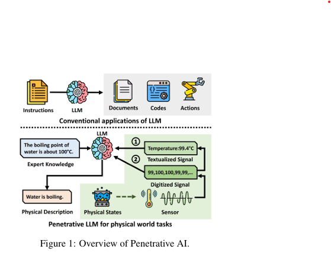
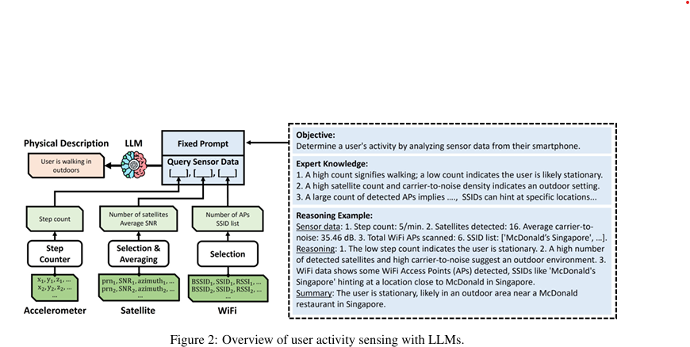
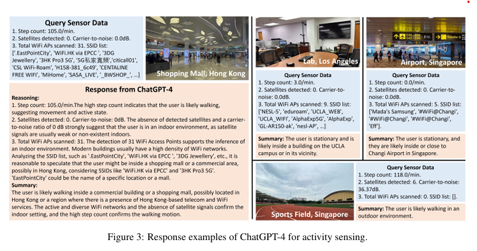
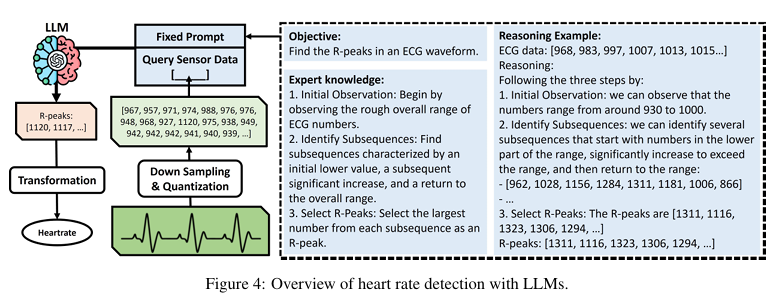

이 논문은 **대규모 언어 모델(LLMs)**이 IoT 센서와 액추에이터를 활용하여 물리적 세계와 상호작용하고 추론하는 능력을 탐구하는 내용을 담고 있습니다. 

1. **연구 배경**
   - LLMs(ChatGPT와 같은 모델 포함)은 다양한 작업에서 놀라운 성능을 보여줌.
   - 하지만 **LLMs가 물리적 세계에 대한 정보**를 처리하고, **상식적 인간 지식을 통합할 수 있는 능력**에 대한 의문은 여전히 남아 있음.

2. **연구 목표**
   - LLMs가 IoT 센서와 액추에이터를 통해 물리적 세계와 상호작용하고 추론하는 방식을 탐구.
   - 이를 **"Penetrative AI"**라는 개념으로 정의.

3. **연구 방향**
   - **물리적 세계와의 연결**:
     - LLMs가 센서 데이터를 처리하고 해석하여 물리적 작업에서 활용될 수 있는지 연구.
   - **LLMs의 고유한 세계 지식 활용**:
     - LLMs가 내재된 세계 지식을 활용하여 IoT 데이터를 이해하고 물리적 세계와 관련된 작업을 수행하는 능력 분석.

4. **주요 결과**
   - **LLMs의 강점**:
     - ChatGPT를 대표적인 사례로 삼아 실험한 결과, LLMs는 IoT 센서 데이터를 해석하고 이를 기반으로 물리적 세계의 작업을 추론하는 데 **독특하고 높은 능력**을 보여줌.
   - **새로운 응용 가능성**:
     - LLMs를 기존 텍스트 기반 작업을 넘어 물리적 세계의 IoT 데이터를 처리하고 활용하는 새로운 응용 프로그램으로 확장 가능.
   - **사이버-물리 시스템에서 인간 지식 통합**:
     - LLMs를 통해 **인간 지식**을 사이버-물리 시스템에 새로운 방식으로 통합 가능.

[Paper Link](https://arxiv.org/pdf/2310.09605)

## Penetrative LLM with Textualized Signals

- **활용 예시**: 스마트폰 센서를 이용한 **사용자 활동 감지**.
  - **입력 데이터**: 스마트폰의 가속도계, 위성(GNSS), WiFi 신호.
  - **출력 목표**: 사용자의 동작 및 주변 환경 맥락을 추론.
- **프로세스 개요**:
  - 센서 데이터를 사전 처리(pre-processing)하여 텍스트화된 상태로 변환.
  - 텍스트화된 데이터를 LLM에 제공하고 고정된 프롬프트로 추론 수행.

### An Illustrative Example

**데이터 준비 및 처리**
#### **(1) 가속도계 데이터**
- 10초간 6,000개의 가속도 데이터를 200Hz로 샘플링.
- **처리 방법**:
  - Android 내장 스텝 감지기를 사용하여 데이터 요약.
  - 예: `step count: 5/min`.

#### **(2) GNSS(위성) 데이터**
- GNSS 데이터에서 다양한 속성을 제공.
  - 예: 위성 식별자(PRN), 신호 대 잡음비(SNR) 등.
- **처리 방법**:
  - **필터링** 후 주요 속성만 선택:
    - 감지된 위성의 수.
    - 평균 SNR 값.

#### **(3) WiFi 데이터**
- **처리 방법**:
  - SSID(Service Set Identifier)와 RSSI(수신 신호 강도)만 선택.
  - RSSI가 -70 이하인 AP는 제외.
  - SSID를 분석하여 위치 관련 정보를 추출.

**LLM을 위한 프롬프트 설계**
#### **(1) 프롬프트 구성**
- **구성 요소**:
  - **목표(Objective)**: 사용자의 동작 및 환경 상태를 추론.
  - **전문가 지식(Expert Knowledge)**: 센서 패턴과 활동 상태 간 관계를 설명.
  - **추론 예시(Reasoning Examples)**:
    - 데이터 처리 과정.
    - 단계별 추론 프로세스.
    - 참조 결과 요약(체인 오브 쏘트(CoT) 방식 활용).
  - **최종 프롬프트(Final Prompt)**:
    - 자연어로 작성된 센서 데이터의 목적, 지식, 예시 포함.
    - 고정된 프롬프트를 사용하여 새로운 데이터를 지속적으로 입력.

#### **(2) 전문가 지식**
- 텍스트 기반 설명을 통해 센서 패턴과 사용자 활동 상태 간 관계를 가이드.
  - 예: **위성 신호**가 강하고 위성 개수가 많으면 야외 환경을 나타냄.

#### **(3) 추론 예시**
- LLM 성능 향상을 위해 예제 추가:
  - **데이터 예제**: 텍스트화된 센서 데이터.
  - **추론 단계**: 단계별로 데이터를 해석.
  - **결론**: 환경 상태와 활동 추론 결과 요약.

#### **(4) 고정된 프롬프트 활용**
- 프롬프트는 한 번 작성 후 고정.
- 새로운 텍스트화된 데이터를 입력하여 추론 결과 생성.

### Results

## Penetrative LLM with Digitized Signals

이 내용은 LLM을 사용하여 **ECG(심전도) 데이터를 기반으로 심박수를 감지**하는 방법을 설명합니다. 

### **1. 개요**
- **예시 작업**: LLM을 활용하여 ECG 데이터를 분석하고 **R-피크(R-peak)**를 감지.
  - **입력 데이터**: ECG 파형을 나타내는 숫자 시퀀스.
  - **목표**: R-피크(ECG 데이터의 높은 상승 신호)를 찾아 심박수를 계산.
- **주요 차별점**: 기존 텍스트 데이터와 달리, 모든 센서 데이터가 **디지털화된 숫자 시퀀스** 형태로 제공.

### **2. 작업 목표 및 근거**
- **목표**:
  - LLM에게 "ECG 데이터에서 R-피크를 찾는 작업"을 수행하도록 요청.
- **근거**:
  - R-피크는 심전도에서 가장 높은 상승 신호로, 심장의 전기적 활동 중 **심실의 탈분극**(QRS 컴플렉스)을 나타냄.

### **3. 데이터 준비**
- **데이터 특성**:
  - 원시 ECG 데이터는 360Hz로 수집되어 높은 샘플링 비율을 가짐.
- **사전 처리**:
  - 데이터를 72Hz로 다운샘플링하고, 정수값으로 양자화(quantization)하여 데이터 시퀀스의 길이와 복잡성을 줄임.

### **4. 전문가 지식 통합**
- **프롬프트 내 전문가 지식**:
  - QRS 컴플렉스의 구조와 R-피크의 특성을 상세히 설명.
  - 예: 
    - "QRS 컴플렉스는 심장의 심실 탈분극을 나타내며, Q 파는 하강, R 파는 상승, S 파는 하강 신호를 포함. R-피크는 R 파의 최대 진폭."
- **LLM에 신호 처리 위임**:
  - 신호 처리의 일부를 LLM이 수행하도록 프롬프트에 명시적 지침 포함.

### **5. R-피크 감지 절차**
- R-피크 감지를 위해 LLM이 이해할 수 있는 절차를 설계:
  1. **ECG 데이터 범위 평가**:
     - 전체 ECG 데이터의 숫자 범위를 확인.
  2. **하위 시퀀스 식별**:
     - 낮은 값에서 시작 → 큰 상승 → 원래 범위로 복귀하는 특징적인 하위 시퀀스 찾기.
  3. **R-피크 선택**:
     - 각 하위 시퀀스에서 **최대 값**을 R-피크로 선택.
- **모호한 로직 처리**:
  - 명확한 임계값 없이 **패턴 기반 추론**을 수행하도록 설계.

### **6. 추론 예제 제공**
- LLM의 성능을 향상시키기 위해 예제 포함:
  - **ECG 데이터**: 디지털화된 숫자 시퀀스.
  - **추론 절차**: 단계별로 데이터 분석 과정 설명.
  - **결론**: R-피크 위치와 해당 값 요약.

### **7. 결과 및 관찰**
- **성공적인 부분**:
  - LLM이 R-피크 감지를 위한 패턴을 어느 정도 이해하고 적용 가능.
- **도전 과제**:
  - 긴 ECG 데이터 시퀀스를 처리할 때, 단순한 R-피크 설명만으로는 한계 발생.
  - **개선 방안**:
    - 패턴 기반 추론 절차 설계.
    - 더 많은 예제와 전문가 지식을 포함하여 정확도를 높임.

## Digital Data as a Figure
이 내용은 **Penetrative AI**의 개념을 확장하여 **Vision-Language Models (VLMs)**를 활용해 디지털화된 센서 데이터를 시각적으로 처리하고 실제 작업을 수행하는 방식을 탐구합니다. 

### **1. VLM을 활용한 ECG R-피크 감지**
#### **(1) 연구 개요**
- **VLM 정의**:
  - Vision-Language Models(VLMs): 시각적 입력(이미지)과 언어적 입력을 결합해 처리할 수 있는 모델.
  - 대표 모델: CLIP(Radford et al., 2021), ALIGN(Jia et al., 2021), LXMERT(Lu et al., 2019), UNITER(Tan and Bansal, 2019).
  
- **목표**:
  - ECG 데이터를 시각적으로 변환하여 VLM에 입력하고 **R-피크의 좌표를 감지**.
  - VLM을 통해 ECG 데이터의 R-피크를 시각적으로 처리하고, 이를 기반으로 심박수를 계산.

#### **(2) 데이터 처리 흐름**
1. **ECG 데이터 시각화**:
   - ECG 데이터를 그래프로 변환(예: 시간-전압 축으로 플롯).
2. **VLM 입력**:
   - 시각화된 ECG 데이터를 VLM에 입력.
3. **작업 지시**:
   - R-피크를 감지하고 해당 좌표를 식별하도록 작업 요청.

### **2. 프롬프트 및 전문가 지식**
#### **(1) 기본 프롬프트**
- R-피크의 정의와 일반적인 설명을 제공:
  - 예: "R-피크는 ECG 데이터에서 가장 높은 상승 신호를 나타내며, QRS 컴플렉스의 일부입니다."

#### **(2) 상세 절차 제공**
- 일부 실험에서는 R-피크 감지 과정을 상세히 설명한 프롬프트 사용.
- **추론 예제 포함**:
  - 참고 ECG 그래프와 함께 R-피크 감지 방법을 단계별로 설명.

### **3. 연구 방법 및 테스트**
#### **(1) 연구 방법**
- **VLM 활용**:
  - GPT-4V(OpenAI, 2023a)와 같은 최신 VLM을 사용하여 시각적 인식 작업 수행.
- **작업**:
  - 시각화된 ECG 데이터를 분석하여 R-피크 좌표 감지.
  - 감지된 R-피크를 기반으로 심박수 계산.

#### **(2) 테스트 프롬프트**
- 다양한 프롬프트 스킴(prompt schemes) 비교:
  - 기본적인 R-피크 설명만 포함된 프롬프트.
  - 추가적인 세부 절차와 예제가 포함된 프롬프트.

### **4. 연구 결과 및 기대**
- **VLM의 가능성**:
  - VLM이 ECG 데이터를 시각적으로 분석하고, R-피크를 정확히 감지할 수 있는 가능성 탐구.
  - Perceptual Task(시각적 인식 작업) 수행 능력 평가.
- **추가 연구 필요**:
  - 시각적 데이터와 언어적 지식을 결합한 작업에서 VLM의 성능 및 효율성 최적화.

## Penetrative AI
이 내용은 **Penetrative AI**라는 새로운 개념을 제안하며, 대규모 언어 모델(LLMs)을 IoT 센서 및 액추에이터와 통합하여 물리적 세계와 상호작용하고 이해하는 방식을 탐구합니다. 

### **1. Penetrative AI의 개념**
- **정의**:
  - **Penetrative AI**는 LLM의 **내재된 세계 지식**과 **IoT 센서 및 액추에이터**를 통합하여 물리적 세계에서 작업을 수행하고 이해하는 AI 시스템.
  
- **주요 특징**:
  1. **LLM의 세계 지식 활용**:
     - LLM이 사전에 학습한 방대한 세계 지식을 기반으로, 추가적인 태스크 지식이나 데이터 없이도(제로샷 또는 몇 샷 학습) 물리적 현상을 분석.
  2. **IoT 센서 및 액추에이터 통합**:
     - 센서를 통해 물리적 세계를 인식하고, 액추에이터를 통해 물리적 세계에 개입.
  3. **물리적 세계와의 직접적 연결**:
     - 단순히 센서 데이터를 처리하는 데 그치지 않고, 물리적 현상에 대한 추론과 이해를 포함.

### **2. Penetrative AI의 범위**
- **기존 접근법과의 차이점**:
  - 기존 LLM 활용 방식:
    - NLP 작업 중심.
    - 센서 데이터를 직접적으로 이해하지 않음.
    - CPS(사이버-물리 시스템)에서 제한적인 역할 수행.
  - **Penetrative AI**:
    - LLM의 세계 지식을 직접 활용해 센서 입력과 CPS 제어를 통합.
    - 물리적 세계의 현상에 대한 심층적인 이해 및 추론 가능.

### **3. Penetrative AI의 잠재력**
#### **(1) 솔루션 배포의 간소화**
- **자연어 인터페이스**:
  - 복잡한 프로그래밍 기술 없이 자연어를 통해 사용자-기계 상호작용 가능.
- **적은 프로그래밍 필요**:
  - 사용자가 직접 코딩하지 않고도 LLM을 활용하여 물리적 문제를 해결 가능.

#### **(2) 데이터 효율성**
- **효율적인 일반화**:
  - LLM은 내재된 세계 지식을 활용해 새로운 작업으로의 적응이 용이.
  - 데이터가 부족한 환경에서도 효과적으로 동작.

#### **(3) 모호한 논리 처리**
- **모호한 정보 처리 능력**:
  - 정밀한 논리가 없어도 불확실하거나 구조화되지 않은 데이터를 기반으로 추론 가능.

#### **(4) 멀티모달 융합**
- **다양한 데이터 형식 통합**:
  - 여러 유형의 데이터를 **텍스트 기반 통일 형식**으로 변환.
  - 추가적인 모델 재설계 없이 다양한 작업에 적용 가능.

### **4. 기대 효과**
- **작업 효율성 향상**:
  - 새로운 데이터나 태스크 지식 없이도 빠르게 문제 해결.
- **사용자 친화적 설계**:
  - 자연어 인터페이스를 통해 접근성을 높임.
- **유연한 응용 가능성**:
  - 센서 네트워크, 스마트홈, 헬스케어, 로봇 시스템 등 다양한 도메인에 적용 가능.

