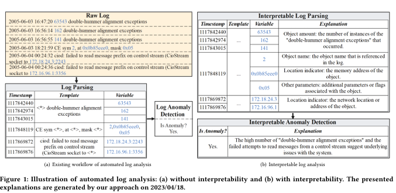
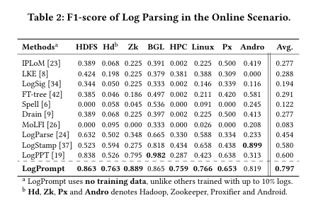
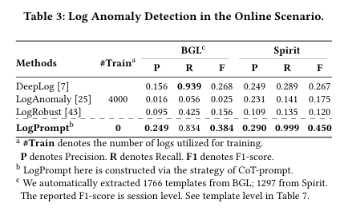

이 논문은 **로그 분석(Log Analysis)**의 해석 가능성과 성능을 개선하기 위해 제안된 **LogPrompt**라는 새로운 접근 방식을 소개합니다.

- **로그 분석의 중요성**:
  - 소프트웨어 유지보수와 엔지니어링 생명주기에서 **로그 분석**은 프로그램 상태 이해와 문제 해결에 중요한 역할을 함.
  
- **기존 방법의 한계**:
  1. **해석 가능성 부족**:
     - 기존 방법은 단일 예측 값만 제공하며, 결과를 해석하기 어려움.
     - 이로 인해 시스템 상태를 이해하거나 적절한 조치를 취하는 데 한계가 있음.
  2. **도메인 의존성**:
     - 기존 모델은 대량의 도메인 특화 데이터로 학습해야 함.
     - 새로운 도메인이나 소프트웨어 업데이트로 인한 **미지의 로그(Unseen Logs)** 환경에서 성능이 크게 저하(최대 62.5%)됨.

- **LogPrompt 개요**:
  - **대규모 언어 모델(LLMs)**을 활용하여 온라인 로그 분석을 수행하는 새로운 접근 방식.
  - **프롬프트 전략**:
    - 로그 분석 작업에 최적화된 고급 프롬프트 설계를 통해, 단순 프롬프트 대비 LLM의 성능을 최대 **380.7%** 향상.


- 성능 평가
    - **데이터셋**:
    - 9개의 공개 데이터셋에서 테스트 수행.
    - **작업**:
        - 로그 파싱(Log Parsing).
        - 로그 이상 탐지(Log Anomaly Detection).
    - **결과**:
    - 기존 모델(수천 개의 로그로 학습된 모델)을 최대 **55.9%** 능가.
    - **추가 학습 없이도** 새로운 도메인에서도 높은 성능 유지.

- 해석 가능성 평가
    - **전문가 평가**:
    - 10년 이상의 경험을 가진 6명의 전문가가 LogPrompt의 출력물을 평가.
    - **평가 결과**:
        - 유용성 및 가독성 면에서 평균 **4.42/5**의 높은 점수를 받음.


- **오픈 소스 및 소규모 LLM과 호환**:
  - LogPrompt는 오픈 소스 및 소규모 LLM과도 높은 호환성을 보임.
  - 실용적인 배포 환경에서의 유연성을 확보.

[Paper Link](https://arxiv.org/pdf/2308.07610)  
[Code Link](https://github.com/lunyiliu/LogPrompt)

## Design of logprompt

### 1. Motivation



이 섹션은 **LogPrompt**의 개발 동기를 설명하며, 기존 로그 분석 방법의 한계를 극복하기 위한 필요성을 강조합니다. 

#### **(1) 해석 가능성 부족**
- **문제점**:
  - 기존 로그 분석 방법은 단순한 예측 값(예: Yes/No)만 제공하며, 충분한 설명이나 의미를 포함하지 않음.
  - 이는 특히 새로운 로그를 처리하거나 온라인 환경에서 작업할 때, 분석가가 결과를 이해하고 검증하는 데 어려움을 초래.
  
- **예시**:
  - **기존 방식**: 로그에서 변수 위치를 식별하거나 이상 탐지를 단순히 Yes/No로 응답.
  - **LogPrompt의 방식**: 변수의 의미를 설명(예: "141"은 "double-hummer 예외의 발생 횟수")하고, 이상 원인(예: "control stream에서 읽기 시도 실패")을 명확히 해석하여 신뢰성을 제공.

#### **(2) 데이터 효율성 부족으로 인한 낮은 적응력**
- **현대 로그 환경의 특징**:
  - 다양한 도메인에서 생성된 **형식과 용어가 다른 이질적인 로그**.
  - 소프트웨어 업데이트로 새로운 로그 이벤트가 지속적으로 등장.
  
- **기존 방법의 문제점**:
  - **대량의 레이블된 데이터**가 필요하며, 새로운 로그 이벤트가 등장할 때 성능이 급격히 저하.
  - 예:
    - **로그 데이터 부족 시 성능 저하**: 학습 데이터가 10% 이하로 제한될 경우, 기존 모델의 성능(F1-score)이 0.88에서 0.33으로 감소(LogRobust).
    - 새로운 로그를 처리하기 위해 **지속적인 재학습** 또는 **처음부터 재학습**이 필요.
  
- **필요성**:
  - 새로운 로그를 레이블링하거나 대규모 학습 없이도 분석할 수 있는 로그 분석 방법이 필요.

#### **(3) 프롬프트 전략의 중요성**
- **LLM 활용 가능성**:
  - ChatGPT와 같은 LLM은 강력한 언어 이해 능력을 바탕으로 **해석 가능한 온라인 로그 분석**에 적합.
  
- **문제점**:
  - 단순한 프롬프트 사용 시 성능이 낮음.
  - 예:
    - 단순 프롬프트로 ChatGPT를 테스트한 결과, 이상 탐지에서 F1-score가 0.189에 불과.
    - **프롬프트 전략 개선**으로 F1-score를 0.195 향상.
    - 로그 파싱에서는 프롬프트에 따라 성능 차이가 최대 **380.7%**까지 발생.
  - 잘못된 프롬프트는 부정확한 결과나 유효하지 않은 내용(예: 환각)을 생성할 위험.

- **해결 방안**:
  - **작업별 맞춤형 프롬프트 설계**:
    - 태스크 특화 프롬프트로 최소한의 노력으로 다양한 로그 분석 문제 해결 가능.


### 2. Overview of LogPrompt

LogPrompt는 **온라인 로그 분석**에서 **정확성**과 **해석 가능성**을 개선하기 위해 LLM을 효과적으로 활용하는 프롬프트 전략을 제공합니다. 

#### **1. LogPrompt의 주요 목표**
- **로그 분석의 정확성과 해석 가능성 향상**:
  - LLM의 강력한 언어 처리 능력을 활용하여 로그 데이터를 분석.
  - 프롬프트 설계를 통해 결과의 **불확실성 감소**와 **명확한 해석 제공**.
- **온라인 환경에 최적화**:
  - 새로운 로그 데이터를 처리하며, 도메인 특화 학습 없이도 안정적인 성능 유지.

#### **2. LogPrompt의 프롬프트 구성 방식**
##### **(1) 입력 로그의 표준화**
- **입력 로그 형식 설정**:
  - 로그 데이터를 표준화된 형식으로 변환하여 일관성 유지.
  - **입력 슬롯 [X]**와 **출력 형식 [Z]**를 설정하여 LLM의 응답 불확실성을 줄임.

##### **(2) 프롬프트 전략 설계**
- **프롬프트 구조**:
  - **프롬프트 접두어(prompt prefix)**:
    - LLM이 작업을 효율적으로 이해하고 처리할 수 있도록 프롬프트의 초반에 추가 정보 제공.
  - 최종 프롬프트는 **프롬프트 접두어 + 입력 슬롯 + 출력 슬롯**을 결합하여 완성.
  - 결과 응답은 LLM에서 생성.


#### **3. 프롬프트 전략의 세 가지 접근 방식**
##### **(1) Self-Prompt**
- **설명**:
  - LLM 자체의 내재된 언어 처리 능력을 활용하여 적합한 프롬프트를 생성.
- **목표**:
  - 최소한의 외부 지식으로도 LLM이 적절한 로그 분석 결과를 생성하도록 유도.
- **적용**:
  - 간단한 작업에 적합.

##### **(2) Chain-of-Thought (CoT) Prompt**
- **설명**:
  - 단계별(reasoning step-by-step)로 문제를 해결하도록 LLM을 유도.
  - 중간 단계를 명시적으로 또는 암시적으로 포함하여 체계적인 추론 과정 강조.
- **목표**:
  - 복잡한 로그 분석 작업(예: 이상 탐지)에서 **체계적이고 설명 가능한 결과 제공**.
- **적용**:
  - 다단계 논리적 추론이 필요한 작업에 적합.

##### **(3) In-Context Prompt**
- **설명**:
  - 로그 분석 작업과 관련된 **다수의 예제**를 제공하여 LLM이 작업 문맥을 이해하도록 지원.
- **목표**:
  - 예제 기반 학습을 통해 **작업 특화된 문맥을 구축**.
- **적용**:
  - 도메인 특화 로그 분석이나 새로운 작업을 처리할 때 효과적.


#### **4. 실험 결과**
- 세 가지 프롬프트 전략을 테스트하여 각 접근 방식의 성능을 비교.
- **결과**:
  - Self-prompt는 간단한 작업에서 성능이 우수.
  - CoT는 복잡한 작업에서 정확성과 해석 가능성을 높임.
  - In-context는 새로운 도메인에서도 높은 성능을 유지.

### 3. Format Controls

이 내용은 **LogPrompt**에서 변동으로 인한 전송 오류를 완화하고, 입력 및 출력 형식의 일관성을 보장하기 위해 **입력 및 출력 제어 함수**를 활용하는 방법을 설명합니다.

- **인터넷 변동으로 인한 문제**:
  - API 호출 시(LMM 호출, 예: ChatGPT), 인터넷 불안정성으로 인해 전송 실패가 발생.
  - 이를 완화하기 위해 **한 번의 쿼리에서 허용 가능한 길이**까지 여러 입력 로그를 [X] 슬롯에 삽입.

- **프롬프트 형식 문제**:
  - 초기 실험에서 형식 제어가 없는 프롬프트는 다음과 같은 문제를 초래:
    1. 로그 누락.
    2. 형식 불일치.
    3. 관련 없는 내용 포함.


- **해결 방안: 제어 함수 𝑓𝑥([X])와 𝑓𝑧([Z])**
#### **(1) 입력 제어 함수: 𝑓𝑥([X])**
- **목적**:
  - 여러 입력 로그를 명확하고 일관된 형식으로 구성.
- **구조**:
  - 입력 로그를 번호로 구분하여 각 로그를 명시적으로 나열.
  - 형식:
    ```plaintext
    There are N logs, the logs begin:
    (1) [X]1
    (2) [X]2
    ...
    (N) [X]N
    ```
- **효과**:
  - 로그를 명확히 구분하여 LLM이 각 로그를 개별적으로 처리할 수 있도록 보장.

#### **(2) 출력 제어 함수: 𝑓𝑧([Z], 𝑆)**
- **목적**:
  - 출력 결과의 형식을 표준화하여 일관성을 유지.
- **구조**:
  - 출력 슬롯 [Z]에 **결과 형식과 값 범위**를 명시.
  - 형식:
    ```plaintext
    Organize your answer to be the following format:
    (1) x-y
    (2) x-y
    ...
    (N) x-y, where x is S and y is the reason.
    ```
  - **S**: 원하는 출력 값의 범위를 설명하는 문자열.
    - 예:
      - 이상 탐지: `"a binary choice between abnormal and normal"`.
      - 로그 파싱: `"a parsed log template"`.

- **효과**:
  - LLM의 응답을 정해진 형식에 맞춰 생성.
  - 입력 로그와 연관된 구체적인 결과를 보장.

- **활용 사례**
    - **이상 탐지**:
    - 입력 로그:
        ```plaintext
        There are 3 logs, the logs begin:
        (1) [X]1
        (2) [X]2
        (3) [X]3
        ```
    - 출력 형식:
        ```plaintext
        Organize your answer to be the following format:
        (1) abnormal - due to high error rate
        (2) normal - no anomalies detected
        (3) abnormal - due to memory overflow
        ```

    - **로그 파싱**:
    - 입력 로그:
        ```plaintext
        There are 2 logs, the logs begin:
        (1) [X]1
        (2) [X]2
        ```
    - 출력 형식:
        ```plaintext
        Organize your answer to be the following format:
        (1) parsed template - [variable details]
        (2) parsed template - [variable details]
        ```

### 4. Prompt Strategies

#### **Self-Prompt 전략 요약**

- **목표**: 
  - LLM이 로그 분석 작업을 효율적으로 수행하도록 최적의 프롬프트를 생성 및 선택.
- **아이디어**:
  - LLM(ChatGPT)에게 **적합한 프롬프트 후보**를 직접 생성하도록 요청.
  - 후보 프롬프트를 소규모 로그 데이터셋에서 테스트하고, 성능 지표를 기반으로 최적의 프롬프트를 선택.

##### **(1) 프롬프트 후보 생성**
- **프롬프트 요청**:
  - LLM에 **정확한 작업 설명과 출력 요구사항**을 제공하여 다수의 프롬프트 후보(𝐶)를 생성.
  - 예: 로그 파싱 작업에 대해 적합한 프롬프트 작성 요청.
  
##### **(2) 후보 프롬프트 평가**
- **데이터셋 사용**:
  - 소규모 작업별 로그 데이터셋(예: Android 데이터셋)에서 프롬프트 후보 테스트.
  - Android 데이터셋은 가장 많은 로그 템플릿을 포함하고 있어 적합한 테스트 환경 제공.
- **평가 지표**:
  - 성능 지표 𝑠(𝑝): **Rand Index**와 **F1-score**의 평균.
  - 프롬프트 성능에 따라 점수 부여 및 순위화.

##### **(3) 최적 프롬프트 선택**
- **최적 프롬프트**:
  - 가장 높은 성능 점수를 받은 프롬프트를 최종적으로 선택.

- **프롬프트 특성**:
  - 더 **정확한 언어**와 **단계별 지침**을 포함한 프롬프트가 더 높은 성능을 보임.
  - 예:
    - 프롬프트 2는 "standardized", "convert"와 같은 정확한 단어를 사용하며, 중간 단계(변수 식별 → 변환)를 명확히 제시.
    - 프롬프트 5는 이런 세부적인 지침이 부족해 성능이 저하.

#### **CoT Prompt (Chain of Thought Prompt)**

- **정의**:
  - CoT(Chain of Thought)는 **중간 추론 단계**를 통해 복잡한 문제를 해결하도록 설계된 프롬프트 전략.
  - LLM이 논리적인 답변을 생성하도록 **명시적** 또는 **암묵적**으로 추론 과정을 유도.

- **기존 문제**:
  - 단순 프롬프트를 사용할 경우, LLM은 환각(hallucination) 같은 잘못된 내용을 기반으로 이상을 보고하거나 잘못된 결론을 내릴 가능성이 있음.
  - 예:
    - 문자열 "0x00000000"을 잘못된 메모리 접근으로 간주.
    - 정보 부족 상황에서 데이터를 비정상적으로 삭제된 것으로 추정.

- **해결 목표**:
  - LLM이 잘못된 논리로부터 벗어나도록 **중간 추론 단계를 제어**.
  - 명확한 지침을 통해 비논리적인 응답 생성 방지.

##### **(1) 암묵적 추론 유도**
- **방법**:
  - **각 응답에 이유를 요청**하여 LLM이 논리적 추론 과정을 암묵적으로 재현.
- **의도**:
  - LLM이 학습 데이터(위키, 책 등)에서 습득한 논리 체인을 기억하고, 이를 바탕으로 합리적인 답변 생성.
- **효과**:
  - 논리적이고 신뢰할 수 있는 답변 제공.

##### **(2) 명시적 추론 단계 정의**
- **방법**:
  - 프롬프트에서 **중간 단계**를 명확히 정의하여, 논리적인 판단 과정을 가이드.
  - 예: 이상 탐지 작업에서의 단계:
    1. 메모리 주소, 부동 소수점 값, 레지스터 값 등이 **유효하지 않으면 정상**으로 표시.
    2. 정보가 부족할 경우 **정상**으로 표시.
    3. `⟨∗⟩`(와일드카드)와 누락된 값은 **비정상 패턴으로 간주하지 않음**.
    4. **이상이 명시적으로 표현된 경우**에만 비정상으로 표시(예: "error" 또는 "interrupt"와 같은 키워드).

- **이상 탐지 작업용 CoT 프롬프트**:
  ```plaintext
  Classify the given log entries into normal and abnormal categories. Do it with these steps:
  (a) Mark it normal when values (such as memory address, floating number and register value) in a log are invalid.
  (b) Mark it normal when lack of information.
  (c) Never consider ⟨∗⟩ and missing values as abnormal patterns.
  (d) Mark it abnormal when and only when the alert is explicitly expressed in textual content (such as keywords like error or interrupt).
  Concisely explain your reason for each log.
  ```
- **구조**:
  - **입력 제어 함수** (𝑓𝑥([X])): 입력 로그를 명확히 나열.
  - **출력 제어 함수** (𝑓𝑧([Z], 𝑆𝑎)): 응답을 "정상" 또는 "비정상"으로 정리하며, 이유를 추가.

#### **In-Context Prompt**

- **정의**:
  - **In-context learning**: 몇 개의 레이블이 포함된 예제를 프롬프트에 포함하여, 새로운 작업의 문맥을 형성하고 LLM이 추론을 통해 입력 데이터를 처리.
  - **특징**:
    - 추가적인 모델 학습(파라미터 업데이트) 없이 작업에 적응 가능.
    - 온라인 환경에서 효율적으로 사용 가능.

- **작동 원리**:
  - 프롬프트에 레이블이 포함된 로그 데이터를 제공하여 작업 문맥을 생성.
  - 제공된 문맥을 바탕으로 LLM이 입력된 새 로그를 처리하고 결과를 예측.


##### **(1) 이상 탐지**
- **구성 요소**:
  - **레이블된 로그 예제**:
    - 정상/비정상 로그와 해당 카테고리(0 = 정상, 1 = 비정상)를 포함.
  - **문맥 형성**:
    - 제공된 레이블 예제를 통해 LLM이 작업 문맥(이상 탐지)을 학습.
  - **프롬프트 형식**:
    ```plaintext
    Classify the given log entries into 0 and 1 categories based on semantic similarity to the following labelled example logs:
    (1) Log: L1 Category: 1
    (2) Log: L2 Category: 0
    ...
    (m-1) Log: Lm-1 Category: 1
    (m) Log: Lm Category: 0
    ```

##### **(2) 로그 파싱**
- **구성 요소**:
  - **로그-템플릿 페어**:
    - 로그와 해당 템플릿이 포함된 예제.
  - **문맥 형성**:
    - LLM이 로그 템플릿 구조를 이해하도록 도움.
  - **프롬프트 형식**:
    - 이상 탐지와 동일한 구조에서, 템플릿과 레이블을 추가.

##### **(3) 제어 함수**
- 입력 제어 함수 (𝑓𝑥)와 출력 제어 함수 (𝑓𝑧)를 사용하여 입력 로그와 출력 형식을 명확히 정의.
- **출력 값 범위**:
  - 예:
    - 이상 탐지: 𝑆𝑐 = "a binary choice between 0 and 1".
    - 로그 파싱: 위에서 정의한 템플릿.

- 이상 탐지 예제
    - **프롬프트 예**:
    ```plaintext
    Classify the given log entries into 0 and 1 categories based on semantic similarity to the following labelled example logs:
    (1) Log: "Error in module X" Category: 1
    (2) Log: "System initialized successfully" Category: 0
    ...
    (5) Log: "Memory overflow detected" Category: 1
    ```
    - **LLM의 역할**:
    - 제공된 레이블 예제를 바탕으로 입력 로그를 비정상(1) 또는 정상(0)으로 분류.

- 로그 파싱 예제
    - **프롬프트 예**:
    ```plaintext
    Parse the given logs into templates based on the following labelled examples:
    (1) Log: "User login from IP 192.168.1.1" Template: "User login from IP <IP>"
    (2) Log: "File uploaded by user123" Template: "File uploaded by <User>"
    ...
    ```
    - **LLM의 역할**:
    - 로그를 템플릿 구조로 변환.

## Evaluation
- Anomaly Detection: DeepLog, LogAnomaly, LogRobust.
- LogParsing Comparison: LogPPT, Logstamp, LogParse, LogSig, Spell, IPLoM, Drain, FT-tree, MoLFI, LKE.


