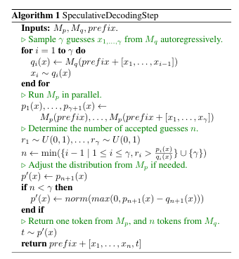

# Fast Inference from Transformers via Speculative Decoding

이 논문은 대규모 자가회귀(autoregressive) 모델, 예를 들어 Transformers와 같은 모델의 추론 속도를 개선하기 위한 새로운 방법인 **Speculative Decoding**을 제안합니다. 논문의 주요 내용을 간단히 정리하면 다음과 같습니다:

**문제점**
- **자가회귀 모델의 느린 디코딩 속도**: 
  - 자가회귀 모델은 K개의 토큰을 생성하려면 K번의 순차적인 모델 실행이 필요합니다.
  - 이는 디코딩이 병렬화되지 못하고 시간이 많이 걸리는 문제를 야기합니다.

**해결책: Speculative Decoding**
- **Speculative Decoding**은 **병렬적으로 여러 토큰을 생성**하면서도 **출력 분포에 변화가 없는** 빠른 추론을 가능하게 하는 알고리즘입니다.

 **핵심 아이디어**
1. **복잡한 작업은 더 단순한 서브태스크로 분해 가능**:
   - 어려운 언어 모델링 작업에는 더 간단하고 계산 효율적인 모델로 근사할 수 있는 쉬운 하위 작업이 포함되어 있습니다.
   - 이러한 단순 모델(근사 모델)을 활용하여 빠르게 초기 결과를 생성합니다.

2. **Speculative Execution과 새로운 샘플링 기법**:
   - 근사 모델의 출력을 바탕으로 정확한 모델(대규모 자가회귀 모델)을 병렬적으로 실행하여 여러 토큰을 동시에 생성합니다.
   - 결과적으로 분포를 변경하지 않으면서 병렬화를 통해 속도를 개선합니다.

**장점**
- **기존 모델과의 호환성**:
  - 기존의 사전 학습된 모델을 **재학습(retraining)**하거나 **아키텍처 변경** 없이 바로 적용할 수 있습니다.
- **속도 향상**:
  - 논문에서는 T5-XXL 모델에 Speculative Decoding을 적용하여 기존 T5X 구현 대비 **2배에서 3배 빠른** 추론 속도를 달성했다고 보고합니다.
  - 출력은 기존 방식과 **완전히 동일**합니다.

[Paper Link](https://arxiv.org/pdf/2211.17192)

## Speculative Decoding

### 1. Overview
이 부분은 **Speculative Decoding** 알고리즘이 어떻게 더 작은 근사 모델 M_q을 활용해 더 큰 목표 모델 M_p의 추론 속도를 가속화하는지 설명하고 있습니다. 이해하기 쉽게 요약하면 다음과 같습니다:

#### **핵심 개념**
1. **목표 모델 (M_p)**:
   - 우리가 원래 사용하려는 대규모 모델입니다. (예: T5-XXL)
   - 이 모델은 `p(x_t | x_{<t})`라는 조건부 확률 분포를 통해 x_t 라는 다음 토큰을 생성합니다.
   - 하지만 이 모델은 계산이 매우 복잡하고 느립니다. K개의 토큰을 생성하려면 K번 순차적으로 실행해야 합니다.

2. **근사 모델 (M_q)**:
   - 목표 모델보다 가볍고 효율적인 모델입니다.
   - 목표 모델과 동일한 작업을 수행하지만, 단순화된 방식으로 `q(x_t | x_{<t})`라는 분포를 예측합니다.
   - 이 모델은 빠르게 여러 개의 토큰을 예측할 수 있습니다.

#### **알고리즘 동작 방식**
1. **근사 모델로 토큰 예측**:
   - 근사 모델 (` M_q `)을 사용해 한 번에 ` \gamma `개의 토큰을 예측합니다. (` \gamma `는 병렬 처리를 최적화하기 위한 매개변수로, 적절히 선택됩니다.)
   - 이 단계는 매우 빠르게 진행됩니다.

2. **목표 모델로 검증**:
   - 목표 모델 (` M_p `)이 근사 모델이 생성한 ` \gamma `개의 토큰에 대해 확률 값을 계산합니다.
   - 근사 모델이 생성한 토큰이 목표 모델과 동일한 분포를 따르는 경우, 해당 토큰들을 "수락"합니다.
   - **병렬 처리**를 통해 이 과정을 빠르게 수행합니다.

3. **거부된 토큰 처리**:
   - 만약 근사 모델의 결과가 목표 모델의 분포와 일치하지 않는 경우, 목표 모델이 새로운 분포를 기반으로 추가 토큰을 생성합니다.
   - 이를 통해 거부된 토큰을 수정하거나 추가 토큰을 생성합니다.

4. **효율성 보장**:
   - 최악의 경우에도 목표 모델의 실행 횟수는 일반적인 자가회귀 방법보다 많지 않습니다.
   - 최적의 경우, 근사 모델의 성능이 좋으면 한 번의 병렬 처리로 여러 개의 토큰(` \gamma + 1 `)을 생성할 수 있습니다.

#### **장점**
- 근사 모델이 목표 모델의 작업 일부를 빠르게 처리하기 때문에, 전체 추론 속도가 **크게 향상**됩니다.
- 목표 모델이 근사 모델의 출력을 검증하므로 결과의 **정확도는 유지**됩니다.
- 최악의 경우에도 일반적인 자가회귀 방식과 동일한 성능을 보장하며, 최적의 경우에는 훨씬 더 빠릅니다.

### 2. Standardized Sampling

이 부분에서는 언어 모델에서 사용하는 다양한 샘플링 방법들을 하나의 **통합된 프레임워크**로 표현할 수 있음을 설명하고 있습니다.

#### **샘플링 방법들**
언어 모델에서 다음 토큰을 생성할 때 사용하는 다양한 샘플링 방법들이 있습니다:
- **argmax**: 확률이 가장 높은 토큰만 선택.
- **top-k 샘플링**: 확률이 높은 ` k `개의 후보 중에서 선택.
- **nucleus 샘플링 (top-p)**: 누적 확률이 ` p ` 이상이 되는 후보들 중에서 선택.
- **온도 설정 (temperature)**: 확률 분포를 부드럽게 조정하거나 더 뾰족하게 만들어 샘플링.

이 샘플링 방법들은 일반적으로 모델의 출력인 **로짓(logit)** 값에 대해 각각 다르게 동작합니다.

#### **모든 샘플링을 확률 분포로 통합 가능**
논문은 이 모든 샘플링 방법을 하나의 표준적인 확률 분포 샘플링으로 통합할 수 있다고 주장합니다:
- 예를 들어, **argmax 샘플링**은 확률 분포에서 가장 큰 값을 제외한 나머지 값들을 0으로 만든 다음, 이를 정규화(normalize)한 것과 동일합니다.
- 다른 샘플링 방법들(top-k, nucleus 등)도 **분포를 조정한 뒤 확률 분포에서 샘플링**하는 방식으로 표현할 수 있습니다.

#### **표준화된 샘플링 가정**
- **` p(x) `**와 **` q(x) `**:
  - ` p(x) `: 대규모 모델 ` M_p `에서 나오는 확률 분포.
  - ` q(x) `: 근사 모델 ` M_q `에서 나오는 확률 분포.
- 논문에서는 이후 논의에서 샘플링 방법에 따라 조정된 확률 분포를 ` p(x) `와 ` q(x) `로 가정합니다.
  - 즉, 어떤 샘플링 방법을 쓰더라도 이를 **조정된 확률 분포에서 샘플링**하는 문제로 통합해서 다룹니다.

### 3. Specuulative Decoding

Speculative Decoding은 다음과 같은 과정을 통해 **빠르게 샘플링**하면서도 **결과의 정확도를 보장**합니다.

1. **근사 모델 (` M_q `)의 샘플링**:
   - 더 가벼운 근사 모델 (` M_q `)에서 ` \gamma `개의 토큰을 생성합니다.
   - 이 샘플들은 대규모 모델 (` M_p `)의 분포와 비교해 "수락"되거나 "거부"될 수 있습니다.

2. **대규모 모델 (` M_p `)의 병렬 검증**:
   - 동시에 대규모 모델 (` M_p `)이 ` \gamma + 1 `개의 토큰에 대해 병렬적으로 확률 분포를 계산합니다.
   - ` M_q `에서 생성된 토큰이 ` M_p `의 분포와 일치하는지 확인합니다.

3. **거부된 샘플 처리**:
   - ` M_q `에서 생성된 샘플이 거부되면, 대규모 모델 ` M_p `의 조정된 분포에서 새로운 샘플을 생성합니다.
   - 결과적으로, 최종 샘플은 항상 ` M_p `의 분포를 따릅니다.

#### **구체적인 알고리즘 단계**
**1. ` M_q `에서 ` \gamma `개의 샘플 생성**
- ` M_q `를 사용해 자가회귀적으로 ` \gamma `개의 샘플 ` x_1, ..., x_\gamma `를 생성합니다.
- 각 샘플에 대해 ` q_i(x) `를 계산하여 ` M_q `의 확률 분포를 기록합니다.

#### **2. ` M_p `에서 병렬적으로 분포 계산**
- ` M_p `를 사용해 ` \gamma + 1 `개의 토큰에 대한 확률 분포 ` p_1(x), ..., p_{\gamma+1}(x) `를 계산합니다.

#### **3. ` M_q `의 샘플을 ` M_p `와 비교해 수락/거부 결정**
- 샘플 ` x_1, ..., x_\gamma `가 ` M_p `의 분포와 얼마나 일치하는지 평가합니다:
  - 샘플 ` x_i `가 ` > p_i(x) / q_i(x) ` 확률을 만족하면 "수락".
  - 만족하지 않으면 "거부".
- ` n `: 수락된 샘플의 개수.

#### **4. 거부된 경우 분포 조정**
- 만약 ` n < \gamma `라면, ` p_{n+1}(x) `의 분포에서 ` q_{n+1}(x) `를 제거한 조정된 분포 ` p_'(x) `에서 새 샘플을 생성합니다.

#### **5. 최종 결과 반환**
- ` n `개의 ` M_q ` 샘플과 ` M_p `에서 새로 생성된 샘플 1개를 결합해 최종 토큰을 반환합니다.

# MEDUSA: Simple LLMInference Acceleration Framework with Multiple Decoding Heads

[Paper Link](https://arxiv.org/pdf/2401.10774)