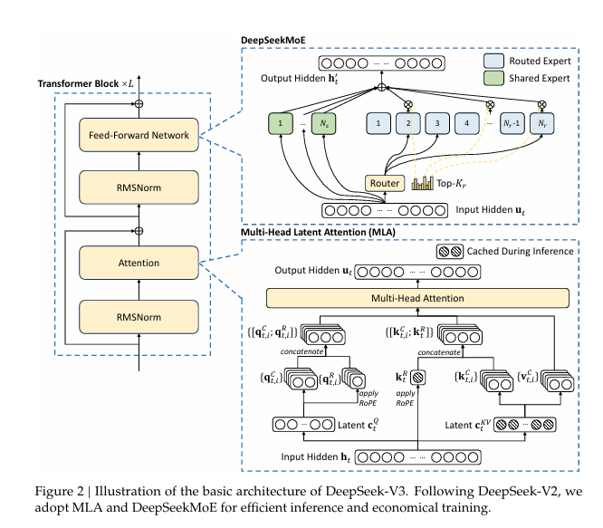
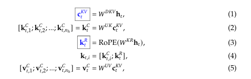
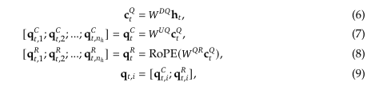
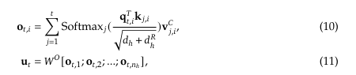
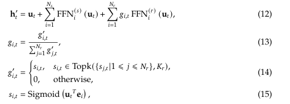
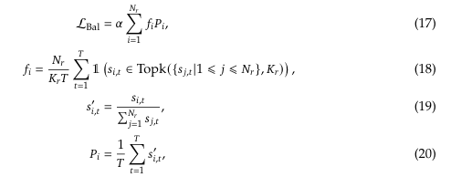
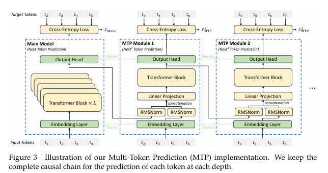
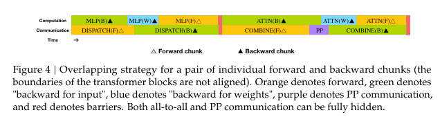
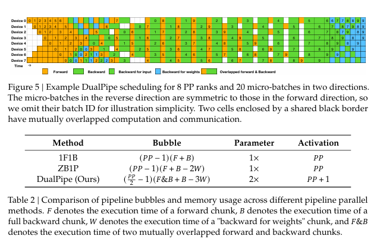
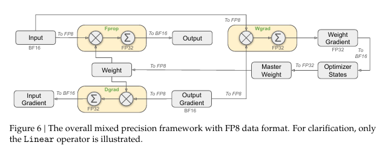

DeepSeek-V3는 6710억 개의 총 파라미터를 가진 강력한 Mixture-of-Experts (MoE) 언어 모델로, 각 토큰 처리 시 370억 개의 파라미터가 활성화됩니다. 효율적인 추론과 비용 효율적인 학습을 달성하기 위해, DeepSeek-V3는 Multi-head Latent Attention (MLA) 및 DeepSeekMoE 아키텍처를 채택했으며, 이는 이전 버전인 DeepSeek-V2에서 철저히 검증되었습니다.

주요 특징:
	1.	부가 손실 없는 부하 분산(Load Balancing): 부가적인 손실(auxiliary loss)을 사용하지 않고도 부하를 효과적으로 분산하는 전략을 처음으로 도입했습니다.
	2.	멀티 토큰 예측 학습 목표: 성능 향상을 위해 멀티 토큰 예측 학습 목표를 설정했습니다.
	3.	대규모 데이터 학습: 14.8조 개의 다양한 고품질 토큰으로 사전 학습을 수행했습니다.
	4.	후속 학습 단계:
- 지도 학습(Supervised Fine-Tuning): 모델의 성능을 극대화하기 위해 수행.
- 강화 학습(Reinforcement Learning): 추가적인 최적화를 통해 모델의 역량을 강화.

평가 결과:
- DeepSeek-V3는 기타 오픈 소스 모델을 능가하며, 상용 비공개 모델과도 비슷한 성능을 달성했습니다.
- 2.788M H800 GPU 시간만으로 전체 학습을 완료할 수 있어 효율적입니다.
- 학습 과정에서 손실 스파이크(loss spike) 또는 복구 불가능한 오류가 발생하지 않았으며, 롤백 없이 안정적인 학습이 가능했습니다.

[Paper Link](https://arxiv.org/pdf/2412.19437)

[Code Link](https://github.com/deepseek-ai/DeepSeek-V3)

## Introduction

모델 개요
- DeepSeek-V3는 **6710억 개(671B)**의 파라미터를 지닌 대규모 Mixture-of-Experts(MoE) 모델이며, 각 토큰 처리 시 활성화되는 파라미터는 37B 개입니다.
- **Multi-head Latent Attention(MLA)**와 DeepSeekMoE 아키텍처를 통해 효율적인 추론과 비용 효율적인 학습을 동시에 달성했습니다.

주요 기술 및 최적화
	1.	보조 손실(Auxiliary Loss) 없는 부하 균형(Load Balancing)
- 부하 균형을 강제하기 위해 발생하는 손실이 모델 성능에 악영향을 주지 않도록, 보조 손실이 없는 부하 균형 전략을 적용했습니다.
	2.	멀티 토큰 예측(Multi-token prediction)
- 모델 학습 과정에서 멀티 토큰을 한 번에 예측하는 목표를 설정하여 전반적인 성능을 향상시켰습니다.
	3.	FP8 혼합 정밀도(FP8 Mixed Precision) 훈련
- FP8 방식의 혼합 정밀도 훈련 체계를 새롭게 도입하고, 이를 초대규모 모델에 처음으로 검증했습니다.
- 계산 속도 향상과 GPU 메모리 사용량 절감이라는 두 가지 이점을 얻었습니다.
	4.	DualPipe 알고리즘을 통한 파이프라인 병렬화(Pipeline Parallelism)
- 파이프라인 병렬화 시 생기는 ‘파이프라인 버블’을 최소화하고, 계산-통신 겹침(Overlap)을 적극 활용해 통신 오버헤드를 거의 없앴습니다.
- 이를 통해, 모델 규모가 더욱 커지더라도, 일정한 계산-통신 비율을 유지하며 세분화된 전문가(Expert) 분산을 활용할 수 있습니다.
	5.	효율적인 Cross-node All-to-All 통신
- InfiniBand(IB)와 NVLink 대역폭을 최대한 활용해 노드 간 통신을 최적화했습니다.
	6.	메모리 최적화
- 텐서 병렬화(Tensor Parallelism) 없이도 대규모 모델을 학습할 수 있도록 메모리 사용을 세밀하게 최적화했습니다.

학습 과정
- 사전 학습(Pre-training)
    - 14.8조(14.8T)개의 고품질·다양한 토큰으로 학습을 진행했으며, 학습 과정은 안정적으로 진행되어 손실 스파이크나 롤백이 발생하지 않았습니다.
- 문맥 길이 확장(Context Extension)
    - 1단계에서 최대 문맥 길이를 32K로 늘린 뒤,
    - 2단계에서 128K로 추가 확장했습니다.
- 후속 학습(Post-Training)
    - **지도학습(SFT)**과 **강화학습(RL)**을 거쳐 모델을 인간 선호도에 맞추고, DeepSeek-R1 시리즈에서 추론 능력을 증류(distillation)하여 정확도와 생성 길이의 균형을 유지했습니다.

성능 평가
- DeepSeek-V3-Base는 오픈소스 베이스 모델 중 최고 수준의 성능을 보이며, 특히 코드와 수학 분야에서 강력한 성능을 보여줍니다.
- Chat 버전 또한 다른 오픈소스 모델을 능가하며, GPT-4o, Claude-3.5-Sonnet 같은 비공개 모델과 비슷한 수준의 성능을 달성했습니다.

비용 및 효율성
- H800 GPU 기준 총 2,788K GPU 시간이 소요되었으며, 대여 비용(시간당 $2)으로 환산하면 $5.576M 정도에 불과합니다.
- 사전 학습: 2664K GPU 시간 ($5.328M)
- 문맥 길이 확장: 119K GPU 시간 ($0.238M)
- 후속 학습: 5K GPU 시간 ($0.01M)
- 자체 클러스터(2048 H800 GPU)에서 14.8조 토큰당 학습 기간은 약 3.7일로, 실제 사전 학습 기간은 두 달이 채 걸리지 않았습니다.

### Main Contribution

1. 아키텍처: 혁신적인 부하 균형 전략과 학습 목표
- 부하 균형을 위한 보조 손실(auxiliary loss)을 제거: DeepSeek-V2의 효율적 아키텍처 위에, 부하 균형을 유도하는 과정에서 발생하는 성능 저하를 최소화하기 위해 보조 손실이 없는(new) 전략을 도입했습니다.
- 멀티 토큰 예측(MTP) 학습 목표: 한 번에 여러 개의 토큰을 예측하도록 하는 MTP를 적용하여 모델 성능을 향상시키고, 추론 단에서도 추측 기반 디코딩(speculative decoding) 기법으로 확장할 수 있음을 보였습니다.

2. 사전 학습: 궁극적인 훈련 효율 추구
- FP8 혼합 정밀도 학습: 초대규모 모델에 대해 FP8 방식의 혼합 정밀도 학습의 타당성과 효과를 최초로 검증했습니다.
- 알고리즘·프레임워크·하드웨어 간 협력 설계: 노드 간 MoE 학습에서 발생하는 통신 병목을 극복하고, 계산-통신을 최대한 겹쳐(Overlap) 통신 오버헤드를 최소화했습니다. 이를 통해 모델 규모를 키우면서도 추가적인 비용 증가 없이 학습 효율을 높였습니다.
- 14.8조(14.8T) 토큰 사전 학습: 단 2.664M H800 GPU 시간 만에 사전 학습을 완료하여, 가장 강력한 오픈소스 베이스 모델을 달성했습니다. 이후 필요한 후속 학습(문맥 길이 확장 등)은 0.1M GPU 시간에 불과합니다.

3. 후속 학습: DeepSeek-R1로부터의 지식 증류
- 롱 체인 오브 생각(Long-CoT) 모델 → 일반 LLM
- DeepSeek-R1 시리즈의 길고 자세한 추론(verification, reflection) 과정을 DeepSeek-V3에 증류(distillation)하는 새로운 방법론을 제안했습니다.
- 이를 통해 추론 성능을 대폭 개선하면서도, 출력 스타일과 길이를 유연하게 제어할 수 있습니다.

4. 핵심 평가 결과
	1.	지식(Knowledge)
- 교육용 벤치마크(MMLU, MMLU-Pro, GPQA)에서 다른 오픈소스 모델을 뛰어넘고(예: MMLU 88.5점 등), GPT-4o, Claude-Sonnet-3.5와 같은 비공개 모델과 비슷한 수준을 보였습니다.
- 사실성(Factuality) 테스트(SimpleQA, Chinese SimpleQA)에서도 오픈소스 중 최고 성능을 기록했으며, 특히 중국어 사실 지식(Chinese SimpleQA) 분야에서는 GPT-4o, Claude-Sonnet-3.5보다 앞선 결과를 보였습니다.
	2.	코드, 수학, 추론(Code, Math, Reasoning)
- 수학 관련 벤치마크에서, 비-long-CoT(OpenAI가 권장하는 긴 사고 사슬을 사용하지 않는) 모델 중 최고 성능을 달성했으며, 특정 벤치마크(MATH-500)에서는 o1-preview보다도 높은 점수를 얻었습니다.
- 코딩 관련 작업(LiveCodeBench 등)에서도 최고 성능을 기록하며, 코드 대회 중심 벤치마크에서 리더 자리를 확고히 했습니다.
- 엔지니어링 태스크에서는 Claude-Sonnet-3.5 대비 약간 뒤처졌지만, 다른 모델들과는 큰 격차로 앞서 다양한 기술 벤치마크에서 경쟁력을 입증했습니다.

위 결과들을 종합해 보면, DeepSeek-V3는 혁신적인 부하 균형 전략과 멀티 토큰 예측 기법, FP8 혼합 정밀도, 그리고 효율적 파이프라인 설계 등을 통해 초대규모 모델임에도 불구하고 높은 학습 효율과 강력한 성능을 동시에 달성한 오픈소스 모델로 평가됩니다.

## Architecture

### 1. Basic Architecture
DeepSeek-V3는 Transformer(2017) 기반을 유지하면서, 효율적인 추론을 위해 Multi-head Latent Attention(MLA) (DeepSeek-AI, 2024c), 경제적인 학습을 위해 DeepSeekMoE (Dai et al., 2024)를 채택하고 있습니다. 이는 DeepSeek-V2에서 이미 철저히 검증된 구성입니다. 다만, DeepSeek-V2와 달리 부하 균형(Load Balancing)을 위한 보조 손실(auxiliary loss)을 사용하지 않는 전략(Wang et al., 2024a)을 새롭게 도입하여, 부하 균형 기법이 모델 성능에 미치는 부정적 영향을 줄였습니다. DeepSeek-V3는 멀티 토큰 예측(MTP) 학습 목표를 추가로 제안합니다. 이 방식은 한 번에 여러 토큰을 예측하도록 모델을 학습시켜, 다양한 평가 벤치마크에서 모델의 전체 성능을 개선하는 데 기여하는 것으로 관찰되었습니다.

#### Multi-Head Latent Attention
MLA의 핵심 아이디어는 추론 과정에서 key-value 캐시 사용량을 줄이기 위해 key, value를 함께 row-rank 로 압축한다는 점입니다.

key-value를 저차원으로 압축하기 위해 down-projection 행렬 W_DKV 와 압축 벡터 c와 이를 up-projection하기 위한 행렬 W_UK, W_UV을 사용합니다. 또한 Rotary Positional Embedding을 생성하기 위한 W_KR을 사용하여 decoupled key를 생성합니다. 

압축 벡터 c_KV와 decoupled key k_R 만 캐싱하면 되므로 KV 캐시 메모리 사용량이 감소하고 MHA Transformer와 비슷한 성능을 유지할 수 있습니다.

attention query를 위해서, query도 low-rank compression을 사용합니다.

#### DeepSeekMoE with Auxilary-Loss-Free Load Balancing 

- Basic Architecture of DeepSeekMoE
    - FFN을 처리하기 위해 기존 GShard (소수의 대형 전문가)와 같은 MoE 구조와 달리 DeepSeekMoE(다수의 세분화된 전문가가)를 채택합니다.
        - GShard
            - 상대적으로 적은 수의 대형 전문가들을 두고, 각 토큰을 주로 하나(또는 소수)의 전문가에게만 라우팅
        - DeepSeekMoE
            - 훨씬 더 많고 작은 전문가들을 두어, 토큰이 보다 세밀하게 다양한 전문가들로 분산될 수 있도록 만듭니다. 이로 인해 MoE가 편향적으로 일부 전문가들게게만 과부화되는 문제를 줄이고, 토큰 특성에 맞춘 학습이 더 정교하게 이루어질 수 있습니다. 
            - 일부 전문가들은 모든 토큰이 공통으로 거치는 shared experts로 고정해 두고, 나머지 전문가들을 Routed experts로 설정 
            - 토큰마다 기본적인 공유 전문가를 통과한 뒤, 추가로 자신에게 특화된 라우팅 전문가를 할당받아 FFN을 처리 
    - DeepSeek-V3 에서 변경점
        - Sigmoid로 친화도를 계산
        - 선택된 전문가들에 한해 각 친화도를 Normalization해 Gating 값으로 변환 

    - K_r: the number of activated routed experts

- Auxiliary-Loss-Free Load Balancing
    - 배경
        - 전문가간 부하가 불균형하면 routing collapse가 발생하게 되고, 전문가 병렬화시 계산 효율이 떨어집니다. 
        - 전통적으로 이를 방지하기 위해 auxiliary loss를 사용하지만, 이를 너무 크게두면 모델 성능이 저하되는 문제가 있었습니다.
    - 그래서 이러한 auxiliary-loss 없이 전문가간 부하를 균등하게 유지하는 전략을 제안합니다. 
    - 각 전문가마다 bias 항 (b)을 두고 토큰-전문가 친화도 (s)를 더해 Top-K 라우팅을 결정합니다. 
    - 실제 FFN 출력에 곱해지는 Gating 값은 원본 친화도(s)에 기반하므로, 편향 항은 라우팅 결정에만 반영됩니다. 
    - 동작 방식
        - 편향항 업데이트
            - 각 학습 스텝이 끝날때마다, 전문가 부하를 모니터링합니다.
            - 특정 전문가의 부하가 과도하면, 해당 전문가의 b를 감소시킵니다.
            - 특정 전문가의 부하가 너무 적으면 b를 증가키십니다.
        - 라우팅
            - b가 반영된 s+b로 top-k 전문가를 결정
            - 실제 게이팅값은 s만 사용
        
- Complementary Sequence-Wise Auxiliary Loss
    - 그렇지만 한 시퀀스 안에서 지나치게 특정 전문가로만 라우팅되는 극단적인 불균형을 방지하기 위해 보완적으로 시퀀스 단위 부하 균형 손실을 도입합니다. 

    - a (Balance Factor): 해당 손실 항에 매우 작은 값을 부여하여, 모델의 전체 성능에 미치는 부정적인 영향이 최소화되도록 함 
    - Indicator Factor: 시퀀스 내의 각 토큰이 어떤 전문가로 라우팅 되었는 지를 지표함수로 집계하여, 시퀀스 단에서 부하의 균형 정도를 측정하고 제어 (T: number of tokens in a sequence)

- Node-Limited Routing
    - 통신 비용을 제한하기 위해 토큰이 라우팅될 수 있는 노드의 수를 최대 M개로 제한합니다.
    - 각 노드에 분포된 전문가들을 최상위 K/M 전문가의 친화도 합을 기준으로 노드를 선택하고, 오직 그 노드들로만 토큰을 라우팅

- No Token-Dropping
    - 효과적인 부하 균형 전략덕분에 훈련 과정에서 전문가 부하가 고르게 유지
    - 학습 중 토큰을 버리는 일이 없음 

### 2. Multi-Token Prediction

한 위치에서 여러개의 미래 토큰을 예측하도록 학습 목표를 확장한 것입니다.
장점은 Dense signal 이 더 많아져 데이터 효율을 높일 수 있고, 모델이 미래의 토큰을 사전에 고려하여 표현력을 강화할 수 있습니다.

추가 토큰을 병렬로 예측하는 대신 대신 순차적으로 예측합니다.
각 예측 단계에서도 완전한 인과적 연결을 유지하여 매 단계마다 이전 단계에서 얻은 표현과 현재 토큰의 임베딩을 결합하여 다음 토큰을 예측합니다. 

- MTP Module
    - D개의 MTP Module을 사용하여 추가 토큰 D개를 순차적으로 예측삽니다. 
    - MTP k-th 모듈은 다음 요소로 구성됩니다. 
        - 공유 임베딩 레이어: Emb()
        - 공유 출력 헤드: OutHead()
        - Transformer 블록: TRM_k()
        - 프로젝션 행렬: M_kk (dx2d)
    - 예를 들어. i-th input token t_i 에 대해 k-th prediction depth 
        - `h_{i, k}' = M_k[RMSNorm(h_{i, k-1}); RMSNorm(emb(t{i+k}))]`
        - `h_{1:T-k} = TRM_k(h_{1:T-k, k}')`
        - `p_{i+k+1, k} = OutHead(h_{i, k})`
    - Emb, OutHead layer는 main 모델과 공유됩니다. 
    - 엄밀히 말하면, 한번에 여러 개를 Parallel하게 뚝딱 생성한다기 보다는 모델 내부에서는 1th depth 에서 첫번째 추가 토큰, 2th depth에서 두번째 추가 토큰, ... 이런식으로 순차적으로 예측을 수행합니다.
    - 다만, 이것은 결국 하나의 큰 forward pass 에서 여러 작은 깊이별 Transformer 블록으로 처리하기 때문에, 결과적으로는 하나의 forward+backward 로 여러 토큰을 예측할 수 있습니다. 
    - 전통적인 모델인 다음 토큰만 예측하고 손실을 구하지만, MTP는 모든 depth 에 대한 손실을 모두 동시에 계산하여 학습합니다. 

- MTP Training Objective
    - k-th 예측 깊이에서 모델이 추가로 예측해야하는 미래 토큰들에 대해 Cross Entropy 손실을 구합니다.
    - 계산된 loss를 평균 내고 가중치를 곱하여 최종 손실을 얻습니다. 이는 추가 학습 목표로 사용됩니다. 

- MTP Inference
    - 추론때 MTP 모듈을 사용하지 않아도 메인 모델은 정상 동작합니다. 원하는 경우 MTP 모듈을 이용한 추론 가속도 가능합니다. (Speculative Decoding)

## Infrastructure
### 1. Compute Clusters

DeepSeek-V3는 2048개의 NVIDIA H800 GPU가 탑재된 클러스터에서 학습됩니다.
각 노드에는 8개의 H800 GPU가 장착되어 있으며, 노드 내부에서는 NVLink와 NVSwitch를 통해 GPU 간 빠른 통신이 이루어집니다.
노드 간에는 InfiniBand(IB) 네트워크가 연결되어, 여러 노드에서 발생하는 연산과 통신을 효율적으로 처리할 수 있게 해줍니다.

### 2. Training Framework

DeepSeek-V3는 사내 엔지니어들이 처음부터 직접 구현한 경량·고효율 학습 프레임워크인 HAI-LLM 위에서 학습됩니다. 전반적인 병렬화 구성은 다음과 같습니다:
- 파이프라인 병렬(PP): 16-way (Qi et al., 2023a)
- 전문가 병렬(EP, Expert Parallelism): 64-way (Lepikhin et al., 2021)로 8개 노드에 걸쳐 수행
- ZeRO-1 데이터 병렬(DP): (Rajbhandari et al., 2020)

주요 최적화 기법
	1.	DualPipe 알고리즘
- 파이프라인 병렬화(PP) 과정에서 발생하는 “파이프라인 버블”을 줄이고,
- 순전파(Forward)와 역전파(Backward)를 서로 겹치도록(Overlap) 하여, 노드 간 전문가 병렬(EP)에서 발생하는 통신 부담을 완화합니다.
	2.	효율적인 크로스-노드 all-to-all 통신 커널
- InfiniBand(IB)와 NVLink 대역폭을 최대한 활용하고,
- 통신 담당 SM(Streaming Multiprocessors)의 사용을 줄여, 통신 병목 현상을 크게 감소시킵니다.
	3.	메모리 사용 최적화
- 학습 과정에서 메모리 풋프린트를 세밀하게 관리해,
- 비용이 큰 텐서 병렬(Tensor Parallelism, TP)을 사용하지 않고도 DeepSeek-V3를 학습할 수 있도록 했습니다.

#### DualPipe and Computation-Communication Overlap

- **문제점**: 모델을 여러 단계(Stage)로 나누어 파이프라인 병렬로 학습할 때, 각 단계에서 계산이 끝날 때마다 통신이 발생하는 부분이 있으면, 통신 동안 GPU 연산 자원이 놀게 됩니다. 특히 **크로스노드 전문가 분할(Expert Parallel, EP) 방식**을 사용하면 노드 간 `all-to-all 통신`이 필요한데, 이 통신이 자주 일어나면 시간이 많이 소요됩니다.
- **목표**: 모델 훈련 시 ‘통신’과 ‘계산’을 **서로 겹치도록(오버랩)** 해서, 가급적 GPU가 통신 때문에 ‘손 놓고 기다리는’ 시간을 줄이고 싶습니다. 또한, 파이프라인 병렬에서 흔히 생기는 파이프라인 ‘버블(병목 구간)’도 최소화하고자 합니다.

듀얼파이프는 **‘앞 방향(Forward) 계산’과 ‘뒤 방향(Backward) 계산’의 세부 단계들을 적절히 쪼개서 재배치**하고, **통신과 계산이 동시에 일어나도록** 스케줄링합니다.

1. **각 마이크로배치(Chunk) 분할**  
   - 보통 한 번의 Forward/Backward를 할 때 모델 내부 연산을 여러 단계로 나눌 수 있습니다. 듀얼파이프에서는 크게  
     1) Attention 부분,  
     2) All-to-all dispatch(EP 통신)  
     3) MLP 부분,  
     4) All-to-all combine(EP 통신)  
     로 나눕니다.  
   - Backward는 Forward 때의 연산 순서와 반대로 진행되지만, 여기선 각 단계(Attention/MLP)를 다시 **두 부분**(입력에 대한 Backward, 파라미터(가중치)에 대한 Backward)로 쪼개 사용합니다.

2. **Forward와 Backward 쌍을 오버랩**  
   - 듀얼파이프는 “Forward를 하는 마이크로배치 A”와 “Backward를 하는 마이크로배치 B”가 서로 **동시에 실행**되도록 만듭니다.  
   - 통신이 필요한 구간(예: all-to-all)도 “다른 연산”과 시간을 겹치도록 배치하여, GPU가 통신만 기다리지 않도록 합니다.  
   - 예를 들어, Forward에서 Attention 계산이 돌아가는 동안, Backward 쪽은 이미 MLP나 통신 부분을 처리하게 해서 최대한 서로 시간을 겹치게 만듭니다.

3. **GPU 자원의 동적 배분**  
   - 통신과 계산이 동시에 일어날 때, GPU SM(Streaming Multiprocessor) 자원을 어떻게 나눌지 비율을 “조정”합니다. 예를 들어, 계산에 70% 자원을 쓰고, 통신을 위한 GPU 커널에 30%를 할당하여 **두 작업이 완전히 차단되지 않도록** 조정합니다. 이렇게 하면 통신과 계산이 **병행**되어 진행되므로, 실질적인 통신 대기 시간이 크게 줄어듭니다.

- 파이프라인 스케줄링: 양방향(Bidirectional) 방식
- 듀얼파이프에서는 파이프라인이 여러 단계(Stage)로 구성되어 있을 때, **마이크로배치를 파이프라인 양쪽에서 동시에 투입**합니다.  
  - 예: 4단계 파이프라인이라면, 1번 스테이지에는 앞으로 진행할 마이크로배치가 들어가고, 4번 스테이지에는 뒤로 진행할(Backward) 마이크로배치가 들어오는 식입니다.  
- 이렇게 하면 파이프라인 중간중간에서 Forward와 Backward가 동시에 일어날 수 있으며, 서로 다른 마이크로배치의 통신과 계산이 겹치면서 **버블이 크게 줄어듭니다.**

- 듀얼파이프의 장점
1. **통신 오버헤드 감소**  
   - 크로스노드 all-to-all 통신 같은 무거운 통신이 있어도, 계산과 통신을 겹쳐 진행하므로 실제로 모델 훈련이 기다려야 하는 ‘순수 통신 대기 시간’이 거의 없어집니다(“은폐(hide)된다”고 표현).
2. **파이프라인 ‘버블’ 최소화**  
   - 기존 파이프라인 방식보다 앞/뒤 방향 계산이 동시에 실행되므로, 유휴 단계가 적어집니다.
3. **확장성(Scalability)**  
   - 모델 규모가 더 커지고 노드 간 통신이 많아져도, **계산/통신 비율을 유지**하면서 듀얼파이프 방식을 적용하면, 여전히 통신 병목을 크게 줄일 수 있습니다.
4. **추가 메모리 사용 부담이 크지 않음**  
   - Forward/Backward를 조금 더 쪼개서 쓰지만, 큰 EP(expert parallel) 방식으로 모델을 구성하는 경우 파라미터 복제 비용이 그렇게 크지 않도록 설계되어 있습니다.
5. **적은 제약 조건**  
   - 듀얼파이프는 파이프라인 스테이지 수와 마이크로배치 수가 ‘2의 배수’만 되면 되는 정도라, 매우 세부적으로 나누는 다른 기법들보다 제약이 적습니다.

#### Efficient Implementation of Cross-Node All-to-All Communication

- 통신 구조 및 토폴로지 최적화
    - **클러스터 환경**: 노드 간 통신은 **InfiniBand(IB)**로, 노드 내 통신은 **NVLink**로 이루어짐.  
    - NVLink 대역폭은 160GB/s, IB는 50GB/s 수준 → **약 3.2배 차이**.
    - **토큰(데이터) 라우팅 방식**:  
    - 한 토큰이 **최대 4개 노드**까지만 가도록 제한하여 IB 사용량을 줄임.  
    - 토큰이 목표 노드에 도달하면, **NVLink**를 통해 해당 노드 내의 정확한 GPU(실제 Expert가 있는 위치)로 빠르게 전달됨.  
    - **IB 전송**과 **NVLink 전송**을 **동시에(overlap)** 진행할 수 있도록 설계해서 통신 시간을 숨김.

이러한 구조 덕분에, 실질적으로 **각 노드당 평균 3.2개 Expert**를 선택해도 **추가 NVLink 비용 없이** 데이터가 효율적으로 분산 가능함. 따라서 한 번의 라우팅으로 **최대 13개 Expert(4노드×3.2개)**까지 확장해도 통신 오버헤드는 동일하게 유지할 수 있음.

- 커널 구현 및 SM 자원 사용
    - **통신 커널**은 `dispatch`(전송)와 `combine`(수신 및 병합)으로 나뉨.  
    - 각 노드에서 **20개의 SM**만으로도 IB와 NVLink의 대역폭을 충분히 활용 가능하게 설계.  
    - **Warp specialization** 기법(각 Warp별로 구체적 통신 업무를 전담)을 사용해, 아래와 같은 통신 단계를 병렬로 처리함:  
    - **Dispatch 시**  
        1) IB로 데이터 전송(IB sending),  
        2) IB→NVLink로 넘어가는 중간 전달(forwarding),  
        3) NVLink 쪽에서 데이터 수신  
    - **Combine 시**  
        1) NVLink로 데이터 전송,  
        2) NVLink→IB로 전달 후 누적(accumulation),  
        3) IB에서 최종 수신 및 누적

    - 각 단계에 할당되는 Warp 수(자원)도 **동적으로 조절**되어, 실제 트래픽이나 워크로드에 맞춰 효율적으로 동작.

- 다른 연산과의 오버랩 및 성능 최적화
    - Dispatch 및 Combine 커널은 **계산 커널과 동시에(오버랩)** 실행되도록 스케줄링됨.  
    - 즉, 통신을 담당하는 SM 20개는 전용 Warp들을 운용하고, 나머지 SM은 계산에 집중할 수 있음.  
    - 이를 위해 **커스텀 PTX** 명령어와 **통신 청크 크기 자동 튜닝**을 적용, L2 캐시 사용량과 다른 SM과의 간섭(인터페어런스)을 최소화.
    - 결과적으로, DualPipe에서 요구되는 **크로스노드 all-to-all 통신**이 최소한의 SM 자원으로도 **IB와 NVLink 대역폭을 최대한** 활용하면서, **계산과 통신을 겹쳐** 수행할 수 있게 됨.

#### Extremely Memory Saving with Minimal Overhead

1. **RMSNorm과 MLA 업프로젝션 Recompute**  
   - **RMSNorm** 연산과 **MLA 업프로젝션** 결과를 역전파 시점에 **재계산**(Recompute)함.  
   - 이를 통해 Forward에서 생성된 해당 연산들의 출력을 **지속적으로 저장할 필요가 없어** 메모리 사용을 크게 절감.  
   - 추가로 들어가는 연산 비용은 작지만, 저장해야 할 **활성화(activations)**가 줄어들어 전체 메모리 사용을 줄이는 효과가 큼.

2. **Exponential Moving Average (EMA) 파라미터를 CPU에서 관리**  
   - 학습 중 모델 파라미터에 대한 **EMA**를 추적하여, 러닝 레이트가 감소한 후 **성능 추정을 빠르게** 하기 위함.  
   - 이 EMA 파라미터는 **CPU 메모리**에 저장하고, **비동기(Asynchronous)** 방식으로 매 스텝 후 업데이트.  
   - 따라서 GPU 메모리를 추가로 소모하지 않으며, 시간을 크게 지연시키지 않고도 EMA 정보를 유지할 수 있음.

3. **Shared Embedding & Output Head(다중 토큰 예측에 활용) 물리적 공유**  
   - **DualPipe** 전략에서, 모델의 가장 얕은 레이어(Embedding)와 가장 깊은 레이어(Output Head)를 **동일한 파이프라인 스테이지**에 배치.  
   - 이렇게 하면 **Shared Embedding**과 **Output Head**가 같은 장치 내에서 **파라미터와 그래디언트를 물리적으로 공유**할 수 있음.  
   - 이로써 **MTP 모듈**(Multi-Token Prediction)과 메인 모델 간에 **중복 파라미터**를 따로 보관할 필요가 없어, **메모리 효율성**이 향상됨.

### 3. FP8 Training

- **FP8** 같은 **초저정밀(ultra-low precision)** 포맷을 활용하면, 모델 학습 시 **연산량과 메모리 사용량**을 크게 줄일 수 있음.  
- 하지만, **아웃라이어(outlier)**로 인해 **activations, weights, gradients**의 범위가 넓어지면, 단순 저정밀 포맷만으로는 손실이 커질 수 있음.  
- **큰 규모의 언어모델(LLM)** 사전 학습(pre-training)에서 저정밀 기법을 안정적으로 적용한 사례는 여전히 제한적.

- 세밀화된(Fine-grained) FP8 양자화 전략
    1. **타일(tile)-단위 1×Nc grouping** 또는 **블록(block)-단위 Nc×Nc grouping**  
    - 매트릭스 연산 시, 각 타일 혹은 블록 내에서 데이터 스케일을 적절히 조정해 **FP8 양자화**를 적용.  
    - 이를 통해 **FP8 포맷의 동적 범위를 확장**해 아웃라이어의 영향을 줄임.
    2. **고정밀 누산(Accumulate) 과정**과 결합  
    - FP8로 입력을 받아도, 내부 누산은 더 높은 정밀도(예: FP16/BF16)로 처리해 **정확도 손실**을 최소화.  
    - 이 과정에서 발생하는 **dequantization(복원) 오버헤드**는 **증가된 정밀도 누산** 과정에 자연스럽게 흡수되어 크게 부담되지 않음.

- MoE 훈련 메모리·통신 최적화
    - **Activations**을 FP8로 **캐싱**하고 **통신**(dispatch)  
    - MoE처럼 활성화(activation) 전송이 빈번한 경우, FP8로 전송하면 **통신 양**과 **메모리**가 대폭 절감.  
    - **Optimizer states**는 **BF16**로 저장  
    - 최적화 파라미터(모멘텀, 스케일 팩터 등)를 FP8로 관리하면 누적 오차가 커질 수 있으므로, BF16을 활용해 **안정성 유지**.

- 실험 결과
    - DeepSeek-V2-Lite 및 DeepSeek-V2 수준의 모델(약 1조 토큰 학습)에 FP8 프레임워크를 적용한 결과,  
    - **BF16 기준 학습 대비 손실(Perplexity 등)의 상대 오차가 0.25% 이하**로 유지됨  
    - 이는 **학습 잡음(랜덤성)** 범위 안에 있는 수준으로, **정확도 저하 없이** FP8 기법이 적용 가능함을 시사.

#### Mixed Precision Framework

- 개요: FP8 기반 혼합정밀 프레임워크
    - **핵심 아이디어**: 모델 훈련에서 발생하는 연산 중, 대부분의 **연산량이 큰(GEMM)** 부분은 FP8로 수행하고,  
    **민감도가 높은 일부 연산**은 원래 정밀도(BF16/FP32)를 유지함으로써 **훈련 안정성과 효율**을 동시에 달성.
    - **FP8의 장점**: 연산량이 많은 부분(GEMM)을 FP8로 처리하면, BF16 대비 **이론적으로 약 2배 더 빠른 속도**를 기대할 수 있음.  
    - **FP8의 한계**: 아웃라이어나 수치 민감도가 높은 연산에서 오차 축적이 심해질 수 있음.

- FP8 적용 범위
1. **대부분의 GEMM 연산**  
   - `Fprop`(Forward Pass),  
   - `Dgrad`(Activation Backward),  
   - `Wgrad`(Weight Backward).  
   - 이 세 가지 핵심 매트릭스 곱(GEMM)을 FP8로 실행해,  
   - **FP8 입력**을 받아 **BF16/FP32 출력**을 내는 형태.  
   - 이때, **Wgrad**에서 활성화(activation)도 FP8로 보관 가능해 **메모리 사용**이 크게 줄어듦.

2. **메모리 절감 효과**  
   - FP8 Wgrad가 가능해지면, **Backward에서 필요한 활성화**를 미리 FP8 형태로 저장할 수 있어 **메모리 부담**이 줄어듦.

- 정밀도가 필요한 연산
    - **민감도가 높거나(Outlier), 연산 비용이 작아서 고정밀을 써도 크게 부담되지 않는** 연산들:
    1. 임베딩(Embedding) 모듈  
    2. 출력 헤드(Output Head)  
    3. MoE의 게이팅(Gating) 연산  
    4. 정규화(Normalization) 오퍼레이터  
    5. 어텐션(Attention) 오퍼레이터  
    - 위 연산들은 **BF16** 또는 **FP32**로 유지해, **수치적 안정성**을 지킴.

- 마스터 가중치 및 옵티마(Optimizer) 상태
    - **마스터 웨이트(Master weights)**, **가중치 그래디언트(Weight gradients)**, **옵티마 상태(Optimizer states)**는 **고정밀(BF16/FP32)**에 저장  
    - 저정밀 연산으로 인한 누적 오차가 생기지 않도록 방지.  
    - 일부 메모리가 더 들지만, **분산 데이터 병렬(DP) 환경**에서 효율적으로 샤딩하면 부담을 줄일 수 있음.

#### Improved Precision from Quantization and Multiplication

1. 미세화(Fine-Grained) 양자화 전략
1.1 타일·블록 단위 스케일링
- **문제**: FP8 포맷은 지수(exponent) 비트가 적어 **동적 범위**가 제한되며, 아웃라이어(outlier)에 취약.
- **해결**: 연산 대상 요소(activation, weight)를 **더 작은 그룹**(타일 또는 블록)으로 묶어, 각 그룹마다 스케일(scale) 팩터를 적용.
  - **Activations**: 1×128 타일(즉, 1개 토큰 × 128 채널)마다 별도 스케일링.  
  - **Weights**: 128×128 블록(128 입력 채널 × 128 출력 채널)마다 별도 스케일링.  
- 이렇게 하면 **아웃라이어가 있는** 일부 영역만 개별적으로 스케일이 조정되어, **양자화 오류**를 크게 줄일 수 있음.

1.2 Per-group scaling in GEMM
- 기존 FP8 GEMM 표준에는 “내부 차원(K)에 따른 per-group 스케일링”이 직접 지원되지 않음.  
- 본 연구에서는 **FP32 누산** 전략과 결합해, GEMM 연산 중간에 **그룹별 스케일**을 적용하여도 오버헤드를 최소화.

2. 고정밀 누산(Accumulation) 향상
- **문제**: H800 등 최신 GPU의 텐서 코어(Tensor Cores)에서 제공되는 FP8 누산은 실제로 약 **14비트 정밀도**만 보장, 대규모 모델(K가 큰 경우)에선 누적 오차가 상당히 커질 수 있음.
- **해결**: 텐서 코어의 **MMA** 연산 중간에 일정 간격(예: 𝑁𝐶=128)마다 **FP32 레지스터**로 승격(promote)해 **완전한 FP32 누산**을 수행.  
  - 한 워프그룹이 승격 연산을 수행하는 동안, 다른 워프그룹은 MMA를 병행(오버랩)해 텐서 코어 활용도를 유지.  
  - 𝑁𝐶 = 128 (4번의 WGMMA) 정도가 “오차 줄이기 vs 성능” 간 균형점으로 실험적 확인.

3. Mantissa 우선(E4M3) FP8 포맷
- **기존**: 과거 혼합 FP8 방식(E4M3 vs E5M2)을 상황별로 다르게 사용(예: Fprop엔 E4M3, Backward엔 E5M2).  
- **본 연구**: 모든 텐서에 **E4M3**를 적용( mantissa=3, exponent=4 )  
  - **이유**: 미세화 양자화로 작은 그룹 내에서 **공동 지수(exponent bits)를 공유**하므로, E4M3 방식으로도 충분한 동적 범위를 커버 가능.

4. 온라인(Online) 양자화
- **지연(Delayed) 양자화**: 이전 스텝들의 최대 절댓값 기록을 활용해 현재 스케일을 추정하는 방식.  
- **온라인 양자화**: 각 1×128 또는 128×128 그룹에서 **실시간으로 최대 절댓값**을 구해 스케일링.  
  - 프레임워크 구현이 간단해지고, **FP8 양자화**가 **항상 최신** 분포에 맞춰진 상태로 수행.

5. 저정밀 메모리·통신 최적화
5.1 옵티마(Optimizer) 상태의 저정밀화
- **AdamW**의 1차·2차 모멘텀(moment)은 **BF16**으로 저장해도 성능 저하가 거의 없음.  
- **마스터 가중치**(Master weights)와 **그래디언트**는 여전히 **FP32**로 유지해, 수치 안정성 보장.

5.2 활성화(Activation) FP8 저장
- **Wgrad 연산**이 FP8로 이뤄지므로, **Backward용 활성화**를 FP8로 **캐싱**해 **메모리 절약**.  
- 다만 **주의가 필요한 연산**(예: Attention Backward)에서 입력 활성화는 더 높은 정밀도(E5M6 등)로 보관하거나,  
  - 미세화 양자화 + 1×128→128×1 변환 등 세부 튜닝을 통해 정확도 유지.

5.3 저정밀 통신
- MoE에서 up-projection 전의 활성화를 FP8로 양자화 후 **dispatch**(all-to-all 통신) → **통신량** 감소.  
  - Forward/Backward combine 등 중요한 부분은 BF16을 사용해 **학습 정확도**를 유지.

