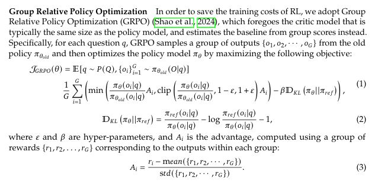
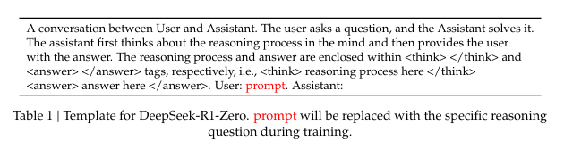
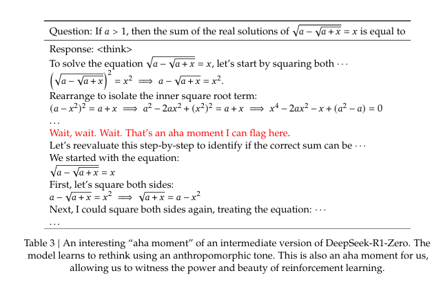

- **DeepSeek-R1-Zero**  
  - **학습 방식:**  
    - 초기 SFT 없이 대규모 강화 학습(RL)만으로 학습되어, 스스로 강력하고 다양한 추론 능력을 발휘함  
  - **특징 및 문제점:**  
    - 자연스럽게 뛰어난 추론 행동들이 나타나지만, 응답의 가독성이 낮고 언어 혼합 현상이 발생하는 문제 존재

- **DeepSeek-R1**  
  - **개선점:**  
    - 다단계 학습과 RL 전에 콜드 스타트 데이터를 도입하여, 가독성과 추론 성능을 대폭 향상  
  - **성능:**  
    - OpenAI-o1-1217과 비교해 유사한 수준의 추론 성능을 달성

- **공개 오픈소스:**  
  - 연구 커뮤니티 지원을 위해 DeepSeek-R1-Zero와 DeepSeek-R1뿐 아니라,  
  - DeepSeek-R1을 기반으로 Qwen 및 Llama 모델을 활용해 증류한 6종의 dense 모델(1.5B, 7B, 8B, 14B, 32B, 70B)도 함께 오픈소스로 공개됨

[Paper Link](https://github.com/deepseek-ai/DeepSeek-R1/blob/main/DeepSeek_R1.pdf)

## Approach

### 1. 연구 배경 및 목표

- **이전 접근 방식:**  
  기존 연구들은 주로 대규모의 지도 학습(슈퍼바이즈드 데이터)을 통해 모델 성능을 향상시켰습니다.

- **본 연구의 목표:**  
  본 연구에서는 지도 학습 없이도, 혹은 소량의 초기(콜드스타트) 데이터만으로도 강화 학습(RL)을 통해 모델의 추론(reasoning) 능력을 크게 개선할 수 있음을 보여줍니다.

- **제안 방법:**  
  1. **DeepSeek-R1-Zero:** 지도 학습 없이 베이스 모델에 바로 강화 학습(RL)을 적용하는 방법  
  2. **DeepSeek-R1:** 수천 개의 긴 Chain-of-Thought(CoT) 예제로 미리 파인튜닝한 체크포인트에서 시작한 후 RL을 적용하는 방법  
  3. **지식 증류:** DeepSeek-R1의 추론 능력을 소형 밀집 모델로 증류(distill)하는 기법도 다룹니다.

---

### 2. DeepSeek-R1-Zero: 지도 학습 없이 강화 학습 적용

- **핵심 아이디어:**  
  지도 학습 없이 베이스 모델 자체가 순수 강화 학습을 통해 스스로 진화하도록 하는 것을 목표로 합니다. 이를 통해 모델이 복잡한 추론 문제를 스스로 해결하는 능력을 키울 수 있음을 확인하였습니다.

- **강화 학습 알고리즘 – Group Relative Policy Optimization (GRPO):**  
  - 기존의 RL 방식에서 사용되는 크리틱(critic) 모델 대신, 그룹 내에서 샘플된 출력들의 점수를 비교하여 기준(baseline)을 추정합니다.
  - **과정:**  
    1. 질문 (q)에 대해, 베이스 모델(과거 정책 pi_{theta_{text{old}})에서 여러 개의 출력을 샘플링합니다.
    2. 각 그룹 내에서 출력에 대응하는 보상들 (r_1, r_2, dots, r_G)를 계산하고, 이로부터 각 출력의 우위(advantage)를 산출합니다.
    3. 이 advantage를 기반으로 정책 모델 \(\pi_\theta\)를 최적화하는 목적 함수를 최대화합니다.
  - **수식 설명:**  
    논문에서는 그룹 내 최소 확률비(clipped probability ratio)와 KL 발산 제한을 포함한 최적화 식을 제시하여 안정적인 학습을 유도합니다.

- **보상 모델링 (Reward Modeling):**  
  보상은 RL에서 모델이 어떤 방향으로 학습할지를 결정하는 중요한 신호입니다.
  - **정확도 보상(Accuracy Rewards):**  
    - 예를 들어, 수학 문제의 경우 최종 답이 정해진 형식(예: 상자 안에 답)으로 나오도록 하여 정확한 결과를 판별할 수 있게 합니다.
    - LeetCode 문제의 경우, 컴파일러를 통해 미리 정해진 테스트 케이스에 대해 피드백을 생성합니다.
  - **형식 보상(Format Rewards):**  
    - 모델이 추론 과정(Chain-of-Thought)을 `<think> ... </think>` 태그 안에 넣도록 강제하여, 추론 과정을 명확히 기록하도록 합니다.
  - **주의사항:**  
    - 신경망(neural) 기반 보상 모델은 보상 해킹(reward hacking) 문제를 야기할 수 있고, 추가 학습 자원이 필요하기 때문에 이번 연구에서는 사용하지 않습니다.

- **학습 템플릿:**  
  - 모델이 추론 과정과 최종 답변을 구조화된 포맷(`<think>` 태그 안에 추론 과정, `<answer>` 태그 안에 최종 답변)으로 생성하도록 간단한 템플릿을 사용합니다.
  - 이 템플릿은 모델이 어떠한 문제 해결 전략이나 반영(reflection)을 명시적으로 배우도록 유도하기보다는, 자연스럽게 자기 발전(self-evolution)을 관찰할 수 있도록 합니다.

---

### 3. 성능 및 자가 발전(Self-evolution) 과정

- **성능 개선:**  
  - **AIME 2024 벤치마크 예시:**  
    - 초기에는 pass@1 점수가 약 15.6%였으나, RL 학습을 진행하면서 71.0%까지 향상되었습니다.
    - 다수결 투표(majority voting)를 적용하면 성능이 86.7%까지 상승하여, OpenAI의 모델(OpenAI-o1-0912)과 비슷하거나 더 나은 수준을 달성했습니다.
  - **비교 분석:**  
    - 논문 내 표(Table 2)를 통해 DeepSeek-R1-Zero와 OpenAI 모델의 다양한 추론 관련 벤치마크에서의 성능 차이를 보여줍니다.

- **자가 발전(self-evolution) 과정:**  
  - RL 학습 과정에서 모델은 점점 더 많은 추론 토큰을 생성하며(수백에서 수천 개까지) 문제 해결에 필요한 '생각하는 시간(thinking time)'을 스스로 늘려갑니다.
  - 이러한 과정에서 모델은 스스로 자신의 이전 추론 단계를 되돌아보거나(reflection), 다른 문제 해결 방법을 탐색하는 등의 복잡한 행동을 자연스럽게 발현하게 됩니다.
  
- **‘Aha Moment’ 현상:**  
  - 학습 도중, 중간 버전의 모델이 자신의 초기 접근 방식을 재평가하며 문제에 더 많은 ‘생각하는 시간’을 할당하는 순간이 발생합니다.
  - 이 현상은 RL이 단순히 정답을 가르치는 것이 아니라, 모델이 자율적으로 고급 문제 해결 전략을 개발할 수 있음을 보여주는 중요한 사례입니다.

---

### 4. 한계 및 후속 연구

- **DeepSeek-R1-Zero의 한계:**  
  - 강력한 추론 능력을 보이지만, 추론 과정의 가독성이 떨어지거나 언어가 혼합되는 문제 등의 단점이 존재합니다.

- **DeepSeek-R1의 접근:**  
  - 이러한 문제를 해결하기 위해, 소량의 인간 친화적(콜드스타트) 데이터를 활용하는 DeepSeek-R1 방식을 도입합니다.
  - 이를 통해 추론 과정의 가독성을 높이고, 커뮤니티와의 공유를 보다 용이하게 하고자 합니다.

### 5. 연구 동기 및 핵심 질문

- **핵심 질문:**  
  1. 고품질의 소량 데이터(콜드 스타트)를 활용하면 모델의 추론 성능을 더욱 개선하거나 수렴 속도를 높일 수 있는가?  
  2. 명확하고 일관된 Chain of Thought(CoT)를 생성하면서, 다양한 작업에서 뛰어난 일반 능력을 갖춘 사용자 친화적인 모델은 어떻게 훈련할 수 있는가?

### 6. DeepSeek-R1 파이프라인 구성

DeepSeek-R1의 훈련 파이프라인은 다음 네 단계로 이루어집니다.

#### 6.1. **Cold Start**

- **목적:**  
  DeepSeek-R1-Zero처럼 베이스 모델에서 바로 RL을 시작하면 초기 불안정성이 발생할 수 있으므로, 소량의 고품질 긴 CoT 데이터를 활용하여 모델을 미리 파인튜닝합니다.

- **데이터 수집 방법:**  
  - few-shot 프롬프트로 긴 CoT 예시 제공  
  - 모델에 상세한 답변(반성 및 검증 포함)을 직접 생성하도록 요청  
  - DeepSeek-R1-Zero의 출력을 읽기 좋은 포맷으로 수집  
  - 인간 후처리를 통해 결과를 정제

- **콜드 스타트 데이터의 장점:**  
  - **가독성:**  
    기존 DeepSeek-R1-Zero의 응답은 여러 언어가 섞이거나 마크다운 포맷이 부족한 문제가 있었는데, 여기서는 `<reasoning_process>`와 `
`를 포함하는 정해진 포맷(예: `|special_token|<reasoning_process>|special_token|
`)으로 응답을 구성하여 가독성을 높입니다.
  - **잠재력:**  
    인간의 선험적(prior) 정보를 반영한 패턴 덕분에 모델의 성능이 개선되는 효과를 기대할 수 있습니다.

- **데이터 규모:**  
  수천 개의 콜드 스타트 데이터를 모아 DeepSeek-V3-Base를 초기 RL 액터로 파인튜닝합니다.

#### 6.2. **추론 지향 강화 학습 (Reasoning-oriented Reinforcement Learning)**

- **프로세스:**  
  - 콜드 스타트 데이터로 미리 파인튜닝한 모델에 대해, DeepSeek-R1-Zero에서 사용한 대규모 RL 학습 방법을 그대로 적용합니다.
  - 코딩, 수학, 과학, 논리 추론 등 잘 정의된 문제에서 모델의 추론 능력을 극대화합니다.

- **문제 및 해결:**  
  - **문제점:** RL 프롬프트가 여러 언어를 혼용할 경우 CoT 내 언어 혼합 현상이 발생합니다.
  - **해결책:**  
    - **언어 일관성 보상(Language Consistency Reward):**  
      CoT에서 목표 언어의 단어 비율을 계산하여 보상에 반영합니다.  
      (약간의 성능 저하가 있을 수 있으나, 인간이 선호하는 가독성 측면에서 유리합니다.)
    - 최종 보상은 추론 정확도 보상과 언어 일관성 보상을 단순 합산하여 사용합니다.

- **학습:**  
  이 강화 학습 단계는 모델이 추론 작업에서 수렴할 때까지 진행됩니다.

#### 6.3. **Rejection Sampling 및 지도 학습 (Supervised Fine-Tuning, SFT)**

- **목적:**  
  RL 학습이 수렴한 체크포인트를 활용하여 추가 SFT 데이터를 생성하고, 이를 통해 모델의 일반 능력(예: 작문, 역할극, 일반 대화 등)을 강화합니다.

- **데이터 구성:**  
  1. **추론 데이터:**  
     - RL 체크포인트에서 거부 샘플링(rejection sampling)을 통해 추론 프롬프트와 CoT(추론 경로)를 생성합니다.
     - 기존에는 규칙 기반 보상으로 평가 가능한 데이터만 사용했으나, 이번 단계에서는 추가 데이터를 포함합니다.
     - 언어 혼합, 긴 단락, 코드 블록 등 가독성이 떨어지는 CoT는 필터링하여 제거합니다.
     - 각 프롬프트마다 여러 응답을 샘플링한 후 정답인 것만 선별하여, 총 약 60만 건의 추론 관련 샘플을 수집합니다.

  2. **비추론 데이터:**  
     - 작문, 사실 기반 질의응답, 자기 인식, 번역 등 추론 이외의 작업에 필요한 데이터는 DeepSeek-V3 파이프라인 및 기존 SFT 데이터를 재사용합니다.
     - 단순한 질문(예: "hello")에는 CoT 없이 응답하도록 구성합니다.
     - 총 약 20만 건의 비추론 데이터가 수집됩니다.

- **최종 파인튜닝:**  
  - 위에서 수집한 약 80만 건의 데이터를 사용해 DeepSeek-V3-Base를 2 에폭 동안 파인튜닝합니다.

### 7. 모든 시나리오를 위한 강화 학습

- **목적:**  
  모델이 인간의 선호에 더 잘 맞도록, 추론 능력을 유지·향상시키면서도 응답의 유용성(Helpfulness)과 안전성(Harmlessness)을 강화하는 추가 강화 학습 단계를 도입합니다.

- **훈련 방식:**  
  - **다양한 보상 신호와 프롬프트 분포 활용:**  
    - **추론 데이터:**  
      - DeepSeek-R1-Zero에서 사용한 규칙 기반 보상 방식을 그대로 적용하여, 수학, 코드, 논리 추론 등의 분야에서 학습시킵니다.
    - **일반 데이터:**  
      - 복잡하고 미묘한 상황에서 인간 선호도를 반영하기 위해, 보상 모델을 사용하여 학습 데이터를 구성합니다.
  
- **세부 내용:**  
  - **유용성(Helpfulness):**  
    - 응답의 최종 요약 부분에 집중하여, 사용자가 실제로 도움이 되는지를 평가합니다.  
    - 이때, 추론 과정에는 간섭을 최소화합니다.
  - **안전성(Harmlessness):**  
    - 모델의 전체 응답(추론 과정과 요약 모두)을 평가하여, 위험, 편향 또는 유해한 내용이 포함되지 않도록 조정합니다.
  
- **결과:**  
  다양한 보상 신호와 데이터 분포를 결합함으로써, 모델이 뛰어난 추론 능력을 유지하면서도 사용자에게 더 유용하고 안전한 응답을 제공하도록 학습할 수 있습니다.

### 8. 지식 증류(Distillation): 소형 모델에 추론 능력 부여

- **목적:**  
  DeepSeek-R1과 같은 강력한 추론 능력을, 보다 효율적인 소형 모델에도 부여하기 위해 지식 증류 기법을 사용합니다.

- **방법:**  
  - DeepSeek-R1에서 구축한 80만 개의 데이터 샘플(§2.3.3에서 언급한 데이터를 기반으로)을 사용하여, 오픈소스 모델(Qwen, Llama 등)을 지도 학습(SFT) 방식으로 파인튜닝합니다.
  - 사용된 베이스 모델 예시:  
    - **Qwen 계열:** Qwen2.5-Math-1.5B, Qwen2.5-Math-7B, Qwen2.5-14B, Qwen2.5-32B  
    - **Llama 계열:** Llama-3.1-8B, Llama-3.3-70B-Instruct (Llama-3.3은 약간 더 우수한 추론 성능을 보임)
  
- **특징:**  
  - 증류된 소형 모델에는 지도 학습(SFT)만 적용하며, 강화 학습(RL) 단계는 포함하지 않습니다.  
  - RL 단계를 추가하면 성능이 더욱 향상될 수 있으나, 이번 연구에서는 간단한 증류 기법의 효과를 보여주는 데 중점을 두었습니다.

- **결론:**  
  이 증류 방법을 통해, 소형 모델도 강력한 추론 능력을 갖출 수 있음을 확인하였으며, 향후 RL을 포함한 추가적인 증류 방법은 연구 커뮤니티에 맡기기로 하였습니다.

