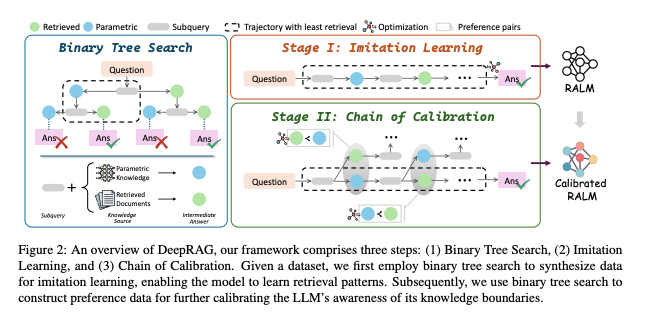
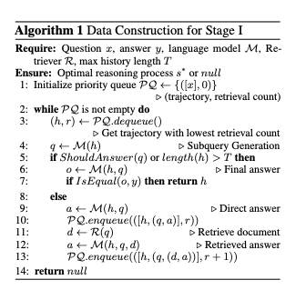
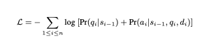
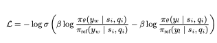
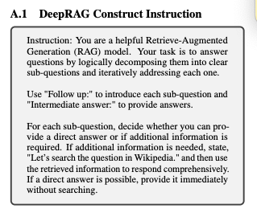

이 논문은 대형 언어 모델(LLM)이 뛰어난 추론 능력을 보여주지만, 시의성, 정확성, 그리고 파라메트릭 지식의 범위 한계로 인해 사실과 다른 정보를 생성하는 문제(환상 현상)를 겪는 점을 지적합니다. 또한, 기존의 Retrieval-Augmented Generation (RAG) 방식은 비효율적인 작업 분해와 중복된 검색 과정으로 인해 불필요한 잡음을 발생시켜 응답 품질을 저하시킬 수 있습니다.
이에 대응하기 위해, 저자들은 DeepRAG라는 프레임워크를 제안합니다. DeepRAG는 검색 보강 추론을 마르코프 결정 과정(MDP)으로 모델링하여, 각 단계마다 전략적이고 적응적인 검색을 수행합니다. 즉, 질문을 반복적으로 분해하면서, 각 단계에서 외부 지식의 검색이 필요한지 또는 내부의 파라메트릭 추론만으로 문제를 해결할 수 있는지를 동적으로 결정합니다.
실험 결과, DeepRAG는 검색 효율성을 개선하는 동시에 답변 정확도를 21.99% 향상시키는 성과를 보였으며, 이는 검색 보강 추론을 최적화하는 데 효과적임을 입증합니다.

[Paper Link](https://arxiv.org/pdf/2502.01142)

## Thinking to Retrieval Step by Step



### DeepRAG의 개요 및 MDP 기반 접근법

DeepRAG는 질의 분해, 원자적(atomic) 결정, 그리고 최종 답변 생성을 하나의 연속적 과정으로 보고, 이를 마르코프 결정 과정(MDP)으로 모델링합니다. 이를 통해 모델은 각 단계에서 외부 지식을 검색할지, 내부의 파라메트릭(내재) 지식을 활용할지에 대해 전략적이고 적응적으로 판단할 수 있습니다.

주요 구성 요소
1.	Binary Tree Search (이진 트리 탐색)
- 각 하위 질의(subquery)에 대해 이진 트리를 구성합니다.
- 트리의 경로 탐색 과정에서, 모델은 파라메트릭 지식을 활용하는 경로와 외부 지식베이스에서 정보를 검색하는 경로 중 하나를 선택합니다.
- 이 과정을 통해 질문의 여러 부분으로 분해하며, 다양한 탐색 경로를 모색합니다.
2.	Imitation Learning (모방 학습)
- 최소한의 검색 비용으로 올바른 최종 답변에 도달하는 추론 과정을 추출하여, 이를 모방 학습 데이터로 활용합니다.
- 이진 트리 탐색을 통해 합성된 데이터를 기반으로, 효과적인 검색 패턴을 학습시킵니다.
3.	Chain of Calibration (일련의 보정 과정)
- 각 원자적 결정(atomic decision)을 보정하여 LLM이 자신의 지식 한계를 명확히 인지할 수 있도록 합니다.
- 이진 트리 탐색을 통해 생성된 선호(preference) 데이터를 이용해, 모델 내부의 지식 활용도를 추가로 보정합니다.

### MDP 모델링의 구체적 요소

DeepRAG는 전체 추론 과정을 (S, A, P, R)로 표현되는 MDP로 정식화합니다.
- 상태 (States, S)
    - 각 시점 t에서 상태 s_t는 원래 질문 x와 지금까지 생성된 일련의 하위 질의와 중간 답변들 (q1, r1), ..., (q_t, r_t)로 구성됩니다.
    - 여기서 중간 답변은 경우에 따라 외부에서 검색된 문서들을 포함할 수 있습니다.
- 행동 (Actions, A)
    - 각 상태 s_t에서 모델은 두 가지 하위 결정으로 구성된 행동 a_t+1 = (b_t+1,c_t+1)을 선택합니다.
    - 종료 결정 (b_t+1): 현재 상태에서 추론을 계속할지(즉, 추가 하위 질의를 생성할지) 아니면 종료하여 최종 답변 o를 생성할지에 대한 이진 결정입니다.
    - 원자적 결정 (c_t+1): 새로운 하위 질의 q_t+1에 대해 외부 지식을 검색할지, 내부 파라메트릭 지식을 활용할지 결정합니다.
- 전이 (Transitions, P)
    - 행동 a_t+1이 수행되면, 환경은 상태를 s_t+1로 업데이트합니다.
    - 만약 종료 결정이 내려졌다면, 최종 답변 o가 생성되어 상태가 s_t+1 = {x, (q1, r1), ..., (qt, rt), o}와 같이 종료 상태로 전이됩니다.
    - 그렇지 않은 경우, 새로운 하위 질의 q_t+1가 생성되며, 원자적 결정에 따라 외부에서 문서 d_t+1를 검색해 중간 답변 r_t+1을 생성하거나 내부 지식을 활용하여 답변을 생성합니다. 이에 따라 업데이트된 상태는 s_t+1 = {x, (q1, r1), ..., (q_t+1, r_t+1)}가 됩니다.
- 보상 (Rewards, R)
    - 보상 함수는 최종 답변 o가 생성된 후, 답변의 정확성과 검색 비용을 종합적으로 평가합니다.
    - 즉, 최종 상태에서의 보상이 주어지며, 이를 통해 모델이 올바른 답변을 최소한의 검색 비용으로 도출하도록 유도합니다.

### Binary Tree Search

목적 및 개요
- 질문 분해 및 탐색: MDP(Markov Decision Process)로 단계별 추론 과정을 모델링한 바와 같이, DeepRAG는 주어진 질문을 이전에 획득한 정보를 바탕으로 여러 하위 질의(subquery)로 반복적으로 분해합니다.
- 이진 트리 탐색 활용: 각 하위 질의에 대해 이진 트리(binary tree)를 구성하여 두 가지 응답 전략을 동시에 탐색합니다.
    - 파라메트릭 지식 활용(Blue Node): 내부 파라메트릭 지식을 직접 활용하여 답변을 생성하는 전략.
    - 외부 문서 검색(Green Node): 외부 문서를 검색하여 추가 정보를 획득한 후 답변을 도출하는 전략.

구현 및 구성
    - 질문 → 하위 질의 → 중간 답변: 모델은 질문을 시작으로 하위 질의를 생성하고, 각 단계마다 위 두 가지 전략 중 하나를 선택하여 중간 답변을 산출합니다.
    - 최종 답변 도출: 이러한 연속적인 하위 질의 및 중간 답변의 결과를 종합하여 최종 답변을 생성합니다.
- 답변 포맷:

```
Question: <Question>
Follow up: <Subquery1>
Let’s search the question in Wikipedia.
Context: <Paragraph Text>
Intermediate answer: <Intermediate Answer1>
Follow up: <Subquery2>
Intermediate answer: <Intermediate Answer2>
......
So the final answer is: <Answer>
```

위와 같은 형식을 통해 질문, 하위 질의, 검색(필요 시) 및 중간 답변들이 단계적으로 연결됩니다.

의의
- 질문 분해와 검색 선택의 영향 분석: 이 접근법은 질문을 순차적으로 분해하면서 각 단계에서 파라메트릭 지식과 외부 검색의 선택이 최종 답변에 미치는 영향을 정밀하게 평가할 수 있도록 돕습니다.

### Imitation Learning

목적 및 개요
- 최적 추론 경로 도출: 이 섹션에서는 이진 트리 탐색을 활용하여 올바른 최종 답변에 도달하면서도 검색 비용을 최소화하는 최적의 추론 경로(optimal reasoning process)를 식별하는 알고리즘을 제시합니다. 이는 보상 함수(정확성과 검색 비용의 균형)를 최대화하는 방향으로 설계되었습니다.
- 모방 학습 기반 미세 조정: 합성된 최적의 추론 데이터를 이용해, 모델이 하위 질의 분해, 종료 결정, 원자적 결정(외부 검색 vs. 내부 지식 활용) 및 중간 답변 생성을 보다 효과적으로 수행하도록 미세 조정합니다.

데이터 합성과 알고리즘
- 우선순위 큐(Priority Queue)를 이용한 경로 탐색:

    

    - Algorithm 1에 제시된 바와 같이, 우선순위 큐를 사용하여 검색 비용이 낮은 경로를 우선적으로 탐색합니다.
    - 알고리즘은 가능한 추론 경로들을 반복적으로 구성 및 평가하며, 올바른 최종 답변을 생성하거나 주어진 제약 내에서 가능한 모든 옵션을 소진할 때까지 진행됩니다.
    - 이 과정을 통해, 검색 비용과 정확성 간의 균형을 맞춘 적응형 추론 데이터셋이 생성됩니다.

훈련 목표 및 손실 함수
- 마스킹된 손실 함수(Masked Loss Function):
    
    

    - 모델이 검색된 문서의 노이즈나 관련 없는 정보를 학습하지 않도록 하기 위해, 마스킹된 손실 함수를 도입합니다.
    - 각 인스턴스에 대해, 하위 질의 및 그에 따른 답변의 생성 확률을 고려한 손실 함수가 다음과 같이 정의됩니다.

- 여기서 d_i는 i-번째 추론 단계에서 검색이 이루어지지 않았다면 null로 취급되며, n은 전체 반복 횟수를 나타냅니다.

의의
- 적응형 추론 및 효율성 향상: 모방 학습을 통해 모델은 각 추론 단계에서 최적의 결정을 내리는 법을 학습하며, 이는 추론 과정 중 불필요한 검색을 줄이고 계산 효율성을 높이는 동시에, 최종 답변의 정확도를 향상시키는 데 기여합니다.


### Chain of Calibration

개요 및 배경
- 최적화 대상: DeepRAG에서는 Markov 프로세스를 기반으로, 네 가지 주요 최적화 요소—종료 결정, 원자적(atomic) 결정, 질의 분해, 중간 답변 생성—를 식별합니다. 이 중 특히 원자적 결정은 모델이 자신의 지식 한계를 인지하고 정밀한 판단을 내리는 데 중요한 역할을 합니다.
- 핵심 아이디어: 기존에 전체 추론 경로를 학습하는 대신, 각 하위 질의(subquery)에 대해 동적으로 원자적 결정을 최적화하는 접근법을 제안합니다.

주요 구성 요소
1.	Preference Data 합성 (Synthesizing Preference Data)
- 최적 경로 식별: Stage I에서 학습된 모델과 알고리즘 1을 활용하여, 최소한의 검색(retrieval)으로 올바른 최종 답변을 도출하는 최적의 추론 경로(optimal path)를 식별합니다.
- 선호도 쌍 생성: 식별된 최적 경로를 기반으로 각 하위 질의에 대해 어느 경우에 외부 검색이 필요한지 결정하는 원자적 결정(preference)을 추출합니다.
- 예를 들어, 한 질문의 최적 경로에서 첫 번째 하위 질의는 파라메트릭 지식만으로 해결되고, 두 번째 하위 질의에서는 외부 문서 검색이 필요하다고 판단되면, 각각의 하위 질의에 대해 “파라메트릭 지식 우선”과 “검색 필요”라는 선호도 쌍(preference pair)을 생성합니다.
- 학습 효과: 이를 통해 LLM은 언제 외부 정보를 검색할 필요가 있는지, 불필요한 검색은 어떻게 줄일 수 있는지 학습하게 되어 파라메트릭 지식을 최대한 활용하면서 효율적인 추론을 수행할 수 있습니다.
2.	체인 오브 캘리브레이션 (Chain of Calibration) 목표
- 미세 조정 과정: 합성된 preference 데이터를 기반으로, LLM을 미세 조정하여 각 하위 질의에서 최적의 원자적 결정을 내릴 수 있도록 보정(calibration)합니다.
- 입력 및 중간 답변: i번째 하위 질의에 대해, 현재 상태 s_i가 주어지면 두 종류의 중간 답변을 생성합니다.
- ri_1 = ai_1 : 파라메트릭 지식을 활용한 직접 답변.
- ri_2 = (di, ai_2): 외부 문서 검색을 통한 답변.
- 훈련 목표 함수: 이미 선호되는 중간 답변이 결정되어 있으므로, 이를 기준으로 다음과 같은 목표 함수로 LLM을 미세 조정합니다.


- 여기서:
- sigma 는 로지스틱 함수로, 출력 확률을 조절합니다.
- beta 는 하이퍼파라미터로, 기본 참조 모델 ref와의 차이에 대해 부과하는 패널티를 조절합니다.
- y_w 는 “Intermediate Answer:”와 같이 직접 생성된 답변 스니펫을, y_i는 “Let’s search the question on Wikipedia”와 같이 검색 기반 답변 스니펫을 나타냅니다.

의의 및 기대 효과
- 동적 결정 최적화: 각 하위 질의마다 외부 검색이 필요한지 여부를 효과적으로 결정할 수 있도록 모델의 원자적 결정 과정을 동적으로 최적화합니다.
- 불필요한 검색 최소화: 파라메트릭 지식의 활용을 최대화함으로써, 불필요한 외부 검색을 줄이고 계산 비용을 낮춥니다.
- 모델 보정 및 신뢰도 향상: Chain of Calibration을 통해 LLM이 자신의 내부 지식 한계를 명확히 인식하고, 그에 맞는 결정을 내림으로써 전반적인 추론 과정의 신뢰성과 정확도를 향상시킵니다.

아래는 4.3 Implementation Details, 5.5 Ablation Study, 5.6 Performance against Strong Baseline 섹션의 주요 내용을 전문적으로 정리한 것입니다.

## Implementation Details
- 데이터셋 구성
- QA 데이터셋: HotpotQA와 2WMQA의 training subset을 사용하여 학습 데이터셋을 구성함.
- 모방 학습 (Imitation Learning): 각 데이터셋에서 무작위로 4,000개의 데이터를 샘플링함.
- 체인 오브 캘리브레이션 (Chain of Calibration): 각 데이터셋에서 1,000개의 데이터를 개별적으로 샘플링함.
- 평가 지표 및 외부 자원
- 평가 지표: 테스트셋에서 Exact Match (EM)와 F1 Score를 사용하여 성능을 평가함.
- Retrieval 모델: Su et al. (2024)을 따라 BM25를 사용함.
- 외부 지식 코퍼스: Wikipedia를 활용하며, 각 문서는 100 토큰 단위의 passage로 분할됨.
- 기반 언어 모델: Llama-3-8B-Instruct (Dubey et al., 2024)와 Qwen-2.5-7B (Yang et al., 2024)를 사용하여 실험함.

## Ablation Study
모방 학습 (Imitation Learning) 단계
- 목적: DeepRAG의 데이터 구성 및 학습 과정의 효과를 검증하기 위해, 모방 학습 단계에서 최적의 추론 경로(최소 retrieval 비용 경로)를 선택하는 기본 전략(DeepRAG-Imi)과 두 가지 대안(최대 retrieval 비용 선택, 무작위 경로 선택)을 비교함.
- DeepRAG-Imi: 평균 F1, EM 등에서 대안들에 비해 우수한 성능을 보임.
- 특히, DeepRAG-Imi는 모델이 자신의 지식 경계를 학습할 수 있도록 하여, retrieval 비용을 낮추면서도 전반적인 성능(평균 F1, EM 등)을 향상시킴.
- 반면, CAG는 최신 정보에 대한 지속적인 retrieval이 필요해 시간 민감성으로 인해 상대적으로 낮은 성능을 보임.

체인 오브 캘리브레이션 (Chain of Calibration) 단계
- 목적: 최적 경로의 노드를 기반으로 preference pair를 구성하는 기본 접근법과 두 가지 대안(모든 노드에 대해 쌍 구성, retrieval 효율성을 기준으로 한 문장 단위의 partial order 쌍 구성)을 비교함.
- 기본 방식(DeepRAG)은 retrieval 비용을 낮추면서 평균 성능을 높이는 효과를 나타냄.
- 문장 단위의 partial order 쌍은 내부 지식에 과도하게 의존하는 잘못된 선호도를 학습하여 retrieval 비용은 낮으나 전체 성능이 저하됨.

Performance against Strong Baseline
- 비교 대상 모델: 최신 강력한 오픈 소스 모델인 QwQ-32B‑preview (Team, 2024)와 gpt-4o‑turbo (OpenAI)와 비교함.
- DeepRAG의 강점: 동적 인지 결정 과정을 통해 외부 지식 베이스를 효과적으로 활용함으로써, 특히 시간 민감한 QA 작업에서 QwQ와 gpt-4o‑turbo 대비 평균 성능에서 우수한 결과를 보임.
- 일부 경우 gpt-4o‑turbo가 약간 우세할 수 있으나, 전반적으로 DeepRAG는 동등하거나 더 나은 성능을 달성하며, 이는 모델이 자신의 지식 한계를 효과적으로 인식하고 시간 민감한 상황에 적응하는 능력을 입증함.



## Summary 

DeepRAG의 학습 방식은 크게 세 가지 주요 단계로 구성되어 있으며, 이를 통해 모델이 언제 외부 정보를 검색하고 언제 내부(파라메트릭) 지식을 활용해야 하는지를 효과적으로 학습할 수 있도록 합니다. 아래는 전체 학습 과정을 이해하기 쉽게 정리한 내용입니다.

1. 문제 해결 과정을 MDP로 모델링
- Markov Decision Process (MDP) 적용:
- 상태(State): 초기 질문과 지금까지 생성된 하위 질의 및 중간 답변들을 포함합니다.
- 행동(Action): 두 가지 결정으로 구성되는데,
	1.	종료 결정: 현재까지의 추론을 마치고 최종 답변을 생성할지, 아니면 추가 하위 질의를 생성할지 선택합니다.
	2.	원자적 결정(Atomic Decision): 새로운 하위 질의를 처리할 때, 내부 파라메트릭 지식을 사용할지 아니면 외부 문서를 검색할지를 결정합니다.
- 전이(Transition): 선택한 행동에 따라 상태가 업데이트되어 다음 단계의 하위 질의나 최종 답변으로 이어집니다.
    - MDP는 “마르코프 성질”을 따르는데, 이는 현재 상태와 선택한 행동에만 의존하여 미래 상태가 결정된다는 의미입니다. 과거의 상태나 행동은 고려되지 않습니다.
- 보상(Reward): 최종 답변의 정확성과 retrieval(검색) 비용을 함께 고려하여, 올바른 답변을 최소한의 검색 비용으로 얻도록 유도합니다.
    - 에이전트는 장기적으로 받을 누적 보상을 최대화하는 방향으로 행동을 선택합니다.

2. 이진 트리 탐색 (Binary Tree Search)
- 질문 분해 및 두 가지 전략의 탐색:
- 주어진 질문을 여러 하위 질의로 분해하면서, 각 하위 질의에 대해 두 가지 전략을 동시에 탐색합니다.
- 전략 1: 파라메트릭 지식 활용
    - 모델이 내부에 학습된 지식을 사용하여 직접 답변을 생성합니다.
- 전략 2: 외부 문서 검색
    - BM25와 같은 검색 모델을 통해 Wikipedia와 같은 외부 지식 코퍼스에서 관련 정보를 검색하여 답변을 보완합니다.
- 이진 트리 구성:
    - 각 하위 질의에서 위 두 가지 선택지를 노드로 하는 이진 트리를 구성하여, 다양한 추론 경로를 탐색합니다.
- 최종적으로는 여러 경로 중에서 최적(정확한 답변을 적은 검색 비용으로 도출하는 경로)을 찾습니다.

3. 모방 학습 (Imitation Learning)
- 최적 경로 탐색:
    - 이진 트리 탐색을 통해 여러 추론 경로 중에서 올바른 최종 답변을 생성하면서 retrieval 비용이 가장 낮은 경로를 선택합니다.
- 학습 데이터 합성:
    - 선택된 최적의 추론 경로를 모방 학습 데이터로 사용하여, 모델이 언제 외부 검색이 필요한지, 언제 내부 지식을 활용하는 것이 좋은지를 학습하게 합니다.
- 모델 미세 조정:
    - 이렇게 합성된 데이터를 통해 모델은 하위 질의 분해, 종료 결정, 그리고 원자적 결정(검색 vs. 파라메트릭)을 개선하도록 미세 조정됩니다.

4. 체인 오브 캘리브레이션 (Chain of Calibration)
- 원자적 결정 보정:
    - 각 하위 질의마다 외부 검색이 필요한지 내부 지식으로 해결 가능한지를 결정하는 “원자적 결정”이 중요한데, 이를 위해 모델 스스로 자신의 지식 범위를 인지할 수 있도록 보정합니다.
- Preference 데이터 생성:
    - 모방 학습 단계에서 최적 경로를 바탕으로, 각 하위 질의마다 “검색을 해야 하는 경우”와 “내부 지식만으로 충분한 경우”를 구분하는 선호(preference) 쌍을 만듭니다.
- 보정 목표 함수로 미세 조정:
    - 생성된 preference 데이터를 이용해, 두 가지 답변(직접 생성한 답변과 검색 기반 답변) 중 어느 것이 더 바람직한지에 대해 모델의 예측이 참조 모델(reference model)와 일치하도록 미세 조정합니다.
- 이를 통해 모델은 자신의 지식 한계를 더 명확하게 인식하고, 불필요한 외부 검색 없이 정확한 답변을 도출할 수 있게 됩니다.

5. 구현 및 평가
- 데이터셋:
- HotpotQA와 2WMQA 등의 QA 데이터셋에서 학습 데이터를 구성하며, 모방 학습과 캘리브레이션을 위한 데이터도 각각 따로 샘플링합니다.
- 외부 지식 및 검색 모델:
- Wikipedia를 외부 지식 코퍼스로 활용하며, BM25 검색 모델을 사용합니다.
- 기반 언어 모델:
- Llama-3-8B-Instruct와 Qwen-2.5-7B 같은 최신 언어 모델을 기반으로 실험이 진행됩니다.
- 평가 지표:
- Exact Match (EM)와 F1 Score 등으로 모델 성능을 측정하고, ablation study를 통해 각 구성 요소(모방 학습, 체인 오브 캘리브레이션)의 효과를 검증합니다.
- 비교 실험:
- DeepRAG는 최신 강력한 모델들과 비교했을 때 특히 시간 민감한 QA 작업에서 우수하거나 유사한 성능을 보이며, 동적 의사결정을 통한 외부 지식 활용의 강점을 입증합니다.

종합 요약

DeepRAG는 질문을 여러 하위 질의로 분해한 후, 각 단계에서 내부 지식과 외부 검색 중 어느 쪽을 활용할지를 동적으로 결정하는 프레임워크입니다.
- 이진 트리 탐색을 통해 다양한 추론 경로를 생성하고,
- 모방 학습을 통해 최적 경로(정확한 답변을 적은 검색 비용으로 도출하는 경로)를 모델이 학습하도록 하며,
- 체인 오브 캘리브레이션을 통해 각 단계의 원자적 결정을 보정하여 불필요한 검색을 줄이고 모델 스스로 지식의 한계를 인지하도록 만듭니다.

이러한 과정을 통해 DeepRAG는 질문에 대해 효율적이고 정확한 답변을 생성할 수 있으며, 특히 시간 민감한 작업에서도 효과적인 성능을 발휘합니다.