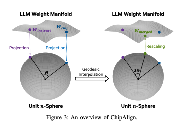
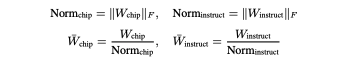
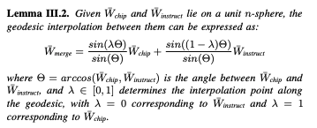
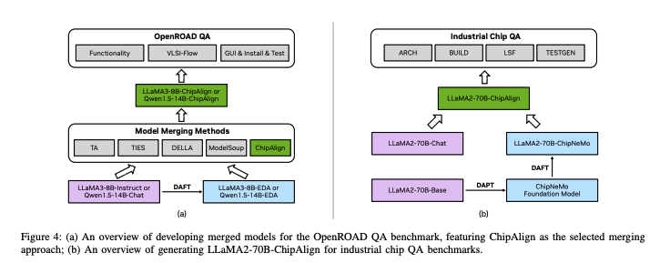
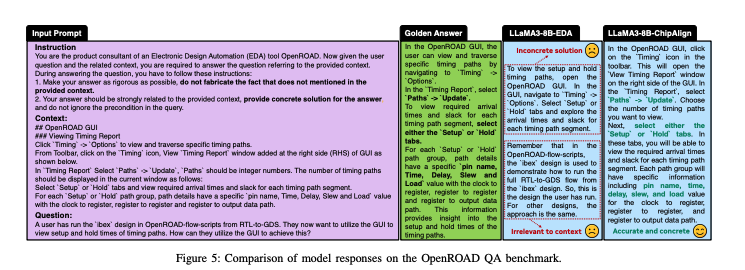

이 논문은 칩 설계 분야에 적용되는 대형 언어 모델(LLM)들이 명령어 정렬(instruction alignment)에서 겪는 문제를 해결하기 위한 새로운 접근법, ChipAlign을 소개합니다.

핵심 내용은 다음과 같습니다:
- 문제점:
    칩 설계에 특화된 모델(예: ChipNeMo)은 도메인 전문성은 뛰어나지만, 인간의 명령어를 명확히 따르는 능력, 즉 명령어 정렬 기능이 부족하여 실제 하드웨어 설계 지원에 한계가 있었습니다.
- 제안된 해결책 (ChipAlign):
    - 모델 병합 전략:
        별도의 추가 학습 없이, 일반 명령어 정렬 기능을 갖춘 LLM과 칩 특화 LLM의 가중치를 융합하는 방식을 사용합니다.
    - geodesic 보간:
        가중치 공간의 내재된 manifold를 고려하여 두 모델의 가중치를 geodesic interpolation 방식으로 병합함으로써, 두 모델의 장점을 모두 취합합니다.
- 성과:
    - 명령어 정렬 능력이 크게 향상되어, IFEval 벤치마크에서 최대 26.6% 개선되었으며,
    - 명령어를 포함하는 QA 작업에서는 OpenROAD QA 벤치마크에서 3.9%, 실제 칩 QA 벤치마크에서 8.25%의 성능 향상을 보였습니다.

결과적으로, ChipAlign은 칩 설계에 필요한 전문성을 유지하면서도, 사용자의 명령어를 더 잘 따르는 LLM을 만들어내어, 하드웨어 설계 엔지니어들을 위한 어시스턴트 챗봇 등 다양한 응용 분야에서의 실용성을 크게 높였습니다.

[Paper Link](https://arxiv.org/pdf/2412.19819)
[Related Code](https://github.com/arcee-ai/mergekit/issues/485)

## Background
이 논문은 칩 설계 분야에 특화된 LLM들이 갖춰야 할 도메인 전문성과 동시에 인간의 명령어를 정확하게 따르는 능력을 어떻게 동시에 확보할 수 있는지를 다룹니다.

1. 칩 설계 도메인에 특화된 LLM (Domain-Adapted LLMs):
- ChipNeMo:
    - LLaMA2‑70B 모델을 기반으로 칩 설계 관련 문서와 코드를 사용하여 사전학습(DAPT)을 진행하고, 약 57,000개의 도메인 및 오픈소스 채팅 데이터를 활용한 후속 학습(DAFT)을 통해 칩 설계에 특화된 지식을 습득함.
- AutoMage 및 ChatEDA:
    - LLaMA2를 기반으로 전자설계자동화(EDA) 도구 사용을 위한 모델로, EDA 디자인 플로우에 최적화된 챗봇 에이전트로 발전함.
- 그 외에도 OpenROAD 스크립트 생성 및 QA 작업을 위한 모델들이 개발됨.

2. 명령어 정렬 (Instruction Alignment)의 중요성:
- 도메인 특화 학습(DAPT/DAFT) 과정에서 모델은 칩 설계 지식을 강화하지만, 동시에 일반 LLM들이 기본적으로 갖추고 있던 명령어를 따르는 능력이 손실될 수 있음.
- 실제 칩 설계 지원 챗봇 등에서는 디자이너가 명령어를 통해 구체적인 디자인 방법이나 문제 해결 절차를 요청하기 때문에, 명령어 정렬 기능은 매우 중요함.
- 다중 작업 학습(multi-task learning) 방식으로 도메인 데이터와 명령어 데이터 모두로 학습하는 방법도 있으나, 고품질의 대규모 명령어 데이터셋 확보가 어렵고 비용이 많이 듬.

3. 모델 병합을 통한 명령어 정렬 강화 (Instruction Alignment via Model Merging):
- **모델 병합(model merging)**은 별도의 추가 학습 없이, 칩 설계에 특화된 LLM과 명령어 정렬에 강한 일반 LLM의 가중치를 융합하는 방법입니다.
- 기존 방법들(예: Model Soup, task arithmetic, TIES, DELLA)은 단순 가중치 평균이나 가중치 차이 평균 등을 사용하지만, LLM 가중치 공간의 기하학적 특성을 고려하지 않아 성능이 제한될 수 있음.
- ChipAlign:
    - 이 논문에서 제안하는 방법은 지오데식 보간(geodesic interpolation) 기법을 활용하여, 리만 다양체 상에서 두 모델의 가중치를 최단 경로로 부드럽게 결합합니다.
    - 이를 통해 칩 설계에 대한 전문성과 명령어 정렬 능력을 모두 갖춘 병합 모델을 만들어, 기존 기법들보다 더 우수한 성능을 달성하였습니다.

## The Proposed Approach
이 방법은 칩 설계에 특화된 LLM(M_chip)과 일반 명령어 정렬이 잘 된 LLM(M_instruct)을 하나의 모델로 병합하는 것을 목표로 합니다. 여기서는 두 모델의 가중치를 지오데식 보간(geodesic interpolation)을 통해 융합하는 과정을 단계별로 설명합니다.

1. 문제 정의
- 목표:
각 층의 가중치 행렬 W_chip(칩 전문 모델)와 W_instruct(명령어 정렬 모델)을 입력받아, 두 모델의 강점을 모두 포함하는 병합 가중치 W_merge를 만드는 함수 f를 정의하는 것입니다.
- 전제 조건:
두 모델은 동일한 아키텍처를 가지므로, 각 층의 가중치 행렬은 동일한 크기(pxq)를 가집니다.

2. 가중치의 기하학적 해석

- 기하학적 관점:
신경망의 가중치는 고차원의 리만 다양체 위의 점으로 볼 수 있습니다. 즉, 각 가중치 행렬은 이 고차원 공간에서 한 점을 나타내며, 이 공간의 구조를 고려하여 두 모델을 부드럽게 연결할 수 있습니다.

- 지오데식 보간:
두 점 사이의 최단 경로(지오데식)를 따라 보간하면, 두 모델의 특성을 자연스럽게 혼합할 수 있습니다.

3. 단위 n-구(Sphere)로의 사영
- 문제점:
고차원 리만 다양체에서 직접 지오데식 보간을 수행하는 것은 계산적으로 매우 어렵습니다.
- 해결책:
각 가중치 행렬을 Frobenius 노름을 이용해 정규화하여 단위 n-구(즉, |w|=1 인 구) 위의 점으로 사영합니다.

    - n = (pxq-1)
    - 이렇게 하면 두 행렬 모두 단위 구 위에 위치하게 되어, 구면 상에서 효율적으로 보간할 수 있습니다.

4. 구면 상에서의 지오데식 보간
- 보간 공식:
단위 구 위의 두 점 W_chip과 W_instruct사이의 지오데식 보간은 다음과 같이 계산됩니다:

- theta는 두 정규화된 가중치 사이의 각도입니다.
- lambda는 [0, 1] 보간 위치를 결정하는 하이퍼파라미터로, lambda=1 이면 W_chip에, lambda=0이면 W_instruct에 가까워집니다.

이 과정을 통해 두 모델의 특징을 일정 비율로 섞은 새로운 가중치 행렬 W_merge를 얻습니다.

5. 원래 규모로 복원
- 재스케일링:
구면 상에서 보간된 가중치 행렬은 단위 구 위에 있으므로, 원래의 스케일(즉, 가중치의 크기)로 복원하기 위해 각각의 Frobenius 노름을 곱해줍니다.


이렇게 최종적으로 각 층의 병합 가중치 W_merge가 완성되며, 이 가중치를 사용해 병합 모델 M_merge가 구축됩니다. 이 모델은 칩 설계 전문성과 명령어 정렬 능력을 동시에 보유합니다.

6. 효율성과 장점
- 하이퍼파라미터:
오직 lambda 하나의 하이퍼파라미터만 필요하여 설정이 간단합니다. 실험에서는 lambda=0.6 이 가장 좋은 성능을 보였습니다.
- 계산 복잡도:
모든 과정은 모델 가중치의 총 파라미터 수 n에 대해 O(n)의 시간과 공간 복잡도를 가지므로, 수십억 파라미터 규모의 LLM에도 효율적으로 적용할 수 있습니다.

## Experiments
실험 섹션은 ChipAlign의 성능을 여러 벤치마크와 비교 평가하여, 칩 설계 도메인 전문성과 명령어 정렬 능력을 동시에 향상시킬 수 있음을 검증합니다.



1. 실험 설정
- 모델 준비:
    - OpenROAD QA 벤치마크를 위해, 공개된 두 개의 명령어 정렬 LLM (Qwen1.5-14B‑Chat, LLaMA3‑8B‑Instruct)을 기반으로 도메인 특화 모델(Qwen1.5‑14B‑EDA, LLaMA3‑8B‑EDA)을 생성하기 위해 약 2K 개의 컨텍스트-쿼리-답변 트리플릿을 활용해 DAFT와 LoRA (rank 8, alpha 16)로 20 에폭 학습했습니다.
    - 산업용 칩 QA 평가에서는 LLaMA2‑70B‑ChipNeMo (칩 도메인 전문)와 LLaMA2‑70B‑Chat (명령어 정렬 모델)을 사용하여, 두 모델을 ChipAlign (λ = 0.6)으로 융합해 LLaMA2‑70B‑ChipAlign을 생성했습니다.
- 컴퓨팅 환경:
    - OpenROAD QA의 경우, 4노드(각 노드에 A100 GPU 8대, 80GB 메모리)를 사용했고, ChipAlign 융합은 48코어 CPU (2.5GHz)에서 10분 내에 완료되었습니다.
- 산업용 칩 QA에서는 융합에 43분이 소요되었습니다.
- 비교 기준:
    - 기존의 모델 병합 기법(예: task arithmetic, TIES, DELLA, Model Soup)과 GPT‑4 Turbo, RAG‑EDA 등과 비교하여 평가했습니다.
    - 성능 평가는 주로 ROUGE‑L 점수를 활용했습니다.

2. 평가 결과
- OpenROAD QA 평가:
    - ChipAlign은 기존 모델 병합 방법보다 최대 6.4% 높은 ROUGE‑L 점수를 기록하며, 명령어 정렬 능력을 강화한 도메인 특화 모델로서 우수한 성능을 보였습니다.
    - 병합 모델들은 각각의 EDA 모델보다도 최대 3.9% 성능 향상을 나타냈습니다.
- 산업용 칩 QA 평가:
    - 실제 하드웨어 설계 엔지니어가 사용하는 39개의 질문(단일턴 및 다중턴 설정)에서, LLaMA2‑70B‑ChipAlign이 LLaMA2‑70B‑Chat와 LLaMA2‑70B‑ChipNeMo보다 최대 8.25% 높은 점수를 받았습니다.
    - GPT‑4 기반 평가 도구를 활용하여, 병합 모델이 지시 사항을 엄격히 따르고 관련 컨텍스트에 근거한 정확한 답변을 생성함을 확인했습니다.
- 명령어 정렬 및 도메인 지식 평가:
    - IFEval 벤치마크(541 프롬프트)를 통해 명령어 따르기 능력을 평가한 결과, LLaMA3‑8B‑ChipAlign이 LLaMA3‑8B‑EDA보다 현저히 우수하며, LLaMA3‑8B‑Instruct 수준에 도달했습니다.
    - 칩 도메인 지식 평가에서는, ChipAlign이 ChipNeMo와 유사한 성능을 보이며 도메인 전문성을 잘 유지하는 것으로 나타났습니다.
- 하이퍼파라미터 λ 민감도 분석:
    - λ 값을 0.0부터 1.0까지 변화시키면서 평가한 결과, 성능은 λ = 0.6에서 최고치를 기록하여, 이 값을 기본 설정으로 추천합니다.

